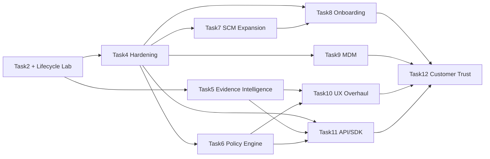

# TrackAI Rough Product Roadmap

**Portfolio index — intentionally non-committal on delivery dates**
Last updated: **2026-07-25**

This document records major product programs, their dependencies and their
recommended Codex-task ownership. Individual task trackers remain authoritative
for implementation detail. Status represents discovery/implementation maturity,
not a promised release date.

## Status legend

| Symbol | Meaning |
|---|---|
| 🟢 ✅ | Program outcome implemented and verified for its stated scope |
| 🟡 ◐ | Active discovery, partial foundation or incomplete implementation |
| 🔴 ☐ | Idea/backlog; dedicated implementation has not begun |
| ⚪ — | Not applicable |

## Portfolio matrix

| ID | Program | Status | Intended outcome | Major workstreams | Dependencies / gates | Recommended horizon | Manual involvement | Codex-task ownership |
|---|---|---:|---|---|---|---|---|---|
| **Ongoing Lab** | Lifecycle Correctness Lab | 🟡 ◐ | Continuously prove that Generated, Committed, In-PR, Merged, Production, Reworked and Churned metrics remain truthful across agents and SCM operations. | Controlled fixtures; provider/model coverage; correction semantics; scale tests; release regression; customer-reproducible evidence. | Current Task2; every later program that changes telemetry, SCM or UI. | **Permanent** | High: live IDE, GitHub, tenant and deployment experiments remain essential. | **This Codex task remains the owner.** |
| **Task4** | Robustness, Security, Administration and Operations | 🟡 ◐ | Make telemetry transport, credentials, tenant/repository policy, retention and operations production-safe. | Durable delivery; encryption; key lifecycle; repository grants; quarantine; admin UI; retention/export; monitoring. | Post-E13 checkpoint and Task2 metric invariants. | **Begins after E13** | High for secrets, GitHub App, multi-tenant, offline and admin verification. | Separate Task4 task; canonical tracker is [`TASK4.md`](TASK4.md). |
| **Task5** | Evidence Explorer and Intention Intelligence | 🟡 ◐ | Let authorized customers traverse ticket/intention → prompt/session/tool activity → code/commit/PR/production and reverse that path for diagnosis and learning. | Evidence taxonomy; privacy; graph; raw evidence; visual explorer; pain analytics; semantic intention review; exports. | Discovery through E15; production raw content blocked by Task4 encryption, authorization and retention. | **Discovery after E15; implementation after security gates** | High for privacy, redaction, UX evaluation and realistic customer workflows. | Discovery remains here through E15; production implementation moves to a separate Task5 task. |
| **Task6** | Expanded Policy and Compliance Engine | 🔴 ☐ | Express, simulate, enforce and audit organization/team/repository/branch/agent/model policies without hardcoded tenant behavior. | Policy model; inheritance; exceptions; approvals; simulation; enforcement points; evidence/audit. | Task4 keys, grants, admin boundaries and monitoring. | **After Task4 policy foundation** | High: policy defaults, exception/approval semantics and compliance review. | Separate Task6 task. |
| **Task7** | GitLab and Bitbucket Integration | 🔴 ☐ | Provide provider-neutral lifecycle behavior and metric parity across GitHub, GitLab and Bitbucket. | SCM adapter contract; provider Apps/OAuth; webhook mapping; PR/MR semantics; deployment mapping; conformance fixtures. | Task4 generalized delivery/idempotency; stable Task2 lifecycle contracts. | **After Task4 transport contracts** | High: provider accounts, installations, webhook configuration and live merges/deployments. | Separate Task7 provider-integration task. |
| **Task8** | Customer Onboarding and Time-to-Value | 🔴 ☐ | Move a customer safely from tenant creation to verified first metrics with clear health checks and recovery guidance. | IdP setup; SCM installation; repository enrollment; agent installation; first-data wizard; diagnostics; guided verification. | Task4 admin/policy; Task7 adapters where applicable; Task9 optional managed deployment. | **After Task4 admin foundations** | Very high: customer journey, copy, failure recovery and usability trials. | Separate Task8 task. |
| **Task9** | MDM and Managed Developer Fleet | 🔴 ☐ | Let enterprise administrators deploy, configure, inventory, update and revoke TrackAI/Git AI across managed developer devices. | Packages/profiles; device identity/posture; fleet inventory; policy distribution; update/rollback; offboarding. | Task4 developer keys, machine identity, repository grants and offline queue. | **After Task4 machine enrollment** | Very high: managed-device access, MDM vendor profiles and restart/offboarding tests. | Separate Task9 task. |
| **Task10** | UX/UI and Design-System Overhaul | 🔴 ☐ | Deliver a coherent, accessible customer/operator experience capable of explaining both lifecycle outcomes and complex evidence. | Information architecture; design system; responsive/accessibility; customer/operator modes; visualizations; progressive disclosure. | Research may start early; connected Evidence Explorer depends on Task5 and policy/admin UX depends on Tasks4/6. | **Research early; implementation after core workflows stabilize** | Very high: design critique, customer workflow testing and accessibility review. | Separate Task10 product-design/implementation task. |
| **Task11** | Public API, SDK and Integration Platform | 🔴 ☐ | Expose stable, versioned TrackAI capabilities to customer automation without leaking internal database models. | OpenAPI contracts; TypeScript/Python SDKs; CLI; callbacks; pagination; versioning; quotas; examples; compatibility policy. | Stable contracts from Tasks4–7; evidence APIs from Task5 if included. | **After core public contracts stabilize** | Medium/high: representative customer integrations and compatibility review. | Separate Task11 platform task. |
| **Task12** | Customer Trust, Technical Enablement and Verification | 🔴 ☐ | Help security, engineering and business stakeholders understand, test and trust product correctness and controls. | Trust center; guided verification lab; sample data; acceptance runbooks; technical docs; buyer-facing evidence; customer testing flows. | Draws verified capabilities from Tasks4–11 and the Ongoing Lab. | **Build incrementally; consolidate after product workflows mature** | Very high: customer language, security review and guided acceptance sessions. | Separate Task12 enablement task. |

## Permanent Lifecycle Correctness Lab

This task remains an independent verification function even while other Codex
tasks implement new capabilities.

| Responsibility | Operating rule |
|---|---|
| Metric contracts | Own the definitions and invariants for lifecycle metrics; implementation tasks must not silently redefine them. |
| Controlled experiments | Maintain deterministic small fixtures plus realistic E15-scale scenarios. |
| Cross-provider verification | Re-run attribution, usage and lifecycle tests when an agent, model, SCM provider or client transport changes. |
| Correction semantics | Preserve observed evidence and validate explicit audited overlays, exclusions and availability states. |
| Release regression | Consume checkpoint commits from other tasks and run affected lifecycle/E2E cases before their release gates turn green. |
| Customer reproducibility | Prefer tests and evidence that a customer can understand and independently repeat. |

## Task5 — Evidence Explorer and Intention Intelligence

Task5 turns currently internal evidence into a permission-aware customer
investigation surface. Raw content is sensitive customer intellectual property,
not ordinary low-risk telemetry.

| ID | Subtask | Status | Outcome | Dependencies / privacy gate | Manual involvement |
|---|---|---:|---|---|---|
| **T5.1** | Evidence Taxonomy and Identity | 🟡 ◐ | Define stable entities and edges for work item, intention, prompt, response, session, trace, tool call, checkpoint, code range, commit, PR, merge and deployment. | Task2 session/trace/commit identity findings; E15. | Domain review required. |
| **T5.2** | Privacy, Authorization and Consent | 🔴 ☐ | Define metadata/content tiers, tenant and field-level access, redaction, audit, retention/deletion and explicit raw-content opt-in. | Task4 encryption, identity, policy and retention contracts. | Security/privacy decisions and threat-model review required. |
| **T5.3** | Evidence Ingestion and Storage | 🔴 ☐ | Store immutable metadata, optional encrypted content, stable provenance references, integrity/version information and availability status. | T5.1–T5.2; Task4 delivery/encryption/retention. | Live provider payload inspection required; never seed real prompt text casually. |
| **T5.4** | Work-Item Linkage | 🔴 ☐ | Connect GitHub Issues, Jira and Linear work items to intentions/sessions/branches/PRs using explicit links first and confidence-labelled inference second. | T5.1, T5.3; provider APIs and customer authorization. | Customer project configuration and ambiguous-link review required. |
| **T5.5** | Evidence Graph APIs | 🔴 ☐ | Support forward and reverse traversal with tenant-safe filters, pagination, evidence/confidence and availability. | T5.1–T5.4; Task11 may later publish selected contracts. | Automated security tests mandatory; manual query review helpful. |
| **T5.6** | Visual Evidence Explorer | 🔴 ☐ | Provide timeline/graph/code-provenance views, filters, progressive drill-down and reversible navigation without overwhelming ordinary dashboard users. | T5.5; Task10 design system/IA collaboration. | High: iterative UX sessions required. |
| **T5.7** | Pain-Point and Quality Analytics | 🔴 ☐ | Identify failed/retried/slow tool calls, ineffective prompt loops, excessive rework, abandoned sessions and weak model/tool outcomes with transparent evidence. | T5.3, T5.5; Task2 metric invariants. | Analysts must validate that signals are explanatory, not punitive or misleading. |
| **T5.8** | Code-to-Intention Reverse Engineering | 🔴 ☐ | Navigate commit/file/line → attribution/checkpoint → tool/session → prompt/intention/work item with explicit gaps rather than invented causality. | T5.1, T5.3, T5.5; Git Notes/range attribution. | Manual provenance audits required. |
| **T5.9** | Semantic Intention Review | 🔴 ☐ | Tenant-isolated semantic search, similar-intention retrieval, historical outcome comparison and duplicate-work discovery. | T5.2–T5.5; opt-in embedding/index policy; Task4 deletion/retention. | High: relevance, privacy, bias and false-similarity evaluation required. |
| **T5.10** | Verification, Audit and Export | 🔴 ☐ | Produce reproducible evidence bundles, access histories and customer-readable explanations of what is observed, inferred, corrected or unavailable. | T5.1–T5.9; Task4 audit/export; Task12 verification UX. | Customer/security acceptance review required. |

### Task5 safety defaults

- Raw prompts, responses and tool payloads are **not** returned by existing
  dashboard APIs and are not enabled merely because metadata is available.
- Metadata-only local prototypes may precede Task4; production content storage
  waits for encryption, access control, retention/deletion and audit.
- Semantic indexes are tenant-isolated, permission-aware and opt-in. Customer
  content is never used for cross-customer training by default.
- Inferred work-item or intention links always expose method and confidence;
  unresolved evidence remains unresolved.
- Insights diagnose systems and workflows. They must not silently become
  employee-surveillance scores or unsupported productivity judgments.

## Future program workstreams

| Program | Referenceable workstreams |
|---|---|
| **Task6 — Policy Engine** | **T6.1** policy vocabulary and inheritance; **T6.2** repository/branch/agent/model rules; **T6.3** approvals and exceptions; **T6.4** dry-run simulation; **T6.5** enforcement adapters; **T6.6** violation evidence and audit; **T6.7** compliance reporting. |
| **Task7 — SCM Expansion** | **T7.1** provider-neutral contract; **T7.2** GitLab App/OAuth; **T7.3** Bitbucket App/OAuth; **T7.4** webhook/event parity; **T7.5** MR/PR and merge semantics; **T7.6** pipeline/deployment mapping; **T7.7** cross-provider conformance suite. |
| **Task8 — Onboarding** | **T8.1** tenant/IdP wizard; **T8.2** SCM installation; **T8.3** repository enrollment; **T8.4** agent/client installation; **T8.5** first-data verification; **T8.6** health diagnostics; **T8.7** guided recovery and time-to-value analytics. |
| **Task9 — MDM/Fleet** | **T9.1** platform packages; **T9.2** device identity/posture; **T9.3** managed configuration profiles; **T9.4** inventory/health; **T9.5** staged update and rollback; **T9.6** revocation/offboarding; **T9.7** fleet security/E2E. |
| **Task10 — UX/UI** | **T10.1** information architecture; **T10.2** design system; **T10.3** responsive/accessibility baseline; **T10.4** customer/operator modes; **T10.5** lifecycle visualizations; **T10.6** Evidence Explorer UX; **T10.7** usability and performance verification. |
| **Task11 — API/SDK** | **T11.1** public resource model; **T11.2** OpenAPI/versioning; **T11.3** TypeScript SDK; **T11.4** Python SDK; **T11.5** CLI; **T11.6** callbacks/webhooks; **T11.7** pagination/quotas/errors; **T11.8** examples and compatibility suite. |
| **Task12 — Trust/Enablement** | **T12.1** security/trust center; **T12.2** guided verification lab; **T12.3** synthetic/sample environments; **T12.4** acceptance runbooks; **T12.5** technical/admin documentation; **T12.6** architecture/security evidence; **T12.7** customer and buyer-facing narratives. |

## Dependency and execution model

### Recommended portfolio sequence

1. Finish the current Task2 deterministic regression, E13–E15 discovery and
   metric contracts; continue the Lifecycle Lab indefinitely.
2. Begin Task4 after the documented E13 checkpoint.
3. Open Task5 discovery here after E15, then hand production implementation to
   a dedicated Task5 task once privacy/storage contracts are decision-complete.
4. Begin Task6/7/8/9 only when their Task4 gates are stable; provider and UX
   research may occur earlier without committing production contracts.
5. Stabilize public resource contracts before Task11 SDK generation.
6. Build Task12 incrementally from verified evidence, then consolidate the
   complete customer trust and verification experience.

## Multi-task coordination

- Every major program uses a dedicated branch, worktree, Codex task, tracker
  and versioned handoff.
- This roadmap is the portfolio index; it does not replace `Task2.md`,
  `TASK4.md` or future program trackers.
- Shared schemas and public contracts integrate only at named checkpoint SHAs.
- The implementing task records what changed; the Lifecycle Lab independently
  reruns affected metric scenarios.
- Handoffs contain paths, SHAs, contracts, tests and known defects—never secret
  values or customer raw content.

## Assumptions

- Task2 remains the lifecycle metric-semantics authority.
- Task5 discovery remains in this task through E15; production Task5 work uses
  another task window.
- Raw prompts, responses and tool content are sensitive customer data.
- Roadmap status reflects maturity, not staffing, commercial commitment or a
  promised date.
