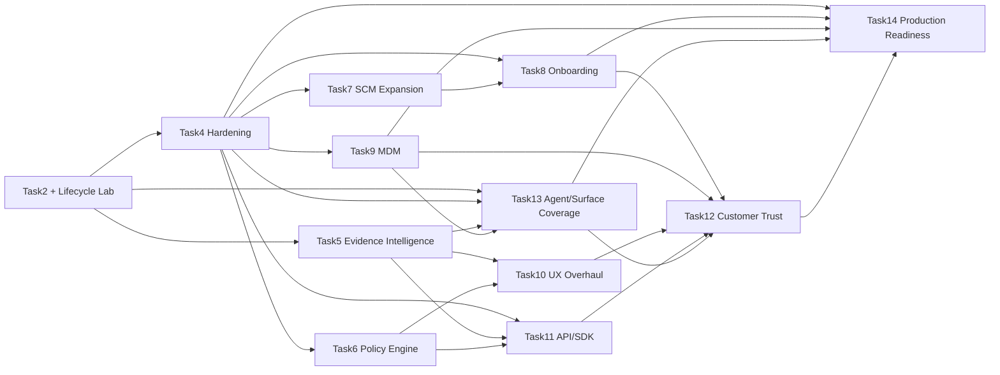

# TrackAI Rough Product Roadmap

**Portfolio index — intentionally non-committal on delivery dates**
Last updated: **2026-08-02**

This document records major product programs, their dependencies and their
recommended Codex-task ownership. Individual task trackers remain authoritative
for implementation detail. Status represents discovery/implementation maturity,
not a promised release date.

## Status legend

| Symbol | Meaning |
|---|---|
| 🟢 ✅ | Program outcome implemented and verified for its stated scope |
| 🟡 ◐ | Active discovery, partial foundation or incomplete implementation |
| 🔴 ☐ | Idea/backlog; dedicated implementation has not begun |
| ⚪ — | Not applicable |

## Portfolio matrix

| ID | Program | Status | Intended outcome | Major workstreams | Dependencies / gates | Recommended horizon | Manual involvement | Codex-task ownership |
|---|---|---:|---|---|---|---|---|---|
| **Ongoing Lab** | Lifecycle Correctness Lab | 🟡 ◐ | Continuously prove that Generated, Committed, In-PR, Merged, Production, Reworked and Churned metrics remain truthful across agents and SCM operations. | Controlled fixtures; provider/model coverage; correction semantics; scale tests; release regression; customer-reproducible evidence. | Current Task2; every later program that changes telemetry, SCM or UI. | **Permanent** | High: live IDE, GitHub, tenant and deployment experiments remain essential. | **This Codex task remains the owner.** |
| **Task4** | Robustness, Security, Administration and Operations | 🟡 ◐ | Make telemetry transport, credentials, tenant/repository policy, retention and operations production-safe. | Durable delivery; encryption; key lifecycle; repository grants; quarantine; admin UI; retention/export; monitoring. | Post-E13 checkpoint and Task2 metric invariants. | **Begins after E13** | High for secrets, GitHub App, multi-tenant, offline and admin verification. | Separate Task4 task; canonical tracker is [`TASK4.md`](TASK4.md). |
| **Task5** | Evidence Explorer and Intention Intelligence | 🟡 ◐ | Let authorized customers traverse ticket/intention → prompt/session/tool activity → code/commit/PR/production and reverse that path for diagnosis and learning. | Evidence taxonomy; privacy; graph; raw evidence; visual explorer; pain analytics; semantic intention review; exports. | Discovery through E15; production raw content blocked by Task4 encryption, authorization and retention. | **Discovery after E15; implementation after security gates** | High for privacy, redaction, UX evaluation and realistic customer workflows. | Discovery remains here through E15; production implementation moves to a separate Task5 task. |
| **Task6** | Expanded Policy and Compliance Engine | 🔴 ☐ | Express, simulate, enforce and audit organization/team/repository/branch/agent/model policies; coding-agent security rules; and capture, upload, redaction, retention, access and export policy without hardcoded tenant behavior. | Policy model; inheritance; exceptions; approvals; simulation; signed endpoint bundles; coding-agent security rules; data-minimization and lifecycle controls; enforcement points; evidence/audit. | Task4 keys, grants, admin boundaries, durable queue and monitoring. Architecture seed: [`TASK6_POLICY_SECURITY_BUNDLE_ARCHITECTURE.md`](TASK6_POLICY_SECURITY_BUNDLE_ARCHITECTURE.md). | **After Task4 policy foundation** | High: policy defaults, signing trust, client failure modes, exception/approval semantics and compliance review. | Separate Task6 task. |
| **Task7** | GitLab and Bitbucket Integration | 🔴 ☐ | Provide provider-neutral lifecycle behavior and metric parity across GitHub, GitLab and Bitbucket. | SCM adapter contract; provider Apps/OAuth; webhook mapping; PR/MR semantics; deployment mapping; conformance fixtures. | Task4 generalized delivery/idempotency; stable Task2 lifecycle contracts. | **After Task4 transport contracts** | High: provider accounts, installations, webhook configuration and live merges/deployments. | Separate Task7 provider-integration task. |
| **Task8** | Customer Onboarding and Time-to-Value | 🔴 ☐ | Move a customer safely from tenant and IdP configuration to verified first metrics, with understandable identity, role, machine-assignment and recovery flows. | Okta/Entra/Google setup; claims and group-to-role mapping; admin bootstrap; JIT/optional SCIM; SCM installation; audited machine-custodian assignment; self-service client enrollment; first-data verification. | Task4 admin/policy; Task7 adapters where applicable; Task9 optional managed deployment. | **After Task4 admin foundations** | Very high: customer IdP configuration, role mapping, customer-admin/regular-user acceptance and usability trials. | Separate Task8 task. |
| **Task9** | MDM and Managed Developer Fleet | 🔴 ☐ | Let enterprise administrators deploy, configure, inventory, update and revoke TrackAI/Git AI across managed macOS, Windows and Linux devices. | Signed packages/profiles; unattended install; device identity/posture and assigned-user evidence; managed configuration; fleet inventory; update/rollback; offboarding; OS secret-store integration. | Task4 developer keys, machine identity, repository grants and offline queue; Task14 secret-store adapter contract. | **After Task4 machine enrollment** | Very high: managed-device access, MDM vendor profiles, user/device reconciliation and restart/offboarding tests. | Separate Task9 task. |
| **Task10** | UX/UI and Design-System Overhaul | 🔴 ☐ | Deliver a coherent, accessible customer/operator experience capable of explaining both lifecycle outcomes and complex evidence. | Information architecture; design system; responsive/accessibility; customer/operator modes; visualizations; progressive disclosure. | Research may start early; connected Evidence Explorer depends on Task5 and policy/admin UX depends on Tasks4/6. | **Research early; implementation after core workflows stabilize** | Very high: design critique, customer workflow testing and accessibility review. | Separate Task10 product-design/implementation task. |
| **Task11** | Public API, SDK and Integration Platform | 🔴 ☐ | Expose stable, versioned TrackAI capabilities to customer automation without leaking internal database models. | OpenAPI contracts; TypeScript/Python SDKs; CLI; callbacks; pagination; versioning; quotas; examples; compatibility policy. | Stable contracts from Tasks4–7; evidence APIs from Task5 if included. | **After core public contracts stabilize** | Medium/high: representative customer integrations and compatibility review. | Separate Task11 platform task. |
| **Task12** | Customer Trust, Technical Enablement and Verification | 🔴 ☐ | Help security, engineering and business stakeholders understand, test and trust product correctness and controls. | Trust center; guided verification lab; sample data; acceptance runbooks; technical docs; buyer-facing evidence; customer testing flows. | Draws verified capabilities from Tasks4–11 and the Ongoing Lab. | **Build incrementally; consolidate after product workflows mature** | Very high: customer language, security review and guided acceptance sessions. | Separate Task12 enablement task. |
| **Task13** | Agent and Surface Coverage | 🟡 ◐ | Capture and validate every supported path by which an AI agent can change code, without confusing model provider, agent family, host surface or capture channel. | Route taxonomy; IDE/CLI/desktop/cloud adapters; host provenance; evidence fidelity; cross-platform conformance; customer verification. | Task2 lifecycle contracts; Task4 host-neutral delivery/enrollment; Task5 raw-evidence policy; Task9 managed deployment. | **Matrix now; adapters and validation in route-priority waves** | Very high: each claimed route and operating system requires a real host experiment. | Separate Task13 implementation task; the Lifecycle Lab remains independent acceptance authority. Canonical tracker: [`AGENT_COVERAGE.md`](AGENT_COVERAGE.md). |
| **Task14** | Production Readiness and Deployment Certification | 🔴 ☐ | Turn verified product capabilities into an operable GCP SaaS service and portable customer-VPC/self-hosted releases with repeatable security, recovery and rollout evidence. | Deployment architecture; secret/KMS and endpoint keyring adapters; TLS/service identity; PostgreSQL/DR; HA/capacity; supply chain; staging/canary/rollback; SLO/incident operations; deployment conformance. | Consumes Task4's completed security/operations contracts plus Task8 onboarding, Task9 packaging and Task13 platform evidence; it does not re-own those programs. | **Build adapters early; certify after the supported release scope is frozen** | Very high: cloud accounts, recovery drills, platform hosts, customer-network and self-hosted acceptance. | Separate Task14 task. Canonical tracker: [`TASK14.md`](TASK14.md); plain-language companion: [`prod-checklist-for-dummies.md`](prod-checklist-for-dummies.md). |

## Permanent Lifecycle Correctness Lab

This task remains an independent verification function even while other Codex
tasks implement new capabilities.

| Responsibility | Operating rule |
|---|---|
| Metric contracts | Own the definitions and invariants for lifecycle metrics; implementation tasks must not silently redefine them. |
| Controlled experiments | Maintain deterministic small fixtures plus realistic E15-scale scenarios. |
| Cross-provider verification | Re-run attribution, usage and lifecycle tests when an agent, model, SCM provider or client transport changes. |
| Correction semantics | Preserve observed evidence and validate explicit audited overlays, exclusions and availability states. |
| Release regression | Consume checkpoint commits from other tasks and run affected lifecycle/E2E cases before their release gates turn green. |
| Customer reproducibility | Prefer tests and evidence that a customer can understand and independently repeat. |

## Task5 — Evidence Explorer and Intention Intelligence

Task5 turns currently internal evidence into a permission-aware customer
investigation surface. Raw content is sensitive customer intellectual property,
not ordinary low-risk telemetry.

| ID | Subtask | Status | Outcome | Dependencies / privacy gate | Manual involvement |
|---|---|---:|---|---|---|
| **T5.1** | Evidence Taxonomy and Identity | 🟡 ◐ | Define stable entities and edges for work item, intention, prompt, response, session, trace, tool call, checkpoint, code range, commit, PR, merge and deployment. | Task2 session/trace/commit identity findings; E15. | Domain review required. |
| **T5.2** | Privacy, Authorization and Consent | 🔴 ☐ | Define metadata/content tiers, tenant and field-level access, redaction, audit, retention/deletion and explicit raw-content opt-in. | Task4 encryption, identity, policy and retention contracts. | Security/privacy decisions and threat-model review required. |
| **T5.3** | Evidence Ingestion and Storage | 🔴 ☐ | Store immutable metadata, optional encrypted content, stable provenance references, integrity/version information and availability status. | T5.1–T5.2; Task4 delivery/encryption/retention. | Live provider payload inspection required; never seed real prompt text casually. |
| **T5.4** | Work-Item Linkage | 🔴 ☐ | Connect GitHub Issues, Jira and Linear work items to intentions/sessions/branches/PRs using explicit links first and confidence-labelled inference second. | T5.1, T5.3; provider APIs and customer authorization. | Customer project configuration and ambiguous-link review required. |
| **T5.5** | Evidence Graph APIs | 🔴 ☐ | Support forward and reverse traversal with tenant-safe filters, pagination, evidence/confidence and availability. | T5.1–T5.4; Task11 may later publish selected contracts. | Automated security tests mandatory; manual query review helpful. |
| **T5.6** | Visual Evidence Explorer | 🔴 ☐ | Provide timeline/graph/code-provenance views, filters, progressive drill-down and reversible navigation without overwhelming ordinary dashboard users. | T5.5; Task10 design system/IA collaboration. | High: iterative UX sessions required. |
| **T5.7** | Pain-Point and Quality Analytics | 🔴 ☐ | Identify failed/retried/slow tool calls, ineffective prompt loops, excessive rework, abandoned sessions and weak model/tool outcomes with transparent evidence. | T5.3, T5.5; Task2 metric invariants. | Analysts must validate that signals are explanatory, not punitive or misleading. |
| **T5.8** | Code-to-Intention Reverse Engineering | 🔴 ☐ | Navigate commit/file/line → attribution/checkpoint → tool/session → prompt/intention/work item with explicit gaps rather than invented causality. | T5.1, T5.3, T5.5; Git Notes/range attribution. | Manual provenance audits required. |
| **T5.9** | Semantic Intention Review | 🔴 ☐ | Tenant-isolated semantic search, similar-intention retrieval, historical outcome comparison and duplicate-work discovery. | T5.2–T5.5; opt-in embedding/index policy; Task4 deletion/retention. | High: relevance, privacy, bias and false-similarity evaluation required. |
| **T5.10** | Verification, Audit and Export | 🔴 ☐ | Produce reproducible evidence bundles, access histories and customer-readable explanations of what is observed, inferred, corrected or unavailable. | T5.1–T5.9; Task4 audit/export; Task12 verification UX. | Customer/security acceptance review required. |

### Task5 safety defaults

- Raw prompts, responses and tool payloads are **not** returned by existing
  dashboard APIs and are not enabled merely because metadata is available.
- Metadata-only local prototypes may precede Task4; production content storage
  waits for encryption, access control, retention/deletion and audit.
- Semantic indexes are tenant-isolated, permission-aware and opt-in. Customer
  content is never used for cross-customer training by default.
- Inferred work-item or intention links always expose method and confidence;
  unresolved evidence remains unresolved.
- Insights diagnose systems and workflows. They must not silently become
  employee-surveillance scores or unsupported productivity judgments.

## Future program workstreams

| Program | Referenceable workstreams |
|---|---|
| **Task6 — Policy Engine** | **T6.1** policy vocabulary and inheritance; **T6.2** repository/branch/agent/model rules; **T6.3** approvals and exceptions; **T6.4** dry-run simulation; **T6.5** enforcement adapters; **T6.6** violation evidence and audit; **T6.7** compliance reporting; **T6.8** external rule-catalog evaluation; **T6.9** signed endpoint-bundle provisioning; **T6.10** capture/upload/redaction/retention/access/export policy families. |
| **Task7 — SCM Expansion** | **T7.1** provider-neutral contract; **T7.2** GitLab App/OAuth; **T7.3** Bitbucket App/OAuth; **T7.4** webhook/event parity; **T7.5** MR/PR and merge semantics; **T7.6** pipeline/deployment mapping; **T7.7** cross-provider conformance suite. |
| **Task8 — Onboarding** | **T8.1** tenant and Okta/Entra/Google IdP wizard; **T8.2** issuer/audience/callback/claims verification; **T8.3** group-to-role, initial-admin and break-glass lifecycle; **T8.4** JIT access and optional SCIM lifecycle; **T8.5** SCM/repository onboarding; **T8.6** audited machine-user/custodian assignment; **T8.7** self-service client enrollment; **T8.8** admin/auditor/regular-user acceptance; **T8.9** first-data diagnostics, recovery and time-to-value analytics. |
| **Task9 — MDM/Fleet** | **T9.1** signed macOS/Windows/Linux packages; **T9.2** unattended deployment; **T9.3** device identity/posture and assigned-user evidence; **T9.4** managed configuration and policy provisioning; **T9.5** inventory/health; **T9.6** staged update and rollback; **T9.7** revocation/offboarding; **T9.8** OS secret-store adapter integration; **T9.9** MDM-to-TrackAI assignment reconciliation; **T9.10** fleet security/E2E. |
| **Task10 — UX/UI** | **T10.1** information architecture; **T10.2** design system; **T10.3** responsive/accessibility baseline; **T10.4** customer/operator modes; **T10.5** lifecycle visualizations; **T10.6** Evidence Explorer UX; **T10.7** scalable repository/fleet policy administration; **T10.8** usability and performance verification. |
| **Task11 — API/SDK** | **T11.1** public resource model; **T11.2** OpenAPI/versioning; **T11.3** TypeScript SDK; **T11.4** Python SDK; **T11.5** CLI; **T11.6** callbacks/webhooks; **T11.7** pagination/quotas/errors; **T11.8** examples and compatibility suite. |
| **Task12 — Trust/Enablement** | **T12.1** security/trust center; **T12.2** guided verification lab; **T12.3** synthetic/sample environments; **T12.4** acceptance runbooks; **T12.5** technical/admin documentation; **T12.6** architecture/security evidence; **T12.7** customer and buyer-facing narratives. |
| **Task13 — Agent/Surface Coverage** | **T13.1** taxonomy and route catalog; **T13.2** normalized host/evidence contract; **T13.3** IDE/chat/completion; **T13.4** CLI/TUI; **T13.5** desktop apps; **T13.6** remote/cloud/background; **T13.7** gateways/Agent V1; **T13.8** macOS/Linux/Windows/WSL; **T13.9** conformance harness; **T13.10** coverage health and customer runbooks. |
| **Task14 — Production Readiness** | **T14.1** GCP SaaS and portable deployment reference; **T14.2** server secret/KMS adapters; **T14.3** endpoint secret-store contract; **T14.4** TLS/service identity/networking; **T14.5** PostgreSQL/pooling/migrations/DR; **T14.6** HA/load/rate/capacity; **T14.7** supply-chain and artifact signing; **T14.8** staging/canary/rollback; **T14.9** SLO/incident operations; **T14.10** SaaS/VPC/self-hosted certification. |

### Task8 and Task9 identity boundary

Human SSO identity and machine identity are deliberately separate. A person
authenticates with an IdP subject; a machine authenticates with its own
installation credential. Task8 owns an audited, time-bounded assignment that
records a machine's primary user or custodian. That assignment helps an
administrator understand responsibility, but it grants neither human nor
machine access by itself. Task9 may attest or reconcile the assignment using
MDM device/user evidence; it must not replace either authentication system or
infer authority from an email domain.

### Task10 repository and fleet administration UX backlog

Task4 provides a safe functional baseline: focused administration sections,
compact repository summaries, one-repository-at-a-time access detail, active
grants separated from collapsed revoked history, and explicit danger zones.
Task10 owns the product-scale experience rather than expanding Task4 into a
general policy designer.

| Area | Pending Task10 outcome | Dependency / acceptance evidence |
|---|---|---|
| Information hierarchy | Dedicated list/detail routes with stable URLs and preserved search, filter, selection and navigation state. Repository summaries show enrollment, active-machine count, branch-coverage summary, health and last policy change without rendering grant history inline. | Task4 resource identities and Task6 policy identities must be stable; test browser back/forward and deep links. |
| Scale and performance | Server-side search, status filters, sorting, cursor pagination and bounded page sizes for hundreds or thousands of repositories, machines, grants and audit records. Use virtualization only where measured rendering cost warrants it. | Task11 pagination/error conventions; performance fixtures at representative enterprise size. |
| Access inspection | Searchable active-machine table per repository; grouped branch rules, effective windows and policy source; revoked/expired history collapsed and separately pageable by default. Provide the inverse machine-centric view of all repository access. | Task4 grant/revocation contracts; cross-check repository-centric and machine-centric results. |
| Safe editing | Structured branch-rule editor with validation, previews and clear `all branches` semantics. Display an impact preview before revoking a credential, machine, grant or repository policy, including exact cascaded resources and unaffected resources. | Task4 fail-closed enforcement and audit; usability tests must distinguish every revocation scope. |
| Bulk administration | Select/filter many repositories or machines, stage bulk grants/revocations, preview the complete diff and impact count, require an audit reason, execute with partial-failure reporting and exportable results. No silent all-or-nothing assumption. | Task6 policy model and Task11 async/batch contract; Company A/B isolation and retry tests. |
| Policy-engine integration | Replace raw JSON editing with human-readable organization/team/repository/branch/agent/model policies, inheritance, exceptions and approvals. Include Cedar-like `why allowed/denied`, dry-run simulation, conflict detection, effective-policy view and before/after diff. JSON remains a versioned transport/debug representation, not the primary administrator experience. | Task6 vocabulary, evaluator and simulation APIs; policy decision conformance fixtures. |
| Roles and modes | Deliberately distinct tenant-admin, auditor, operator and customer-reader experiences. Hide unavailable mutations but always explain permissions and effective tenant context; do not infer authority from email domain. | Task4 subject-bound roles; role-by-action accessibility and security matrix. |
| Audit and history | Link every resource state to its immutable audit trail without mixing historical rows into current access. Support actor/action/resource/time filters, correlated bulk-operation IDs and export. | Task4 audit/retention plus Task11 export contracts. |
| Accessibility and responsive behavior | Keyboard-complete tables, drawers and dialogs; visible focus; semantic labels; screen-reader announcements; contrast and zoom compliance; responsive detail presentation without hiding security context. | WCAG review, automated checks and manual keyboard/screen-reader testing. |
| Design system | Reusable status, scope, policy-source, confirmation, danger-zone, empty-state and partial-failure components with consistent language across machine, repository, GitHub App and historical-import workflows. | T10 design tokens/component library and content guidelines. |
| Usability verification | Task-based studies for first machine, first repository grant, credential rotation, single-grant revoke, whole-machine revoke, repository-policy revoke, historical import and recovery from partial failure. Measure completion, errors, comprehension and time—not visual preference alone. | Representative novice and experienced administrators; single-machine and enterprise-scale fixtures. |

Task10 must preserve the Task4 security rule that the server is authoritative.
Client filtering, disabled buttons, previews and policy simulations improve safety
but never replace tenant-bound server enforcement or immutable audit.

### Task6 external rule-catalog discovery expansion

The future policy task will evaluate external open-source rule catalogs,
including the user-identified Numbat candidate corpus, without copying their
surface syntax directly into TrackAI. Discovery must inventory each candidate
rule, record source/license/provenance, identify its evidence requirements and
classify it as advisory, approval-gated or enforceable. Each accepted rule then
needs an explicit execution contract: Cedar-like principal/action/resource/
context authorization where applicable, or normalized-event and sequence
evaluation for coding-agent behavior. Both forms require organization/team/
repository/branch inheritance, conflicts and exceptions, human-readable
allow/deny explanations, simulation fixtures, audit evidence and explicit
behavior when required evidence is unavailable. The inventory and exact rule
count remain discovery outputs, not a Task4 contract.

Task4's editable branch set remains a high-level resource-access foundation.
It must not grow ad hoc agent/model/compliance semantics ahead of Task6's
versioned vocabulary and evaluator.

## Dependency and execution model

### Recommended portfolio sequence

1. Finish the current Task2 deterministic regression, E13–E15 discovery and
   metric contracts; continue the Lifecycle Lab indefinitely.
2. Begin Task4 after the documented E13 checkpoint.
3. Open Task5 discovery here after E15, then hand production implementation to
   a dedicated Task5 task once privacy/storage contracts are decision-complete.
4. Begin Task6/7/8/9 only when their Task4 gates are stable; provider and UX
   research may occur earlier without committing production contracts.
5. Stabilize public resource contracts before Task11 SDK generation.
6. Build Task12 incrementally from verified evidence, then consolidate the
   complete customer trust and verification experience.
7. Maintain Task13's route matrix immediately; implement adapters and run
   conformance waves as Task4 delivery, Task5 evidence and Task9 deployment
   contracts become available. A vendor claim never substitutes for live
   TrackAI acceptance.
8. Build Task14's deployment adapters before the final feature freeze, then run
   SaaS, customer-VPC and self-hosted certification against the exact supported
   product and platform matrix.

## Multi-task coordination

- Every major program uses a dedicated branch, worktree, Codex task, tracker
  and versioned handoff.
- This roadmap is the portfolio index; it does not replace `Task2.md`,
  `TASK4.md`, `AGENT_COVERAGE.md`, `TASK14.md` or future program trackers.
- Shared schemas and public contracts integrate only at named checkpoint SHAs.
- The implementing task records what changed; the Lifecycle Lab independently
  reruns affected metric scenarios.
- Handoffs contain paths, SHAs, contracts, tests and known defects—never secret
  values or customer raw content.

## Assumptions

- Task2 remains the lifecycle metric-semantics authority.
- Task5 discovery remains in this task through E15; production Task5 work uses
  another task window.
- Raw prompts, responses and tool content are sensitive customer data.
- Task13 owns route implementation status; Task2 retains bridge tests and the
  Lifecycle Lab independently validates every route.
- Task14 consumes verified Task4 controls as release prerequisites; it does not
  redefine or duplicate Task4 retention, export, monitoring, audit, encryption
  or credential-lifecycle semantics.
- Roadmap status reflects maturity, not staffing, commercial commitment or a
  promised date.
