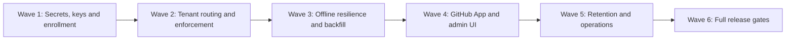

# Task4 — Robustness, Security, Administration and Operations

**Authoritative Task4 tracker**
Last updated: **2026-07-31**

Task4 begins from the documented post-E13 Task2 checkpoint. Task2 continues
to own lifecycle metric truth; Task4 owns reliable delivery, credentials,
repository policy, administration, retention and operations. The authoritative
cross-task context is `docs/handoffs/TASK2_TO_TASK4.md`.
The broader program dependency map is maintained in [`ROUGH_ROADMAP.md`](ROUGH_ROADMAP.md).
Git AI’s maintained Task2 patch inventory is
[`docs/GIT_AI_TASK2_CHANGES.md`](docs/GIT_AI_TASK2_CHANGES.md).

## Status legend

| Symbol | Meaning |
|---|---|
| 🟢 ✅ | Complete for the stated scope and manually verified live |
| 🟡 ◐ | Partial foundation, automated-test-only, or further scenarios remain |
| 🔴 ☐ | Not implemented or not tested for the stated scope |
| ⚪ — | Not applicable |

“Verified” means the Task4 acceptance behavior was observed, not merely that a
related Task1/Task2 component exists.

## Master Task4 matrix

| ID | Milestone | Implementation and portability | Implemented | Tested & verified | Manual involvement | Dependencies | Priority/order | Evidence / remaining work |
|---|---|---|---:|---:|---|---|---|---|
| **5.5.1** | Master Secret Injection Interface | Read one portable runtime master-key interface; SaaS may inject it through managed secrets while VPC/on-prem uses Kubernetes Secrets or an environment file. | 🟢 ✅ | 🟡 ◐ | **Implement:** user must provision non-production and production secrets. **Verify:** required. | Post-E13 checkpoint | **Wave 1 · 1** | Versioned server-only environment keyring is implemented with strict 32-byte base64 validation, active-key selection, bounded versions and redacted serialization. The non-production runtime keyring passed live validation and an in-memory staged rotation without changing `.env`; production secret-store injection remains a deployment/release-gate task requiring user cooperation. |
| **5.5.2** | Application-Layer Envelope Encryption | Encrypt sensitive credentials before PostgreSQL writes using Node cryptography and versioned ciphertext metadata; remain independent of Supabase-specific encryption. | 🟢 ✅ | 🟡 ◐ | **Implement:** no routine cooperation beyond secret setup. **Verify:** required backup/restore and wrong-key tests. | 5.5.1 | **Wave 1 · 2** | Portable AES-256-GCM envelope encryption uses a random data key per value and authenticates tenant/purpose/resource context. Automated and live checks prove randomized round trips, tamper/context rejection, old-key readability during rotation, new-envelope rejection by a retired keyring and encrypted serialization/restore. The first persistent reversible credential consumer is the Wave 4 GitHub App lifecycle, so its database restore gate remains there. |
| **5.5.3** | Developer-Key Lifecycle | Generate opaque machine credentials, store only strong hashes, bind them to tenant/machine status, and support grant, rotation and revocation without a proprietary issuer. | 🟢 ✅ | 🟢 ✅ | **Implement:** admin-flow decisions required. **Verify:** required on at least two machines/tenants. | 5.5.1, 5.5.2 | **Wave 1 · 3** | Managed `trk_v1` authentication, one-time issuance, staged rotation, credential revocation and whole-machine revocation are implemented with tenant-scoped immutable audit. Live verification simulated two logical installations on the single Mac across Company A/B: both initial credentials authenticated, wrong secrets failed, old/new overlap worked, explicit old-key revocation failed closed, whole-machine revocation rejected every remaining key, and no probe credential remained active. Plaintext tokens were neither printed nor stored. |
| **5.6.1** | Repository Enrollment Registry | Add tenant-owned machine/repository grants with canonical repository identity, optional branch rules, effective interval, status and audit history in portable relational tables. | 🟢 ✅ | 🟢 ✅ | **Implement:** policy defaults require user approval. **Verify:** required for Company A and B. | 5.5.3; Task2 E13 checkpoint | **Wave 1 · 4** | Enrollment/grant/revocation services and deny-by-default effective lookup are implemented using the approved branch defaults. The live Company A/B rollback gate accepted same-tenant enrollment/grants, rejected four A↔B machine/repository/grant crossings at composite foreign keys, proved audit immutability, left zero probe rows and preserved all Task2 lifecycle counts. |
| **5.6.2** | Per-Repository Tenant Resolution | Bind tenant/key context when an event is queued, use a portable local policy cache, and support one developer machine working across organizations without a mutable global-key race. | 🟢 ✅ | 🟢 ✅ | **Implement:** cooperation required to configure both organizations. **Verify:** required with live key switching, offline backlog and restart. | 5.5.3, 5.6.1 | **Wave 2 · 5** | The Git AI client has a versioned non-secret repository policy, owner-only multi-key credential keyring, schema-v6 immutable queue bindings, atomic policy quarantine and bound upload partitioning by queued API/key identity. One Mac exercised two isolated logical company profiles in one durable queue: A/B rows retained distinct tenant/repository/branch/key IDs offline, survived hard daemon restart, and delivered once through their exact credentials after recovery. The database plus WAL/SHM are forced to `0600`; no credential is stored in SQLite or printed. Automated routing, rotation, restart, quarantine and partial-error remapping also pass. |
| **5.6.3** | Server-Side Scope Enforcement | Resolve the active machine grant and reject or quarantine every out-of-policy repository/branch event; never trust only the client allowlist. | 🟢 ✅ | 🟢 ✅ | **Implement:** no routine cooperation. **Verify:** required cross-tenant negative test. | 5.6.1, 5.6.2 | **Wave 2 · 6** | Managed authentication carries explicit machine context into ingestion, which independently resolves the active tenant/machine/enrollment/grant interval and branch rule. Live HTTP tests used both managed credentials: each allowed index was retained only in its tenant, both A→B and B→A repository crossings were rejected, `main` was rejected against `task4-wave2/*`, and partial acknowledgements preserved original indexes `1,2`. Credentials and raw payloads were not printed. Legacy static ingestion tokens retain the Task2 transitional tenant-only path pending their retirement gate. |
| **5.4.1** | Idempotency and Deduplication Engine | Persist provider delivery IDs and logical event fingerprints transactionally; work with ordinary PostgreSQL rather than a cloud cache. | 🟢 ✅ | 🟢 ✅ | **Implement:** none. **Verify:** helpful live redelivery plus required automated concurrency tests. | 5.6.1, 5.6.3 | **Wave 2 · 7** | Portable PostgreSQL delivery evidence, fingerprint indexes, projection cursors, atomic leases and fencing are wired into GitHub webhook ingestion. Every delivery ID remains auditable even when evidence repeats; duplicate effects are stopped by the cursor. Migration `0004` is applied and journaled. Automated plus rollback-only live A/B checks prove tenant isolation, terminal replay acknowledgement, active retry, failed recovery, projected resume, expired-lease fencing/reclaim and zero residue. |
| **5.4.2** | Chronological Order Enforcement | Compare authoritative provider timestamps/versions before mutable projections change while retaining late immutable evidence for audit. | 🟢 ✅ | 🟢 ✅ | **Implement:** none. **Verify:** helpful live out-of-order redelivery. | 5.4.1 | **Wave 2 · 8** | Provider-native timestamps and stable PR/branch/deployment identities drive row-locked cursors. Live rollback verification proves newer evidence alone invokes projection, while duplicate, stale, equal-time conflict and missing-time evidence receives explicit terminal acknowledgement without projection mutation. Company A/B cursors remain tenant-isolated and Task2 lifecycle counts stay unchanged. |
| **5.4.3** | Fail-Safe Retry Signalling | Return deterministic retryable `503` responses for transient server/database failures and non-retryable acknowledgements for accepted or quarantined input across providers. | 🟢 ✅ | 🟢 ✅ | **Implement:** none. **Verify:** required fault injection. | 5.4.1 | **Wave 2 · 9** | GitHub validates delivery IDs, acknowledges terminal evidence with `200`, returns `503` plus `Retry-After` for active leases/transient failures, and releases failed projection or enrichment work for fenced recovery. A signed live HTTP probe used a disposable port, secret and intentionally unreachable PostgreSQL adapter: it received the exact generic `503` response and `Retry-After: 5`, wrote no database rows and printed no raw payload. |
| **5.4.4** | Durable Offline Queue and Crash Recovery | Git hooks enqueue locally without waiting on network; prioritize commit/rewrite evidence; persist original tenant/repository/time and retry with bounded exponential backoff and jitter. | 🟡 ◐ | 🟡 ◐ | **Implement:** no routine cooperation. **Verify:** required offline, IDE/daemon restart and machine-restart exercise. | 5.5.3, 5.6.1–5.6.3, 5.4.1–5.4.3 | **Wave 3 · 10** | The Wave 2 routing subset is proven: A/B checkpoint rows were durably bound before delivery, accumulated classified connection failures without blocking local commits, survived hard daemon restart, retained exact key IDs, and later acknowledged once after controlled retry rescheduling. Queue DB/WAL/SHM are owner-only. Wave 3 still owns priority ordering, bounded retry exhaustion, poison isolation, the E12c producer/drain barrier, IDE and whole-machine restart, and full crash guarantees. |
| **5.4.5** | Partial Acknowledgement and Poison Quarantine | Complete valid event indexes once, isolate invalid indexes with reason/evidence, and prevent poison events from blocking or repeatedly resending successful work. | 🟡 ◐ | 🟡 ◐ | **Implement:** none. **Verify:** helpful manual inspection; automated replay is mandatory. | 5.4.1, 5.4.3, 5.4.4, 5.6.3 | **Wave 3 · 11** | Indexed upload errors exist, but repository-scope failure currently closes the whole batch and no durable quarantine/operator workflow exists. |
| **5.4.6** | Enrollment Watermarks and Controlled Backfill | Support from-now, bounded and explicitly approved historical ingestion independently for generation/session evidence and commits/Notes, preserving original occurrence time. | 🔴 ☐ | 🟡 ◐ | **Implement:** user must select policy defaults. **Verify:** required using an old local queue and repository history, then repeated across OpenCode, Copilot, Codex and Antigravity-supported agents. | 5.4.4, 5.4.5, 5.6.1–5.6.3 | **Wave 3 · 12** | E15 reproduced the missing-watermark defect: after a server reset, OpenCode reused its external conversation ID and retransmitted five earlier usage records. TrackAI accepted **237,618 stale tokens** alongside **1,068,513 current-run tokens**, yielding a contaminated 1,306,131-token total even though LoC evidence remained correct. Implement enrollment/evidence-type watermarks, explicit bounded backfill, delayed/backfill labelling and reset-safe fingerprint continuity. Verify that IDE restart, persisted conversations and new conversations neither replay old usage nor suppress legitimate new usage; watch for the same behavior across every supported agent/model. |
| **5.5.4** | GitHub App Credential Lifecycle | Store installation credentials per tenant with envelope encryption, rotation, revocation, least privilege and audit; keep the implementation portable. | 🟡 ◐ | 🟡 ◐ | **Implement:** user must manage GitHub App settings/private-key rotation. **Verify:** required for both installations. | 5.5.1, 5.5.2 | **Wave 4 · 13** | Task2’s read-only GitHub App client and two live installation IDs work. Credentials remain environment-based and lack administrative lifecycle/audit. |
| **5.6.4** | Admin Policy and Lifecycle UI | Let tenant admins enroll/revoke machines, approve repositories, set branches/backfill, rotate keys and inspect rejection/quarantine audit records through protected APIs/UI. | 🔴 ☐ | 🔴 ☐ | **Implement:** user acceptance and policy decisions required. **Verify:** required with Company A/B administrators. | 5.4.5, 5.4.6, 5.5.3, 5.5.4, 5.6.1–5.6.3 | **Wave 4 · 14** | No production administration flow exists. It must use existing tenant/SSO boundaries and never permit cross-tenant lookup. |
| **5.7.1** | Retention, Archive and Production Export | Apply tenant policy without breaking immutable audit requirements; produce versioned, reproducible exports containing observed and audited values. | 🔴 ☐ | 🔴 ☐ | **Implement:** retention/export policy decisions required. **Verify:** required restore and reproducibility review. | 5.4.1, 5.4.6, 5.6.1 | **Wave 5 · 15** | No retention/archive/export implementation exists. Pricing and metric corrections must remain versioned rather than rewriting evidence. |
| **5.7.2** | Delivery and Evidence Monitoring | Show rejected, quarantined, delayed, retried and unresolved evidence with tenant-safe operator diagnostics; avoid requiring raw database inspection. | 🔴 ☐ | 🔴 ☐ | **Implement:** operator UX review helpful. **Verify:** required fault-injection walkthrough. | 5.4.1–5.4.6, 5.6.3 | **Wave 5 · 16** | Current diagnosis uses terminal/SQLite/Supabase inspection. No operator-facing monitoring exists. |
| **5.8.1** | Local/Offline Lifecycle Release Gate | Prove enrolled generation, uncommitted work, local commits, offline restart/retry and later push converge once without blocking Git or losing timestamps. | 🟡 ◐ | 🟡 ◐ | **Implement:** manual cooperation required. **Verify:** required. | Waves 1–5; Task2 metric invariants | **Wave 6 · 17** | Task2 proved live local upload paths but not the production enrollment/offline/crash contract. Run incrementally and again at release. |
| **5.8.2** | SCM Lifecycle Release Gate | Prove manual/AI commits through push, PR update/close, amend/rebase/squash, merge, deployment and revert/rollback with immutable lineage and no double counting. | 🟡 ◐ | 🟡 ◐ | **Implement:** manual GitHub cooperation required. **Verify:** required. | Waves 1–5; Task2 E1–E16 | **Wave 6 · 18** | Task2 E1–E12 cover substantial deterministic behavior. Remaining Task2 fixes and Task4 reliability controls must be included in the final rerun. |
| **5.8.3** | Multi-Tenant/Security Release Gate | Exercise Company A/B identities, keys, machines, installations, repositories, JWT reads, revocation and quarantine concurrently and under replay. | 🟡 ◐ | 🟡 ◐ | **Implement:** manual two-tenant cooperation required. **Verify:** required. | 5.5.*, 5.6.*, 5.4.* | **Wave 6 · 19** | E11 proved baseline login isolation and exposed the global-key race. Production grants, revocation and quarantine remain untested. |
| **5.8.4** | Operations/Export Release Gate | Demonstrate monitoring explanations and reproduce observed/audited totals after retention, archive and versioned export/restore. | 🔴 ☐ | 🔴 ☐ | **Implement:** manual policy cooperation required. **Verify:** required. | 5.7.1, 5.7.2; other 5.8 gates | **Wave 6 · 20** | No implementation or release evidence exists. Operational finding: the canonical `0000`–`0002` chain assumes an earlier manually provisioned schema and cannot bootstrap empty PostgreSQL; add and verify a reproducible baseline before the release gate. |

## Execution waves

Items may be designed in parallel inside a wave, but implementation advances
only after its listed dependencies have stable contracts. The 5.8 tests run
incrementally and are repeated as mandatory release gates after Wave 5.

## Brief regression watchlist

| Task4 surface | Likely regression | How the agent and user avoid it |
|---|---|---|
| Keys/encryption (Wave 1) | Existing ingestion or GitHub App access stops after rotation, or secrets leak into logs/browser responses. | Version ciphertext, support staged rotation, test old/new/wrong keys, scan logs and Git before every checkpoint. |
| Tenant routing/grants (Waves 1–2) | A valid key accepts the wrong repository, or a queued Company B event is delivered as Company A. | Bind tenant/repository when queued; rerun both A→B and B→A negative tests after every policy change. |
| Dedup/order/retry/backfill (Waves 2–3) | Duplicate, stale or lost events change Generated, Committed, Reworked or token totals. | Keep raw evidence immutable; replay identical/out-of-order/partial batches and reconcile golden totals before/after restart. |
| Admin/retention/export (Waves 4–5) | SSO/RLS isolation breaks, or cleanup/export rewrites observed history. | Use protected tenant-scoped APIs, dry runs and backups; retain audited overlays and prove export/restore totals exactly. |
| Shared schema/ingestion/UI | Task4 infrastructure accidentally changes Task2 metric meaning or `Unavailable` semantics. | Compare against Task2 fixtures and lifecycle equations; stop and coordinate any shared-contract change before merging. |

At the end of every wave, rerun the smallest affected release gate plus Company
A/B isolation. At the final gate, repeat the complete lifecycle suite rather
than relying only on unit tests from individual waves.

## Task ownership and integration contract

| Task | Owns |
|---|---|
| **Task2** | Attribution, Generated/Committed/Reworked definitions, lifecycle reconciliation, metric corrections and lifecycle UI truth |
| **Task4** | Queueing, transport, keys, encryption, repository grants/policy, administration, retention, export and operations |
| **Shared surfaces** | Database schema, telemetry ingestion, machine authentication and lifecycle dashboard/API integration |

Task2 and Task4 use separate branches and worktrees. Shared-surface changes are
integrated only at documented checkpoint commits; neither task overwrites or
copies uncommitted changes from the other worktree.

Task4 does **not** wait for T2.14, remaining T2.21 trends/deep links or T2.22.
T2.23 and T2.24 are green; Task4 preserves their contracts while independently
implementing delivery, security, repository policy and operations hardening.

## Security and portability invariants

- Never store secrets, private keys or plaintext developer tokens in Git,
  browser responses, logs or handoff documents.
- PostgreSQL and standard application cryptography remain the portable source
  of truth; managed cloud services are optional deployment adapters.
- Raw evidence is immutable. Corrections, quarantine decisions, retention and
  exports are explicit, audited and versioned.
- Repository and branch authorization is evaluated using tenant-owned grants;
  a valid API key alone never authorizes an arbitrary repository.
- Missing, delayed, rejected and unresolved evidence remains distinguishable
  from zero and from successfully processed evidence.

## Readiness to open the separate Task4 Codex task

- [x] E13 is complete for the accepted scope and reflected in the canonical Task2 tracker.
- [x] TrackAI Task2 checkpoint is committed, pushed, merged and clean.
- [x] Git AI Task2 checkpoint is committed, pushed and clean.
- [x] `docs/handoffs/TASK2_TO_TASK4.md` contains exact immutable SHAs.
- [x] The handoff passes its secret scan and reproducibility review.
- [x] Dedicated Task4 branches/worktrees are created from those SHAs.

## Wave 1 implementation evidence

| Date | Scope | Status | Evidence / next gate |
|---|---|---:|---|
| 2026-07-31 | W1.0 isolated baselines | 🟢 ✅ | TrackAI `feature/task4-hardening` starts at `18d56e3`; Git AI `feature/task4-client-hardening` starts at `a77081cba`. TrackAI API baseline passed 42 tests and its TypeScript build; the web production build passed with non-secret build-only public values. |
| 2026-07-31 | W1.0 live database recovery checkpoint | 🟢 ✅ | Read-only preflight reached the remote database, confirmed the migration journal exists and confirmed zero Task4 security tables before application. A custom-format pre-Wave-1 backup (3,165,249 bytes) was created outside both repositories, verified with `pg_restore --list`, and restricted to owner-only mode `0600`; its local path and database contents are intentionally not versioned. |
| 2026-07-31 | W1 migration live dry run | 🟢 ✅ | Migration `0003_lean_prima.sql` applied successfully inside a live PostgreSQL transaction with a bounded lock/statement timeout, exposed all five expected Task4 security tables inside that transaction, and rolled back cleanly to zero Task4 tables. No persistent schema change was made by the dry run. |
| 2026-07-31 | W1 migration live application | 🟢 ✅ | The live Drizzle journal matched all three pre-Task4 SQL hashes and exposed only `0003_lean_prima` as pending. The migration then applied persistently: five Task4 security tables exist, all five have RLS enabled, the journal has four matching rows, no plaintext credential columns exist, and the append-only audit trigger is present for both `UPDATE` and `DELETE`. An initial checker incorrectly expected one `information_schema.triggers` row for a two-event trigger; the corrected PostgreSQL catalog check passed, so this was a verification-script defect rather than a schema defect. |
| 2026-07-31 | W1 live Company A/B isolation | 🟢 ✅ | A reusable rollback-only verifier simulated two logical installations on the single development Mac. Same-tenant credentials, enrollments and grants were accepted; cross-tenant machine credentials, repository enrollments, machine grants and enrollment grants were rejected by named composite foreign keys. Audit `UPDATE` and `DELETE` were rejected, rollback left zero probe rows, and Task2 lifecycle-table counts were unchanged before/after. |
| 2026-07-31 | 5.5.3 live managed-key lifecycle | 🟢 ✅ | The production service functions registered two logical installations across Company A/B, issued tenant-bound credentials, rejected a wrong secret, maintained a controlled old/new rotation overlap, rejected the explicitly revoked old credential, and rejected all remaining credentials after whole-machine revocation. No probe credential remained active, plaintext tokens were never printed/stored, and revoked records plus immutable audit events remain as the intended verification trail. |
| 2026-07-31 | 5.5.1–5.5.2 live key/envelope gate | 🟢 ✅ | The configured non-production runtime keyring validated without exposing key material. A synthetic envelope survived encrypted serialization/restore and a staged in-memory master-key rotation; the retired keyring rejected new ciphertext, tenant-context crossing failed authentication, and all temporary artifacts were removed. `.env` and the active runtime key were not modified. |
| 2026-07-31 | 5.5.1–5.5.2 security foundation | 🟡 ◐ | Five new key/encryption tests pass alongside all 42 Task2 regressions (47 total), and the API TypeScript build passes. No real secrets or database records were used. Next: threat-review the format, then add the developer-key and repository-grant schema through a dry-run migration. |
| 2026-07-31 | 5.5.3 and 5.6.1 managed auth and registry | 🟡 ◐ | Managed authentication/lifecycle and enrollment/grant services compile; 52 total API tests pass. Migration `0003_lean_prima.sql` was applied to disposable PostgreSQL restored from the exact pre-Task4 schema. Synthetic A/B crossings failed at composite foreign keys; RLS, append-only audit and absence of plaintext credential columns passed. Live backup/application and tenant verification remain. |
| 2026-07-31 | Production dependency audit | 🟡 ◐ | The focused API checkpoint upgraded `drizzle-orm` to patched `0.45.2` and aligned `drizzle-kit` at `0.31.10`; 52 API tests, TypeScript and `drizzle-kit check` pass. Drizzle's high-severity identifier-escaping finding is gone from `npm audit --omit=dev`. Two high-severity production findings remain in Next.js and transitive PostCSS and still block the final security gate; handle them in a separate full web regression checkpoint rather than an unreviewed forced audit fix. |
| 2026-07-31 | Drizzle 0.45 compatibility | 🟢 ✅ | The existing tenant query helper needed a type-only adaptation for Drizzle 0.45's generic `from()` guard: it now explicitly selects the table's typed columns and narrows only the table argument. Tenant predicates and generated SQL behavior are unchanged. Root development tooling pins the same ORM version so the hoisted Kit CLI resolves its required peer; the workspace dependency tree is deduplicated. |
| 2026-07-31 | Wave 1 incremental release gate | 🟢 ✅ | After the focused Drizzle security upgrade, 53 API tests (42 Task2 lifecycle, 10 Task4 security and one tenant SQL-shape regression), TypeScript, `drizzle-kit check`, the upgraded live no-op migration runner, the web production build, secret scan and `git diff --check` passed. The live Company A/B rollback gate again blocked four cross-tenant writes, preserved audit immutability, left zero residue and kept Task2 lifecycle counts unchanged. Wave 1 implementation is complete for the non-production checkpoint; production secret-store injection remains in the final deployment gate and the first persistent envelope-encrypted GitHub credential remains Wave 4 scope. |

## Wave 2 implementation evidence

| Date | Scope | Status | Evidence / next gate |
|---|---|---:|---|
| 2026-07-31 | 5.6.2 immutable client routing foundation | 🟢 ✅ | Git AI schema v6 stores tenant, normalized repository, branch, API base URL and credential key ID with each queued row while never storing the reusable token in SQLite. A versioned local repository policy and owner-only (`0600`) credential keyring support multiple logical tenants on one Mac. Tests prove A/B events in one worker batch retain distinct bindings, legacy schema-v5 rows migrate without invented identity, ambiguous/unknown repositories fail closed, old queued keys remain exact during rotation overlap, removed keys never fall forward, incomplete configuration quarantines rather than globally uploads, and A/B partial acknowledgements map back to original row indexes. The live single-Mac/two-profile gate kept A/B rows separately bound offline, survived hard daemon restart, retained retry state, then acknowledged both after recovery. A live finding hardened the queue database and its WAL/SHM sidecars to `0600`; all 43 metrics DB tests pass. |
| 2026-07-31 | 5.6.3 managed-machine repository/branch enforcement | 🟡 ◐ | Managed authentication now carries explicit machine context into telemetry ingestion. The server resolves only tenant-owned repositories and calls the existing active machine/enrollment/grant/branch evaluator; it no longer relies on the client policy or Task2 organization auto-discovery for managed keys. Missing repository, malformed URL, cross-tenant/unenrolled repository and denied branch return original-batch indexed policy errors, while authorized siblings are ingested through a bounded partition/remap contract. All 55 API tests and the TypeScript build pass. Next: live rollback-only A/B HTTP verification and rejection/audit operational evidence. |
| 2026-07-31 | 5.4.1–5.4.3 provider delivery hardening | 🟡 ◐ | GitHub webhook ingestion now persists immutable tenant-bound delivery evidence, uses five-minute fenced processing leases, serializes stable PR/branch/deployment cursors, blocks stale/conflicting/unsequenced projection mutations, resumes projected enrichment after failure, and emits deterministic `400`/`200`/`503` outcomes without logging raw payloads. Fingerprints are indexed rather than unique so every provider delivery ID remains auditable. All 64 API tests, TypeScript and Drizzle consistency pass. Migration `0004_majestic_lucky_pierre` applied successfully inside a rollback-only remote transaction: both tables, RLS, lease column, two indexes and immutable-evidence trigger passed; operational status updates remained allowed and rollback left zero tables. Next: fresh backup, persistent migration, then live A/B concurrency/order/fault verification. |
| 2026-07-31 | 5.4.1–5.4.2 live A/B delivery and chronology gate | 🟢 ✅ | A fresh 0600 pre-Wave-2 backup was verified, migration `0004_majestic_lucky_pierre` applied persistently, and the read-only schema gate confirmed two provider tables, RLS, lease column, two indexes, immutable trigger, no plaintext-secret columns and five Drizzle journal rows. The rollback-only live store verifier used Company A/B with the same delivery ID and projection key, proved tenant isolation, active-lease retry, changed-evidence conflict, duplicate/stale/equal-time/unsequenced suppression, newer-event projection, failed recovery, projected resume and expired-worker fencing/reclaim. Exactly four legitimate projection callbacks ran; rollback left zero probe rows and all Task2 lifecycle counts were unchanged. |
| 2026-07-31 | 5.6.2–5.6.3 live client/server routing gate | 🟢 ✅ | Two isolated branches on one Mac queued one Company A and one Company B checkpoint while TrackAI was offline. Both rows had distinct immutable tenant, repository, branch and credential-key bindings, recorded connection retries, survived hard daemon restart and later acknowledged exactly once. Supported `ai_tab` probes then produced one generated physical line per tenant; read-only server verification found normalized evidence, Task2 `Generated` and per-model lifecycle projections, accepted-line evidence as `Unavailable`, and zero cross-tenant rows. Live partial-ack HTTP batches retained only each tenant's allowed index and rejected both cross-tenant repository and denied-branch indexes at original positions `1,2`. API tests/build pass 64/64; credentials and raw payloads were never printed. |
| 2026-07-31 | 5.4.3 live provider HTTP fault gate | 🟢 ✅ | A disposable API on port `8082` used a temporary local webhook secret and an unreachable PostgreSQL adapter. A correctly signed GitHub push request passed signature/body parsing, failed only at the transient database boundary, and returned generic HTTP `503` with `Retry-After: 5`. No customer credential, real webhook secret, raw payload or database row was exposed or created. |
| 2026-07-31 | Wave 2 temporary credential cleanup | 🟢 ✅ | Cleanup dry-run identified exactly two logical profiles. Applied cleanup revoked both machines and their credentials, grants and enrollments; removed the local policy, keyring and manifest; retained immutable audit history; and the read-only preflight confirmed Company A/B each had zero active credentials, enrollments and grants. The retained evidence-only SQLite queue is a regular 53,248-byte file with owner-only `0600` permissions. |
| 2026-07-31 | Wave 2 final release gates | 🟢 ✅ | TrackAI passes 64 API tests, TypeScript build and Drizzle consistency against the applied five-entry journal. Git AI passes formatting, all 2,122 library tests and the normal development build. Secret scans found no managed credential, private key or master-key value in either change set; the local API `.env` remains ignored/untracked and `0600`. Wave 2 routing, enforcement, provider idempotency/order and retry signalling are complete; Wave 3 retains poison quarantine, backfill/watermarks and the broader offline/crash matrix. |
