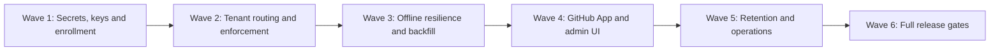

# Task4 — Robustness, Security, Administration and Operations

**Authoritative Task4 tracker**
Last updated: **2026-07-30**

Task4 begins from the documented post-E13 Task2 checkpoint. Task2 continues
to own lifecycle metric truth; Task4 owns reliable delivery, credentials,
repository policy, administration, retention and operations. The authoritative
cross-task context is `docs/handoffs/TASK2_TO_TASK4.md`.
The broader program dependency map is maintained in [`ROUGH_ROADMAP.md`](ROUGH_ROADMAP.md).
Git AI’s maintained Task2 patch inventory is
[`docs/GIT_AI_TASK2_CHANGES.md`](docs/GIT_AI_TASK2_CHANGES.md).

## Status legend

| Symbol | Meaning |
|---|---|
| 🟢 ✅ | Complete for the stated scope and manually verified live |
| 🟡 ◐ | Partial foundation, automated-test-only, or further scenarios remain |
| 🔴 ☐ | Not implemented or not tested for the stated scope |
| ⚪ — | Not applicable |

“Verified” means the Task4 acceptance behavior was observed, not merely that a
related Task1/Task2 component exists.

## Master Task4 matrix

| ID | Milestone | Implementation and portability | Implemented | Tested & verified | Manual involvement | Dependencies | Priority/order | Evidence / remaining work |
|---|---|---|---:|---:|---|---|---|---|
| **5.5.1** | Master Secret Injection Interface | Read one portable runtime master-key interface; SaaS may inject it through managed secrets while VPC/on-prem uses Kubernetes Secrets or an environment file. | 🔴 ☐ | 🔴 ☐ | **Implement:** user must provision non-production and production secrets. **Verify:** required. | Post-E13 checkpoint | **Wave 1 · 1** | No production master-secret contract exists. Never commit the key or expose it to the browser. |
| **5.5.2** | Application-Layer Envelope Encryption | Encrypt sensitive credentials before PostgreSQL writes using Node cryptography and versioned ciphertext metadata; remain independent of Supabase-specific encryption. | 🔴 ☐ | 🔴 ☐ | **Implement:** no routine cooperation beyond secret setup. **Verify:** required backup/restore and wrong-key tests. | 5.5.1 | **Wave 1 · 2** | GitHub App and future provider credentials are currently runtime configuration rather than encrypted tenant records. |
| **5.5.3** | Developer-Key Lifecycle | Generate opaque machine credentials, store only strong hashes, bind them to tenant/machine status, and support grant, rotation and revocation without a proprietary issuer. | 🔴 ☐ | 🔴 ☐ | **Implement:** admin-flow decisions required. **Verify:** required on at least two machines/tenants. | 5.5.1, 5.5.2 | **Wave 1 · 3** | Task1’s `TRACKAI_INGEST_TOKENS_JSON` is a temporary plaintext environment map, not the production lifecycle. |
| **5.6.1** | Repository Enrollment Registry | Add tenant-owned machine/repository grants with canonical repository identity, optional branch rules, effective interval, status and audit history in portable relational tables. | 🟡 ◐ | 🟡 ◐ | **Implement:** policy defaults require user approval. **Verify:** required for Company A and B. | 5.5.3; Task2 E13 checkpoint | **Wave 1 · 4** | Repository records and canonical URLs exist, but explicit machine grants, policy history and revocation do not. E11 defines the negative case. |
| **5.6.2** | Per-Repository Tenant Resolution | Bind tenant/key context when an event is queued, use a portable local policy cache, and support one developer machine working across organizations without a mutable global-key race. | 🔴 ☐ | 🟡 ◐ | **Implement:** cooperation required to configure both organizations. **Verify:** required with live key switching, offline backlog and restart. | 5.5.3, 5.6.1 | **Wave 2 · 5** | E11 reproduced a delayed Company B event delivered under Company A after a global key change. No production client-side resolver exists. |
| **5.6.3** | Server-Side Scope Enforcement | Resolve the active machine grant and reject or quarantine every out-of-policy repository/branch event; never trust only the client allowlist. | 🟡 ◐ | 🟡 ◐ | **Implement:** no routine cooperation. **Verify:** required cross-tenant negative test. | 5.6.1, 5.6.2 | **Wave 2 · 6** | Task2’s organization/enrolled-repository preflight rejected the E11 crossing before raw storage. Replace it with explicit grants, audit and quarantine. |
| **5.4.1** | Idempotency and Deduplication Engine | Persist provider delivery IDs and logical event fingerprints transactionally; work with ordinary PostgreSQL rather than a cloud cache. | 🟡 ◐ | 🟡 ◐ | **Implement:** none. **Verify:** helpful live redelivery plus required automated concurrency tests. | 5.6.1, 5.6.3 | **Wave 2 · 7** | Telemetry batches/events already deduplicate by tenant hash/fingerprint. Generalized GitHub webhook delivery deduplication and concurrent claims remain. |
| **5.4.2** | Chronological Order Enforcement | Compare authoritative provider timestamps/versions before mutable projections change while retaining late immutable evidence for audit. | 🔴 ☐ | 🔴 ☐ | **Implement:** none. **Verify:** helpful live out-of-order redelivery. | 5.4.1 | **Wave 2 · 8** | No generalized stale-event protection exists. “Reject” means skip stale projection changes, not discard immutable evidence. |
| **5.4.3** | Fail-Safe Retry Signalling | Return deterministic retryable `503` responses for transient server/database failures and non-retryable acknowledgements for accepted or quarantined input across providers. | 🟡 ◐ | 🟡 ◐ | **Implement:** none. **Verify:** required fault injection. | 5.4.1 | **Wave 2 · 9** | Machine authentication and telemetry ingestion return `503` for temporary failures. Generalized webhook classification and provider retry tests remain. |
| **5.4.4** | Durable Offline Queue and Crash Recovery | Git hooks enqueue locally without waiting on network; prioritize commit/rewrite evidence; persist original tenant/repository/time and retry with bounded exponential backoff and jitter. | 🟡 ◐ | 🟡 ◐ | **Implement:** no routine cooperation. **Verify:** required offline, IDE/daemon restart and machine-restart exercise. | 5.5.3, 5.6.1–5.6.3, 5.4.1–5.4.3 | **Wave 3 · 10** | Git AI has a persistent SQLite delivery queue and delivered/pending state. E12c exposed a drain-barrier defect: `git-ai await` returned before the asynchronously spawned rewrite-metric producer persisted event 5807, although the event was subsequently delivered successfully. `await` must cover all accepted command work, async metric producers, queue persistence and delivery up to its barrier. Tenant binding, crash guarantees, prioritization and full offline recovery remain. |
| **5.4.5** | Partial Acknowledgement and Poison Quarantine | Complete valid event indexes once, isolate invalid indexes with reason/evidence, and prevent poison events from blocking or repeatedly resending successful work. | 🟡 ◐ | 🟡 ◐ | **Implement:** none. **Verify:** helpful manual inspection; automated replay is mandatory. | 5.4.1, 5.4.3, 5.4.4, 5.6.3 | **Wave 3 · 11** | Indexed upload errors exist, but repository-scope failure currently closes the whole batch and no durable quarantine/operator workflow exists. |
| **5.4.6** | Enrollment Watermarks and Controlled Backfill | Support from-now, bounded and explicitly approved historical ingestion independently for generation/session evidence and commits/Notes, preserving original occurrence time. | 🔴 ☐ | 🟡 ◐ | **Implement:** user must select policy defaults. **Verify:** required using an old local queue and repository history, then repeated across OpenCode, Copilot, Codex and Antigravity-supported agents. | 5.4.4, 5.4.5, 5.6.1–5.6.3 | **Wave 3 · 12** | E15 reproduced the missing-watermark defect: after a server reset, OpenCode reused its external conversation ID and retransmitted five earlier usage records. TrackAI accepted **237,618 stale tokens** alongside **1,068,513 current-run tokens**, yielding a contaminated 1,306,131-token total even though LoC evidence remained correct. Implement enrollment/evidence-type watermarks, explicit bounded backfill, delayed/backfill labelling and reset-safe fingerprint continuity. Verify that IDE restart, persisted conversations and new conversations neither replay old usage nor suppress legitimate new usage; watch for the same behavior across every supported agent/model. |
| **5.5.4** | GitHub App Credential Lifecycle | Store installation credentials per tenant with envelope encryption, rotation, revocation, least privilege and audit; keep the implementation portable. | 🟡 ◐ | 🟡 ◐ | **Implement:** user must manage GitHub App settings/private-key rotation. **Verify:** required for both installations. | 5.5.1, 5.5.2 | **Wave 4 · 13** | Task2’s read-only GitHub App client and two live installation IDs work. Credentials remain environment-based and lack administrative lifecycle/audit. |
| **5.6.4** | Admin Policy and Lifecycle UI | Let tenant admins enroll/revoke machines, approve repositories, set branches/backfill, rotate keys and inspect rejection/quarantine audit records through protected APIs/UI. | 🔴 ☐ | 🔴 ☐ | **Implement:** user acceptance and policy decisions required. **Verify:** required with Company A/B administrators. | 5.4.5, 5.4.6, 5.5.3, 5.5.4, 5.6.1–5.6.3 | **Wave 4 · 14** | No production administration flow exists. It must use existing tenant/SSO boundaries and never permit cross-tenant lookup. |
| **5.7.1** | Retention, Archive and Production Export | Apply tenant policy without breaking immutable audit requirements; produce versioned, reproducible exports containing observed and audited values. | 🔴 ☐ | 🔴 ☐ | **Implement:** retention/export policy decisions required. **Verify:** required restore and reproducibility review. | 5.4.1, 5.4.6, 5.6.1 | **Wave 5 · 15** | No retention/archive/export implementation exists. Pricing and metric corrections must remain versioned rather than rewriting evidence. |
| **5.7.2** | Delivery and Evidence Monitoring | Show rejected, quarantined, delayed, retried and unresolved evidence with tenant-safe operator diagnostics; avoid requiring raw database inspection. | 🔴 ☐ | 🔴 ☐ | **Implement:** operator UX review helpful. **Verify:** required fault-injection walkthrough. | 5.4.1–5.4.6, 5.6.3 | **Wave 5 · 16** | Current diagnosis uses terminal/SQLite/Supabase inspection. No operator-facing monitoring exists. |
| **5.8.1** | Local/Offline Lifecycle Release Gate | Prove enrolled generation, uncommitted work, local commits, offline restart/retry and later push converge once without blocking Git or losing timestamps. | 🟡 ◐ | 🟡 ◐ | **Implement:** manual cooperation required. **Verify:** required. | Waves 1–5; Task2 metric invariants | **Wave 6 · 17** | Task2 proved live local upload paths but not the production enrollment/offline/crash contract. Run incrementally and again at release. |
| **5.8.2** | SCM Lifecycle Release Gate | Prove manual/AI commits through push, PR update/close, amend/rebase/squash, merge, deployment and revert/rollback with immutable lineage and no double counting. | 🟡 ◐ | 🟡 ◐ | **Implement:** manual GitHub cooperation required. **Verify:** required. | Waves 1–5; Task2 E1–E16 | **Wave 6 · 18** | Task2 E1–E12 cover substantial deterministic behavior. Remaining Task2 fixes and Task4 reliability controls must be included in the final rerun. |
| **5.8.3** | Multi-Tenant/Security Release Gate | Exercise Company A/B identities, keys, machines, installations, repositories, JWT reads, revocation and quarantine concurrently and under replay. | 🟡 ◐ | 🟡 ◐ | **Implement:** manual two-tenant cooperation required. **Verify:** required. | 5.5.*, 5.6.*, 5.4.* | **Wave 6 · 19** | E11 proved baseline login isolation and exposed the global-key race. Production grants, revocation and quarantine remain untested. |
| **5.8.4** | Operations/Export Release Gate | Demonstrate monitoring explanations and reproduce observed/audited totals after retention, archive and versioned export/restore. | 🔴 ☐ | 🔴 ☐ | **Implement:** manual policy cooperation required. **Verify:** required. | 5.7.1, 5.7.2; other 5.8 gates | **Wave 6 · 20** | No implementation or release evidence exists. |

## Execution waves

Items may be designed in parallel inside a wave, but implementation advances
only after its listed dependencies have stable contracts. The 5.8 tests run
incrementally and are repeated as mandatory release gates after Wave 5.

## Brief regression watchlist

| Task4 surface | Likely regression | How the agent and user avoid it |
|---|---|---|
| Keys/encryption (Wave 1) | Existing ingestion or GitHub App access stops after rotation, or secrets leak into logs/browser responses. | Version ciphertext, support staged rotation, test old/new/wrong keys, scan logs and Git before every checkpoint. |
| Tenant routing/grants (Waves 1–2) | A valid key accepts the wrong repository, or a queued Company B event is delivered as Company A. | Bind tenant/repository when queued; rerun both A→B and B→A negative tests after every policy change. |
| Dedup/order/retry/backfill (Waves 2–3) | Duplicate, stale or lost events change Generated, Committed, Reworked or token totals. | Keep raw evidence immutable; replay identical/out-of-order/partial batches and reconcile golden totals before/after restart. |
| Admin/retention/export (Waves 4–5) | SSO/RLS isolation breaks, or cleanup/export rewrites observed history. | Use protected tenant-scoped APIs, dry runs and backups; retain audited overlays and prove export/restore totals exactly. |
| Shared schema/ingestion/UI | Task4 infrastructure accidentally changes Task2 metric meaning or `Unavailable` semantics. | Compare against Task2 fixtures and lifecycle equations; stop and coordinate any shared-contract change before merging. |

At the end of every wave, rerun the smallest affected release gate plus Company
A/B isolation. At the final gate, repeat the complete lifecycle suite rather
than relying only on unit tests from individual waves.

## Task ownership and integration contract

| Task | Owns |
|---|---|
| **Task2** | Attribution, Generated/Committed/Reworked definitions, lifecycle reconciliation, metric corrections and lifecycle UI truth |
| **Task4** | Queueing, transport, keys, encryption, repository grants/policy, administration, retention, export and operations |
| **Shared surfaces** | Database schema, telemetry ingestion, machine authentication and lifecycle dashboard/API integration |

Task2 and Task4 use separate branches and worktrees. Shared-surface changes are
integrated only at documented checkpoint commits; neither task overwrites or
copies uncommitted changes from the other worktree.

Task4 does **not** wait for T2.14, remaining T2.21 trends/deep links or T2.22.
T2.23 and T2.24 are green; Task4 preserves their contracts while independently
implementing delivery, security, repository policy and operations hardening.

## Security and portability invariants

- Never store secrets, private keys or plaintext developer tokens in Git,
  browser responses, logs or handoff documents.
- PostgreSQL and standard application cryptography remain the portable source
  of truth; managed cloud services are optional deployment adapters.
- Raw evidence is immutable. Corrections, quarantine decisions, retention and
  exports are explicit, audited and versioned.
- Repository and branch authorization is evaluated using tenant-owned grants;
  a valid API key alone never authorizes an arbitrary repository.
- Missing, delayed, rejected and unresolved evidence remains distinguishable
  from zero and from successfully processed evidence.

## Readiness to open the separate Task4 Codex task

- [x] E13 is complete for the accepted scope and reflected in the canonical Task2 tracker.
- [x] TrackAI Task2 checkpoint is committed, pushed, merged and clean.
- [x] Git AI Task2 checkpoint is committed, pushed and clean.
- [x] `docs/handoffs/TASK2_TO_TASK4.md` contains exact immutable SHAs.
- [x] The handoff passes its secret scan and reproducibility review.
- [ ] Dedicated Task4 branches/worktrees are created from those SHAs.
