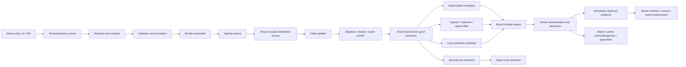

# Task6 — Policy and Security Bundle Architecture

**Status:** design seed for the future Task6 tracker; not an implementation contract
**Last updated:** 2026-08-02
**Inputs:** Task4 tenant/machine/repository foundations, planned Cedar-like
organization policy, capture/upload policy requirements, and the Numbat rule
catalog and rule/deployment/enforcement documentation.

## 1. Executive recommendation

Task6 should move from Task4's small, manually installed client routing snapshot
to a signed, versioned **effective policy bundle** that is provisioned to each
client installation and evaluated locally.

The transition can be incremental because Task4 already provides the essential
bootstrap primitives:

- stable tenant, machine, credential, repository and branch identities;
- a machine credential and owner-only local keyring;
- a versioned local delivery-policy file;
- immutable tenant/repository/branch/key binding at queue time;
- durable offline delivery; and
- authoritative server-side authentication and repository/branch enforcement.

Task6 must retain **dual enforcement**:

1. **Client enforcement** makes pre-action security, capture minimization,
   redaction and offline behavior possible without a network round trip.
2. **Server enforcement** remains authoritative for tenant access, credential
   state, upload admission and customer isolation. A modified or stale client
   must never grant itself additional server access.

The client should therefore know the complete **effective policy applicable to
that client**, but not every policy or secret belonging to the tenant. It does
not need the full organization policy graph after the server has compiled the
effective result for its tenant, group, machine, repositories and rollout ring.

## 2. Why one bundle needs multiple policy forms

Do not force every Task6 rule into Cedar.

| Component | Best fit | Examples | Primary enforcement point |
|---|---|---|---|
| Authorization policy | Cedar-like principal/action/resource/context decisions | Machine may upload for repository; user may administer team; agent/model allowed on branch | Client preflight plus authoritative server check |
| Coding-agent security rules | Numbat-style normalized events plus CEL-like predicates and ordered sequences | Secret read, download-to-shell, credential exfiltration, hook tampering, privilege escalation | Client pre-action hook for supported agents; monitor-only where pre-action enforcement is unavailable |
| Capture policy | Closed declarative schema, not general-purpose code | Observe metrics but not prompts; collect Edit events but not Bash commands; maximum prompt size | Client before local persistence |
| Upload policy | Closed declarative schema plus server admission | Upload prompts for Engineering but not Finance; allow only company-owned organizations; destination and network constraints | Client before queue/upload and server on receipt |
| Redaction policy | Ordered, deterministic transformations over specifically permitted fields | Remove email addresses, API keys and customer identifiers; hash or generalize paths | Client before persistence/upload, repeated defensively at server ingress |
| Retention policy | Declarative time and disposition rules | Delete prompt content after 14 days; retain aggregate metrics for a different period | Client durable store and server retention workers |
| Access policy | Cedar-like principal/action/resource/context decisions | Only Engineering Managers may read prompts; machine may upload metrics for a repository | Client preflight where useful plus authoritative server check |
| Export policy | Cedar-like authorization plus declarative field/destination limits | Auditor may export metrics but not prompt content; export requires approval and expires | Authoritative server export service; client only for explicitly supported local exports |
| Operational metadata | Signed manifest | Bundle identity, hashes, epochs, expiry, compatibility, rollout ring, signer | Client verifier and server registry |

Cedar should decide authorization over stable entities. A security detector needs
event normalization, command parsing and sequence correlation that are not
ordinary resource-authorization decisions. Capture/upload policy must remain
bounded and auditable; arbitrary expressions over raw content would make data
minimization difficult to prove.

### Organization policy families and evaluation pipeline

The organization-defined policy engine should make these six families
first-class rather than treating them as unrelated feature flags:

```text
Policy Engine
├── Capture Policy
├── Upload Policy
├── Redaction Policy
├── Retention Policy
├── Access Policy
└── Export Policy
```

They are evaluated as a pipeline, but remain independently versioned so an
administrator can explain which decision changed:

```text
agent activity
  → capture eligibility
  → redaction/transformation
  → local retention classification
  → upload eligibility and destination
  → server admission
  → server retention
  → read access
  → export authorization and projection
```

An earlier stage can reduce data available to later stages. A later stage may
deny use or movement of data, but cannot recreate content that capture or
redaction removed. Access permission never implies permission to capture,
upload, retain or export, and export permission never implies unrestricted
field access.

Policy conditions should use a closed, versioned vocabulary that covers at
least:

| Dimension | Representative organization rule |
|---|---|
| Repository | Never upload prompts from `payments/*` |
| SCM organization | Upload only for company-owned GitHub organizations |
| File path | Exclude `/secrets/`, `/legal/` and `/customer-data/` |
| Branch | Ignore feature branches or restrict content capture to a protected branch set |
| Content size | Drop or metadata-label prompts larger than 500 KB |
| Model | Permit Claude-derived evidence but not GPT-derived content |
| Tool/event | Upload Edit events but not Bash commands |
| User/group | Exclude contractors; allow Engineering Managers to read prompts |
| Content classification | Remove email addresses, API keys and customer identifiers |
| Retention class | Delete prompt content after 14 or 30 days while retaining permitted aggregates separately |

Repository names, paths, branches, models, tools, users and organizations must
be normalized to stable typed attributes before evaluation. Avoid unbounded
regular expressions or arbitrary code in endpoint policies; define resource
and latency limits for any permitted pattern language.

### Worked organization example

The example requirements resolve into separate decisions rather than one broad
“telemetry allowed” switch:

| Scope | Evidence | Decision |
|---|---|---|
| All repositories | Metrics | Capture and upload, subject to field minimization |
| Engineering repositories | Prompts | Capture, redact and upload unless a stricter applicable deny applies |
| Finance repositories | Prompts | Never upload; capture/local retention must be separately stated and should default to no prompt persistence |
| Security repositories | Git Notes | Upload Git Notes only; other content families remain denied unless explicitly allowed |
| All uploaded prompts | Prompt content | Delete after 14 days on every managed storage tier and record deletion evidence |
| Engineering Managers | Prompt read | Allow only after tenant/resource authorization; this does not itself grant export |

Task6 must define overlap explicitly. Recommended defaults are: mandatory
parent constraints cannot be weakened by a child; an applicable explicit deny
wins over allow; the more data-minimizing transformation wins; retention uses
the shortest applicable maximum unless a legally approved hold applies; and
exceptions are narrow, approved, expiring and audited. The simulator must show
the exact source rules and precedence behind every effective decision.

## 3. Numbat findings relevant to Task6

The current Numbat catalog spans secrets, exfiltration, integrity, execution,
reconnaissance, privilege, lateral movement, impact, source control, tampering,
persistence and ordered sequences. The catalog document explicitly says that
built-in rules are detection-enabled and **do not block by default**, and that a
pre-action match describes a requested action rather than a confirmed outcome.
The authoritative rule definitions are the shipped YAML files, not the catalog
summary. See [Numbat built-in rule catalog](https://github.com/perplexityai/numbat/blob/main/docs/rule-catalog.md).

Numbat rules use stable IDs and rule-owned versions, evaluate a normalized
closed event model with CEL, support single-event and ordered sequence rules,
and carry an explicit `enforce` flag separate from severity. Operator rules can
replace built-ins by stable ID and should include positive and negative tests.
See [Writing Numbat rules](https://github.com/perplexityai/numbat/blob/main/docs/rules.md)
and the [normalized event model](https://github.com/perplexityai/numbat/blob/main/docs/event-model.md).

Numbat enforcement is mediated by each coding-agent host's synchronous
pre-action hook. Numbat requests a native deny; the host remains the actual
enforcement point. Post-action, OTLP and at-rest observations cannot prevent an
already executed action. Its documented clean-decision gate and host-specific
fail behavior demonstrate why TrackAI must record enforcement capability and
decision certainty per agent rather than promise universal blocking. See
[Numbat enforcement](https://github.com/perplexityai/numbat/blob/main/docs/enforcement.md).

Numbat documents user, project and managed/system hook scopes, agent-specific
configuration precedence, fleet rollout concerns, durable local output and the
need to verify that an agent actually loaded a hook. These are useful Task6 and
Task9 inputs; writing a policy file does not prove activation. See
[Numbat deployment](https://github.com/perplexityai/numbat/blob/main/docs/deployment.md).

Numbat is Apache-2.0 licensed. Task6 must still perform a deliberate
reuse-versus-adaptation decision, retain required notices for copied or derived
material, identify modified files and record upstream rule provenance. See the
[Numbat license](https://github.com/perplexityai/numbat/blob/main/LICENSE).

### Numbat evaluation workstream

For every candidate upstream rule, Task6 should record:

| Field | Required decision |
|---|---|
| Source | Upstream repository, path, commit SHA and license |
| Rule identity | Stable TrackAI ID, upstream ID and upstream version |
| Evidence requirement | Event types and fields needed to evaluate correctly |
| Fidelity | Which agents/hooks provide pre-action, post-action or incomplete evidence |
| Effect | Observe, notify, require approval where supported, or deny |
| Certainty | Conditions that permit enforcement versus monitor-only behavior |
| Data handling | Whether evaluation requires sensitive command/content fields and whether those fields may leave the endpoint |
| Exceptions | False-positive exclusions, approved tools/destinations and bounded overrides |
| Tests | Positive, negative, ambiguous, malformed, bypass and version-compatibility fixtures |

The catalog is evolving. Task6 discovery—not Task4 documentation—will own the
exact accepted rule inventory and count.

## 4. Target architecture



### Control-plane components

| Component | Responsibility |
|---|---|
| Policy source store | Immutable authored versions, inheritance, approvals, exceptions and provenance |
| Resolver/compiler | Produces deterministic effective policy for tenant/group/machine/repository scope |
| Simulator | Explains effective capture/upload/redaction/retention/access/export and security results against fixtures before publication |
| Bundle assembler | Packages all resolved organization-policy and coding-security components with hashes |
| Signing service | Signs publishable manifests using a protected online key authorized by an offline root |
| Distribution service | Authenticates the machine, returns only its authorized channel/bundle and supports ETag/delta-friendly retrieval |
| Bundle registry | Records published, active, superseded, withdrawn and emergency-revoked bundle versions |
| Compliance/audit | Records author, approver, compiler, signer, rollout, client activation and decision evidence |

### Endpoint components

| Component | Responsibility |
|---|---|
| Bootstrap configuration | Server URL, tenant/machine identity, credential key ID, pinned policy root keys and channel |
| Updater | Poll with jitter, conditional download, bounded size/time, retry and staged rollout |
| Verifier | Validate signature chain, hashes, tenant/machine audience, schema, compatibility, validity interval and monotonic epoch |
| Compiler/loader | Parse and compile all components before activation; no partial component activation |
| Atomic activator | Write to a staged directory, fsync where supported, switch one active pointer and retain last-known-good |
| Authorization evaluator | Local Cedar-like decisions for preflight and offline behavior |
| Security evaluator | Normalized action detection, sequences and supported synchronous deny decisions |
| Capture filter | Decide whether to observe and which fields may be persisted locally |
| Redaction filter | Apply deterministic, versioned transformations before protected persistence or movement |
| Upload filter | Decide which already-permitted evidence may enter a destination-specific queue |
| Retention scheduler | Crash-safely expire local classes under the active signed policy without silently broadening or shortening legal obligations |
| Status reporter | Report only bundle IDs/hashes, activation health, capability and aggregate decision counters unless richer diagnostics are explicitly authorized |

## 5. Proposed bundle contract

The bundle must contain no machine credentials, GitHub private keys, webhook
secrets, customer prompts or raw evidence.

```text
trackai-policy-bundle/
  manifest.json
  authorization/
    entities.json
    policies.cedar
    schema.cedarschema
  security/
    rules.yaml
    sequences.yaml
    rule-tests-manifest.json
  capture/
    capture-policy.json
  upload/
    upload-policy.json
  redaction/
    redaction-policy.json
  retention/
    retention-policy.json
  access/
    access-policy.cedar
  export/
    export-policy.json
  trust/
    signer-chain.json
  signatures/
    manifest.ed25519
```

The directory shape is illustrative; Task6 can use an archive or content-
addressed objects. The security properties are mandatory.

### Required manifest fields

| Field | Purpose |
|---|---|
| `bundle_schema_version` | Evolves the bundle envelope independently of rule versions |
| `bundle_id` | Globally unique immutable publication ID |
| `tenant_id` | Prevents cross-tenant replay |
| `audience` | Tenant, group, rollout ring and optional machine constraints |
| `policy_epoch` | Monotonic anti-rollback counter for the audience/channel |
| `created_at`, `not_before`, `expires_at` | Validity and offline behavior boundary |
| `supersedes` | Explicit predecessor for audit and rollback reasoning |
| `min_client_version`, `max_client_version` | Compatibility gate |
| `components` | Path, media type, schema version and cryptographic hash for every component |
| `policy_sources` | Source policy IDs/versions and compiler version |
| `signing_key_id` | Selects an authorized verification key without embedding private material |
| `rollout` | Stable, canary, pilot or emergency channel metadata |
| `capability_requirements` | Required hook/event/enforcement capabilities; unsupported mandatory capability fails activation |

Use deterministic serialization for the signed manifest. Component files are
content-addressed by their hashes, so a component cannot be replaced without
invalidating the signature.

## 6. Trust, signing and rollback protection

Recommended hierarchy:

1. An **offline root key** authorizes and revokes online signing keys.
2. A protected **online policy signing key** signs ordinary bundle manifests.
3. Optionally separate signers by environment or tenant class; do not create a
   private signing key on every endpoint.
4. Clients pin one or more root public keys during trusted enrollment/package
   installation.
5. Root and online-key rotation use explicit overlap and expiry, with tests for
   old/new acceptance and retired-key rejection.

Minimum verification order on the client:

1. Bound archive and component size/count before parsing.
2. Verify the manifest signature against a pinned, currently authorized key.
3. Verify tenant/audience binding.
4. Reject a lower `policy_epoch` than the highest accepted epoch unless an
   separately signed emergency rollback authorization names the exact target.
5. Verify time validity with a defined clock-skew allowance.
6. Verify every component hash and reject unknown mandatory components.
7. Verify client compatibility and required endpoint capabilities.
8. Parse/compile every component and run embedded sanity fixtures.
9. Atomically activate the complete bundle and record the decision.

TLS protects transport but is not a substitute for bundle signatures. A CDN,
proxy, cached response or compromised distribution service must not be able to
forge or roll back policy.

## 7. Provisioning and distribution lifecycle

### Enrollment/bootstrap

Task4's machine credential remains the bootstrap authenticator. Enrollment or
managed installation additionally provides:

- distribution base URL;
- pinned root public keys/key IDs;
- tenant and machine identity;
- assigned policy channel/ring; and
- a minimal bootstrap expiry/recovery contract.

The existing `trackai-delivery-policy.json` can evolve into a versioned
bootstrap document. During transition, Git AI should continue understanding
the Task4 version while a Task6-capable client reads the signed bundle
reference. Unknown future versions must fail closed for managed delivery rather
than being guessed.

### Fetch and refresh

- Fetch at startup, periodically with jitter and after an authenticated server
  response indicates a newer minimum policy epoch.
- Use ETag/If-None-Match or immutable content-addressed URLs to avoid repeatedly
  downloading unchanged bundles.
- Authenticate machine eligibility before revealing tenant policy artifacts.
- Return no credentials or unrelated tenant policy graph.
- Download off the agent hook's critical path.
- Stage and validate before switching the active pointer.
- Keep the last-known-good bundle and a bounded number of predecessors for
  diagnostics and explicitly authorized rollback.
- Report activation acknowledgement so administrators can distinguish
  “published” from “actually active on endpoint.”

Optional push notifications may wake the updater, but pull and signature
verification remain authoritative. Push must never carry unsigned policy.

### Offline and expired-policy behavior

A single global “fail open” or “fail closed” rule is unsafe. Task6 must define
behavior per decision class:

| Decision class | Recommended disconnected behavior |
|---|---|
| Server resource access | Cached client decision may deny early, but cannot authorize the server; server rechecks on upload |
| Pre-action security deny | Continue using valid last-known-good policy; after expiry follow an explicit per-rule/bundle failure mode and agent capability contract |
| Capture of sensitive content | On missing/invalid/expired policy, fall back to the minimum safe metadata-only capture profile or no capture—not broader capture |
| Upload | On missing/invalid/expired policy, do not upload newly disallowed or unclassified data; retain only if local retention policy permits and storage is protected |
| Emergency deny/withdrawal | Prefer short refresh intervals and signed emergency metadata; document the unavoidable offline revocation window |

Policy expiry must not delete raw evidence silently. Local retention/deletion is
a separate signed decision with dry-run, audit and crash-safe execution.

## 8. Policy resolution and precedence

The server should compile deterministic effective policy from scopes such as:

```text
platform defaults
  → organization
    → team
      → repository
        → branch
          → machine / managed group
            → user / agent / model context
              → bounded approved exception
```

Task6 must specify, not imply:

- which fields inherit, replace or merge;
- whether explicit deny overrides allow;
- whether a lower scope may weaken a mandatory parent rule;
- how exceptions are approved, bounded and expired;
- conflict handling across capture, upload, redaction, retention, access and
  export components—and coding-security decisions—without conflating their
  effects;
- how an administrator sees the effective result and its provenance; and
- how client and server produce the same decision from the same normalized
  context.

Prefer compiling the effective client bundle on the server. Do not require the
endpoint to receive the full tenant graph or reproduce organization-wide
resolution. Include source/version provenance so the UI and audit can explain
the result.

## 9. Capture policy

Capture policy is evaluated before writing local evidence. It should be a
closed schema that can express at least:

- permitted source agents and versions;
- event families: session, command, file, network, tool, permission, Git and
  lifecycle metadata;
- whether prompts, assistant messages, reasoning, command text, tool arguments,
  tool results, file content or content previews are forbidden, metadata-only,
  redacted, hashed or retained;
- path, repository, branch, file type and sensitivity classification filters;
- maximum field/event/batch sizes and truncation labels;
- deterministic sampling where permitted;
- redaction transformations and their version;
- local encryption and retention class; and
- required availability labels when evidence is intentionally not captured.

Default behavior must be data minimization. “Not captured by policy” is not
zero, success or absence of activity; it is an explicit availability reason.
Task2's “Unavailable, never invented zero” invariant remains authoritative.

Security evaluation and telemetry capture are related but distinct. A local
security rule may need a sensitive field to make a pre-action decision while
capture policy forbids persisting or uploading that field. The evaluator should
consume the transient normalized action and emit a minimal finding/decision
record rather than automatically retaining the source content.

## 10. Upload policy

Upload policy is evaluated after capture/redaction and before queue insertion.
It should express:

- allowed evidence families and field tiers;
- permitted destination(s) and tenant binding;
- repository/branch/machine/user/agent/model conditions;
- whether raw content is never uploaded, requires explicit opt-in or uses a
  separately authorized destination;
- network constraints, proxy requirements and maximum batch sizes;
- immediate versus scheduled upload;
- offline queue size, age and priority classes;
- quarantine behavior for data that cannot be classified safely;
- server-required policy epoch/schema; and
- whether a server partial rejection is terminal, retryable or requires a
  newer bundle.

Every upload should carry bundle identity/epoch and the relevant capture and
upload policy versions. The server independently authenticates the credential,
rechecks resource authorization, validates the claimed bundle against the
machine/channel and rejects fields the server policy does not permit. Client
policy may reduce data; it must never expand server admission.

The immutable Task4 delivery binding remains useful. Task6 should extend it
with policy provenance such as:

```text
bundle_id
policy_epoch
capture_policy_version
upload_policy_version
redaction_policy_version
local_retention_policy_version
security_rule_set_version
```

Policy identity is bound when the event is captured/queued. Delivery must not
reinterpret old evidence under a mutable current global policy without an
explicit audited migration/reclassification contract.

The bundle manifest preserves provenance for access, export and server
retention components too, but later reads, exports and server deletion jobs
must use the then-current authoritative policy. A historical endpoint bundle
does not freeze a user's future read/export permission.

### 10.1 Redaction policy

Redaction is not merely an upload option. It is an explicit transformation
stage with its own policy version and tests. It should define ordered rules for
permitted content classes, structured detectors, replacement/hash strategy,
failure behavior and the fields to which a detector may apply. A redaction
failure on sensitive content must quarantine or omit the affected content; it
must not silently pass through the original value.

Prefer structured extraction and well-tested bounded detectors over general
prompt rewriting. Record only minimal transformation metadata such as rule ID,
version and result category—never the removed secret. Reapply compatible
server-side defenses at ingress because a modified client is not trusted, but
do not claim the server can undo a client-side leak that has already crossed
the network.

### 10.2 Retention policy

Retention applies independently to endpoint queues, server raw evidence,
redacted content, aggregates, exports and quarantined records. Each class needs
an explicit maximum age, disposition, legal-hold interaction and deletion
evidence contract. “Delete prompts after 14 days” must identify every managed
copy, including backups and derived exports, and document any technically
unavoidable backup-erasure delay.

Retention workers must support dry-run impact counts, bounded batches,
restart-safe cursors, tenant isolation, immutable audit and verified deletion.
Policy changes apply prospectively unless an explicit audited migration says
otherwise; shortening a period must show impact before deletion. Legal hold is
a separately authorized overlay, not an invisible mutation of raw evidence.

### 10.3 Access policy

Access policy controls who or what may read, administer or act on an existing
resource. It is distinct from collection and movement. For example, allowing
Engineering Managers to read prompts does not permit the endpoint to capture
or upload prompts from Finance, and revoking prompt-read access does not by
itself delete already authorized evidence.

Cedar-like evaluation should use stable principals, actions, resources and
context for administrators, managers, auditors, service identities, machines,
repositories and evidence classes. The client may use a compiled subset for
preflight or offline UX, while the server always re-evaluates reads and
mutations against current authoritative membership and resource state.

### 10.4 Export policy

Export is a separate data-movement action, not a synonym for read access.
Policy should specify eligible principals, resource/evidence scopes, fields,
aggregation/redaction requirements, destination class, format, maximum size,
approval, purpose, expiry, rate limit and audit/export-manifest requirements.

Exports should be generated from an authorized projection, not by handing out
raw database access. A signed manifest should bind the requesting principal,
tenant, policy versions, query/scope, redaction tier, object hash, creation and
expiry. Revocation cannot recall a file already downloaded, so high-risk
exports need short-lived links, explicit warnings and optional approval or
watermark controls.

## 11. Local security evaluation

Task6 should normalize agent-specific hooks into one closed event model before
rule evaluation. Preserve:

- requested action versus observed result;
- source agent, hook type and capability;
- session/tool-call correlation;
- repository, branch, machine and user context;
- confidence and evidence provenance; and
- whether enforcement was eligible, requested, delivered and confirmed where
  the host exposes confirmation.

Roll out in stages:

1. monitor-only built-in and organization rules;
2. compare client findings against controlled fixtures;
3. enable enforcement for a small reviewed subset and pilot ring;
4. expand only where hook fidelity, false-positive rate, output durability and
   recovery behavior meet the release gate.

Severity must not automatically imply denial. Enforcement is an explicit rule
effect plus an endpoint capability decision. Rules based on uncertain parsing,
post-action evidence or unsupported hooks remain detection-only.

## 12. Server admission and reconciliation

Server responsibilities remain mandatory:

- authenticate current credential and machine status;
- enforce current tenant/repository/branch/time grants;
- validate bundle ID, audience and acceptable epoch for the machine;
- reject cross-tenant or unknown policy provenance;
- validate capture/upload schema and permitted fields;
- enforce access and export policy from authoritative current state;
- schedule server retention independently of endpoint compliance;
- retain partial acknowledgement semantics;
- preserve immutable raw observed evidence and audited overlays;
- label policy-caused unavailability explicitly;
- record stale-client, invalid-signature and incompatible-client health without
  accepting unsafe evidence; and
- support emergency bundle withdrawal and minimum-epoch signals.

The server may be stricter than the client's last-known-good bundle. The client
must handle rejection without rewriting tenant/repository binding or silently
dropping raw local evidence.

## 13. Threat model and controls

| Threat | Required control |
|---|---|
| Forged bundle | Pinned-root signature verification and content hashes |
| Cross-tenant replay | Signed tenant/audience plus machine-authenticated distribution |
| Rollback to permissive policy | Monotonic epoch and signed exact-target emergency rollback |
| Locally edited policy | Admin-owned permissions where possible; signature verification on every activation/startup; server still authoritative |
| Compromised distribution service/CDN | End-to-end signature verification |
| Compromised online signer | Offline-root revocation, short signer validity, audit, emergency rotation and optional approval/multi-signature for high-risk publication |
| Interrupted update | Staging, full validation, atomic pointer switch and last-known-good |
| Parser/resource exhaustion | Bounded archive, YAML/JSON/CEL sizes, rule counts, expression complexity, sequence windows and evaluation time |
| Malicious/ambiguous rule | Static validation, deterministic compiler, fixtures, simulation and monitor-first rollout |
| Unsupported agent hook | Capability manifest and monitor-only fallback; never claim prevention |
| Client bypass/tampering | Managed hook/MDM where supported, health reporting and authoritative server admission; document residual endpoint-admin threat |
| Clock manipulation | Signed epoch, bounded skew, monotonic observations where possible and explicit offline-expiry health |
| Sensitive policy leakage | Distribute only effective policy; avoid secrets and unnecessary organization graph/content |

## 14. Publication, rollout and recovery

Every publish flow should be dry-run-first:

1. Resolve and compile candidate bundle.
2. Validate schemas, rule IDs/versions and deterministic output.
3. Run unit fixtures and client/server conformance tests.
4. Show human-readable policy diff, effective impact and affected endpoint
   count.
5. Require author, approver and audit reason according to risk.
6. Sign and publish immutable candidate.
7. Roll out to local/test, then Company A pilot, Company B isolation probe,
   canary ring and wider fleet.
8. Monitor download, verification, activation, rule findings, deny requests,
   server rejections and unsupported capabilities.
9. Promote or halt. Rollback requires a new signed epoch or signed exact-target
   emergency authorization; never decrement the ordinary epoch silently.

Provide break-glass recovery without embedding an unsigned bypass. Emergency
policy should be narrowly scoped, short-lived, separately authorized and fully
audited. A local user-editable flag cannot disable managed mandatory controls.

## 15. Verification plan

### Automated gates

- deterministic compilation: same sources/context produce identical hashes;
- signature valid, tampered manifest/component, unknown signer and wrong tenant;
- online/root key rotation overlap and retired-key rejection;
- epoch rollback, replay, expiry and clock-skew boundaries;
- interrupted download/write and atomic last-known-good recovery;
- unsupported schema/client/capability rejection;
- Cedar authorization fixtures for every scope/precedence/exception rule;
- security-rule positive, negative, ambiguous, malformed and enforcement-
  eligibility fixtures;
- sequence correlation isolation by tenant/machine/session;
- capture minimization and explicit availability-reason tests;
- upload filtering plus server-side stricter rejection;
- redaction positive/negative/bypass, detector-failure and no-secret-in-audit
  tests;
- retention dry-run, bounded deletion, crash recovery, legal hold, backup-delay
  labeling and cross-tenant isolation tests;
- access read/admin/export separation and current-membership revocation tests;
- export field projection, approval, expiry, destination and manifest tests;
- immutable queue binding to bundle/policy versions;
- offline capture/upload behavior at valid, near-expiry and expired states;
- partial acknowledgement, stale epoch and policy-refresh retry classification;
- Company A/Company B bundle, decision, cache and queue isolation;
- resource/latency limits on hook critical paths; and
- compatibility matrix across supported agent versions and operating systems.

### Manual/live gates with one physical machine

Use two logical installations and separate owner-only runtime directories:

1. Provision Company A and Company B bundles independently.
2. Confirm each client sees only its effective bundle/channel.
3. Attempt bundle-file crossing and verify tenant/audience rejection.
4. Exercise one benign non-match, monitor-only match and supported deny per
   agent adapter.
5. Disconnect the network, restart the client and confirm last-known-good
   behavior.
6. Publish a newer capture policy and verify atomic activation without
   widening captured fields.
7. Revoke upload of one evidence family; confirm local label/retention behavior
   and server rejection of a deliberately stale client.
8. Tamper with one component and confirm activation rejection plus continued
   use of last-known-good.
9. Rotate signing keys with overlap, then retire the old signer.
10. Simulate interrupted update and disk-full behavior.
11. Confirm audit distinguishes published, downloaded, verified, activated,
    evaluated, deny-requested and server-accepted states.
12. Re-run Task2 lifecycle counts and availability semantics; policy omissions
    must become explicit `Unavailable`, never invented zero.
13. Apply the Engineering/Finance/Security worked example and verify prompts,
    metrics and Git Notes resolve independently for both logical tenants.
14. Verify a manager who may read prompts still cannot export them without a
    separate export decision, and that revoking access takes effect server-side
    even while the endpoint holds an older bundle.

## 16. Incremental migration from Task4

| Phase | Change | Compatibility rule |
|---|---|---|
| 0 — Freeze foundations | Document current Task4 local policy/keyring/binding and server admission contracts | No Task2 semantic change |
| 1 — Bundle envelope | Wrap current repository routing entries in a signed manifest; client still uses existing routing evaluator | Task4 clients continue on version 1 during a bounded transition |
| 2 — Updater and trust | Add pinned roots, authenticated fetch, atomic activation, epochs, acknowledgements and last-known-good | Server accepts declared supported bundle versions only |
| 3 — Local authorization/capture/upload | Add compiled effective resource policy and closed capture/upload manifests | Server continues independent admission; monitor differences first |
| 4 — Security monitor mode | Add normalized hook events and reviewed Numbat-derived rule subset | No automatic denial; measure fidelity and privacy |
| 5 — Selective enforcement | Enable reviewed `deny` rules on supported synchronous pre-action adapters | Per-agent capability and failure-mode release gates |
| 6 — Fleet and policy UX | MDM/vendor-managed installation, rings, bulk operations, simulation and effective-policy explanation | Coordinate with Task9 and Task10 |

This sequencing avoids a flag day. The existing delivery binding can gain
optional bundle provenance columns in a forward-compatible SQLite migration,
and the server can support a bounded overlap of client capabilities while still
enforcing current tenant/repository policy.

## 17. Task6 decisions that must be explicit

1. Reuse Numbat as a component, consume its event/rule contracts, or maintain a
   separately adapted engine?
2. Exact Cedar entity/action/resource/context schema and inheritance rules.
3. Capture, upload, redaction, retention, access and export schemas, their
   cross-family precedence, safe defaults and policy-expiry behavior.
4. Bundle serialization, signature envelope and whether to adopt a TUF-style
   metadata/update framework rather than inventing one.
5. Offline root and online signing-key custody, rotation and approval model.
6. Per-tenant, per-group, per-machine or layered bundle granularity.
7. Publication approval thresholds for monitor, capture, upload and deny rules.
8. Agent capability vocabulary and what “enforced” is allowed to mean.
9. Local storage encryption, retention and endpoint-admin threat boundary.
10. Emergency withdrawal, break-glass and exact-target rollback process.
11. Server stale-epoch grace period and client refresh/retry behavior.
12. Licensing/NOTICE/provenance process for upstream rule reuse.

## 18. Non-negotiable inherited invariants

- Raw observed evidence remains immutable.
- Corrections, exclusions and policy overlays remain explicit and audited.
- Missing or policy-suppressed evidence is `Unavailable`, never invented zero.
- A default-branch merge remains only a labelled production proxy.
- A valid credential never authorizes an arbitrary repository.
- Tenant, repository, branch, credential key and policy provenance are bound
  when evidence is captured/queued; delivery never relies on a mutable global
  key or policy.
- The bundle contains no secrets or customer raw content.
- Company A/Company B isolation is verified after every relevant wave.
- PostgreSQL, application cryptography and bundle contracts remain portable;
  cloud KMS, CDN, MDM and vendor policy planes are adapters.
- Client enforcement can deny or minimize early; it can never overrule a
  stricter server admission decision.
