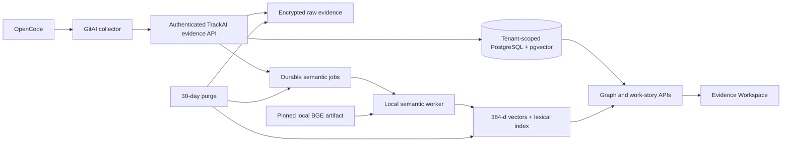

# Task5 Local Acceptance and Production Readiness Runbook

This runbook explains what was installed locally for Task5 verification, what
is actual product code, what still requires production deployment work, and how
a product owner can personally review the customer experience. The canonical
implementation tracker remains [`../TASK5.md`](../TASK5.md); this file does not
make independent completion claims.

Use synthetic data only. The acceptance database, accounts, passwords and
encryption key are disposable test fixtures and must never be reused in a real
environment.

## 1. What the local verification used

| Local item | Why it was used | Product or test-only? | Production equivalent |
|---|---|---|---|
| Docker `pgvector/pgvector:pg16` on port `55432` | Isolated PostgreSQL with pgvector | Container/data are test-only; schema and migrations are product code | Managed or customer-hosted PostgreSQL 16 with pgvector, backups, encryption and Task14 operations |
| `.task5-semantic-py312` | Isolated Python, PyTorch and Sentence Transformers runtime | Test-only virtual environment | Pinned worker image/package built by Task14 |
| Local `BAAI/bge-small-en-v1.5` artifact | Real 384-dimensional embeddings without an external service | Cached copy is test-only; pinned model/revision/checksum are product contracts | Same verified artifact packaged with the worker |
| Semantic worker process | Claimed durable jobs and wrote vector/lexical indexes | Product code in a development process | Supervised and monitored background service |
| `task5-password-recovery-v1` corpus | Supplied PRs, intentions, attribution, failures, gaps and hard negatives | Test-only | Real consented OpenCode/GitAI evidence |
| Acceptance-auth server on port `54321` | Issued JWTs for an administrator and ordinary developer | Strictly test-only; blocked in production | Customer Supabase/OIDC and Task4 memberships |
| API `8080` and Next.js dev server `3000` | Exercised real protected APIs and UI | Development processes | Deployed API/web with TLS, monitoring and rollout controls |
| Test encryption keyring | Exercised real envelope encryption | Disposable test key only | KMS/secret-manager keyring from Tasks4/14 |

The local components were disposable hosts for the real migrations,
encryption, graph, search, worker and UI code. Passing locally and in CI proves
behavior; it does not provision or certify a production environment.

## 2. Intended production flow



At an intention milestone—not after every prompt—the API creates or versions
an intention and enqueues an idempotent semantic job. The worker decrypts the
intention only in memory, runs the local checksum-verified BGE model, normalizes
the vector, and stores the vector and PostgreSQL full-text document with the
source expiry. Search combines exact metadata, lexical and cosine results using
RRF and deterministic reranking. Derived rows are deleted with the source.

### Already implemented in Task5

- PostgreSQL/pgvector migrations and tenant-bound foreign keys.
- Separate encrypted content, metadata and searchable derived storage.
- Idempotent OpenCode ingestion and GitAI identities.
- Durable semantic jobs, retries and safe failure states.
- Pinned local BGE adapter with remote inference loading disabled.
- Hybrid exact, lexical and vector search with match reasons.
- Tenant isolation, privileged raw reveal, audit and deletion logic.
- Evidence Workspace and reverse file/line provenance.
- CI using ephemeral pgvector and the real pinned model.

### Required before a production launch

| Remaining deployment concern | Owner |
|---|---|
| Provision PostgreSQL/pgvector, backups, restore, HA and capacity | Task14 |
| Package the model and Python runtime without runtime downloads | Task14 |
| Deploy, supervise, scale and monitor the semantic worker | Task14 |
| Supply keyrings through KMS/secret manager and certify rotation | Tasks4/14 |
| Configure production Supabase/OIDC tenants and administrator bootstrap | Tasks8/14 |
| Deploy API/web with TLS, service identity, canary and rollback | Task14 |
| Make evidence policies customer-configurable | Task6 |
| Add providers beyond OpenCode | Task13 |
| Produce customer trust evidence and deployment certification | Tasks12/14 |

Task5's functional path exists, but it is not a certified production
deployment until Task14 supplies and verifies those runtime pieces.
The current `apps/api/Dockerfile` packages the Node API only; it does not yet
package Python, the BGE artifact or the separate semantic-worker process. That
is concrete evidence that semantic production packaging remains Task14 work.

## 3. Review the currently running workspace

If the local verification processes are still running, open
[http://localhost:3000/login](http://localhost:3000/login).

| Role | Email | Synthetic password | Expected access |
|---|---|---|---|
| Tenant administrator | `admin@task5.acceptance.invalid` | `task5-acceptance-only` | Stories plus explicit raw reveal and Administration |
| Ordinary developer | `developer@task5.acceptance.invalid` | `task5-viewer-only` | Same story facts, but no raw reveal or administrator actions |

These are non-production fixture credentials. Start as administrator, sign out,
then repeat security checks as the developer. Both roles see the same evidence
story; Task4 authorization controls raw reveal and Administration access.

## 4. Product-owner acceptance checklist

Do not inspect the database during this walkthrough. Record pass/fail and notes
in the last column or in a review note.

| Gate | What to do | Expected result | Product-owner result / feedback |
|---|---|---|---|
| E5-1 | Open **Not committed**, then recovery and **Committed, not in a PR** stories | Zero-, one- and multi-commit work remain distinct | Pending |
| E5-2 | Open **Prevent duplicate password recovery token use**, then expand **Changes** and **How do we know?** | Multiple sessions, traces and checkpoints remain distinct without cluttering the initial story | Pending |
| E5-3 | As admin reveal one raw event and inspect audit; repeat as developer | Admin reveal is audited; developer has no reveal or Administration access | Pending |
| E5-4 | Expand recovery **How do we know?** | OpenCode provider/trace identity remains; unavailable reasoning is labelled | Pending |
| E5-5 | Expand/collapse every story group | Forward/reverse evidence is available without duplicate links or scattered pages | Pending |
| E5-6 | Open the recovery PR | Browse/search controls and unrelated PRs disappear; the intention appears once, followed by outcome, scope and important signal; derivation mechanics remain under **How do we know?** | Pending |
| E5-7 | Open **Insights** | Failed/retried/slow tools, prompt loop, rework and unresolved signals are compact and do not score people | Pending |
| E5-8 | Under **Changes**, open `src/auth/recovery.ts`, select its recorded range, then inspect `src/auth/recovery-metrics.ts:19` | The first reveals why the line exists, its commit/outcome and exact supporting trace without leaving the PR; the second is an honest gap, never time proximity presented as proof | Pending |
| E5-9 | Search `authentication credential race condition`, `5100000`, `src/auth/recovery.ts`, and `playwright`; apply merged filter | Relevant recovery/refresh work and match reasons appear; design-token work is not a semantic false positive | Pending |
| E5-10 | Inspect corrected intention plus unavailable/redacted badges | Correction and availability are separate; destructive expiry remains an isolated automated gate | Pending |
| E5-11 | Review final CI in `TASK5.md` | Metrics, security, migrations, live gates, types and production build are green | Pending |
| E5-12 | Complete the focused story, use Back, and repeat authorization as developer | Complete story works without database inspection; browsing context returns; low-level evidence is progressive | Pending |

Useful exact fixtures are PR `104`, branch `feature/recovery-token-race`, SHA
prefix `5100000`, path `src/auth/recovery.ts`, and tool `playwright`.

## 5. Rebuild the environment later

Run each long-lived service in a separate Mac terminal from the Task5 working
copy. All data and credentials below are synthetic.

### A. PostgreSQL and corpus

Create the disposable container once:

```bash
docker run --name trackai-task5-uat-pg \
  -e POSTGRES_HOST_AUTH_METHOD=trust \
  -e POSTGRES_DB=trackai \
  -p 127.0.0.1:55432:5432 \
  -d pgvector/pgvector:pg16
```

For an existing stopped container, run `docker start trackai-task5-uat-pg`.

```bash
cd /Users/manishmahajan/Documents/Codex/2026-09-19/trackai-task5/work/TrackAI-V1

DATABASE_URL='postgresql://postgres@127.0.0.1:55432/trackai' \
npm run db:migrate --workspace=apps/api

DATABASE_URL='postgresql://postgres@127.0.0.1:55432/trackai' \
MASTER_ENCRYPTION_KEY_ACTIVE_VERSION='local-v1' \
MASTER_ENCRYPTION_KEYS_JSON='{"local-v1":"MDEyMzQ1Njc4OWFiY2RlZjAxMjM0NTY3ODlhYmNkZWY="}' \
TASK5_EPHEMERAL_DATABASE='1' \
TASK5_ACCEPTANCE_PERSIST='1' \
npm run verify:task5-corpus-live --workspace=apps/api
```

The displayed encryption key is a public disposable test value. Never use it
outside this synthetic database.

### B. Model runtime

Use Python 3.11 or 3.12:

```bash
python3.12 -m venv .task5-semantic-py312
source .task5-semantic-py312/bin/activate
python -m pip install --requirement apps/api/scripts/requirements-semantic.txt
python apps/api/scripts/prepare-task5-bge.py \
  --output "$HOME/.cache/trackai/bge-small-en-v1.5-5c38ec7"
```

Preparation downloads the pinned artifact. Runtime inference uses
`local_files_only=True`, verifies revision/checksum and calls no embedding API.

### C. Acceptance auth — terminal 1

```bash
cd /Users/manishmahajan/Documents/Codex/2026-09-19/trackai-task5/work/TrackAI-V1
TASK5_EPHEMERAL_DATABASE='1' \
npm run serve:task5-acceptance-auth --workspace=apps/api
```

### D. API — terminal 2

```bash
cd /Users/manishmahajan/Documents/Codex/2026-09-19/trackai-task5/work/TrackAI-V1
PATH="$PWD/.task5-semantic-py312/bin:$PATH" \
DATABASE_URL='postgresql://postgres@127.0.0.1:55432/trackai' \
MASTER_ENCRYPTION_KEY_ACTIVE_VERSION='local-v1' \
MASTER_ENCRYPTION_KEYS_JSON='{"local-v1":"MDEyMzQ1Njc4OWFiY2RlZjAxMjM0NTY3ODlhYmNkZWY="}' \
SUPABASE_URL='http://127.0.0.1:54321' \
FRONTEND_URL='http://localhost:3000,http://127.0.0.1:3000' \
TRACKAI_BGE_EXECUTABLE="$PWD/apps/api/scripts/trackai-bge-embed.py" \
TRACKAI_BGE_MODEL_PATH="$HOME/.cache/trackai/bge-small-en-v1.5-5c38ec7" \
TRACKAI_BGE_REVISION='5c38ec7c405ec4b44b94cc5a9bb96e735b38267a' \
TRACKAI_BGE_CHECKSUM='3c9f31665447c8911517620762200d2245a2518d6e7208acc78cd9db317e21ad' \
npm run dev --workspace=apps/api
```

### E. Enqueue semantic work once

After auth and API are ready, use a short-lived terminal. The JWT remains in a
shell variable and is not printed:

```bash
cd /Users/manishmahajan/Documents/Codex/2026-09-19/trackai-task5/work/TrackAI-V1
TASK5_TOKEN="$(curl -fsS -X POST \
  'http://127.0.0.1:54321/auth/v1/token?grant_type=password' \
  -H 'Content-Type: application/json' \
  --data '{"email":"admin@task5.acceptance.invalid","password":"task5-acceptance-only"}' \
  | python3 -c 'import json,sys; print(json.load(sys.stdin)["access_token"])')"

curl -fsS -X POST 'http://127.0.0.1:8080/api/admin/evidence/semantic-reindex' \
  -H "Authorization: Bearer $TASK5_TOKEN" \
  -H 'Content-Type: application/json'

unset TASK5_TOKEN
```

### F. Semantic worker — terminal 3

```bash
cd /Users/manishmahajan/Documents/Codex/2026-09-19/trackai-task5/work/TrackAI-V1
PATH="$PWD/.task5-semantic-py312/bin:$PATH" \
DATABASE_URL='postgresql://postgres@127.0.0.1:55432/trackai' \
MASTER_ENCRYPTION_KEY_ACTIVE_VERSION='local-v1' \
MASTER_ENCRYPTION_KEYS_JSON='{"local-v1":"MDEyMzQ1Njc4OWFiY2RlZjAxMjM0NTY3ODlhYmNkZWY="}' \
TRACKAI_BGE_EXECUTABLE="$PWD/apps/api/scripts/trackai-bge-embed.py" \
TRACKAI_BGE_MODEL_PATH="$HOME/.cache/trackai/bge-small-en-v1.5-5c38ec7" \
TRACKAI_BGE_REVISION='5c38ec7c405ec4b44b94cc5a9bb96e735b38267a' \
TRACKAI_BGE_CHECKSUM='3c9f31665447c8911517620762200d2245a2518d6e7208acc78cd9db317e21ad' \
npm run worker:evidence-semantic --workspace=apps/api
```

Initial loading can take several minutes on an Intel Mac. A healthy continuous
worker normally prints nothing while waiting. In the administrator UI, wait
until semantic health reports all current intentions available before judging
semantic search.

### G. Web — terminal 4

```bash
cd /Users/manishmahajan/Documents/Codex/2026-09-19/trackai-task5/work/TrackAI-V1
NEXT_PUBLIC_SUPABASE_URL='http://127.0.0.1:54321' \
NEXT_PUBLIC_SUPABASE_ANON_KEY='task5-local-public-placeholder' \
NEXT_PUBLIC_API_URL='http://127.0.0.1:8080' \
npm run dev --workspace=apps/web
```

Open [http://localhost:3000/login](http://localhost:3000/login).

## 6. Cleanup

Stop foreground services with `Ctrl-C`. Stop the database with:

```bash
docker stop trackai-task5-uat-pg
```

Removing the disposable container/model cache is optional and should wait until
review is finished. Never run cleanup against a shared or production database.
