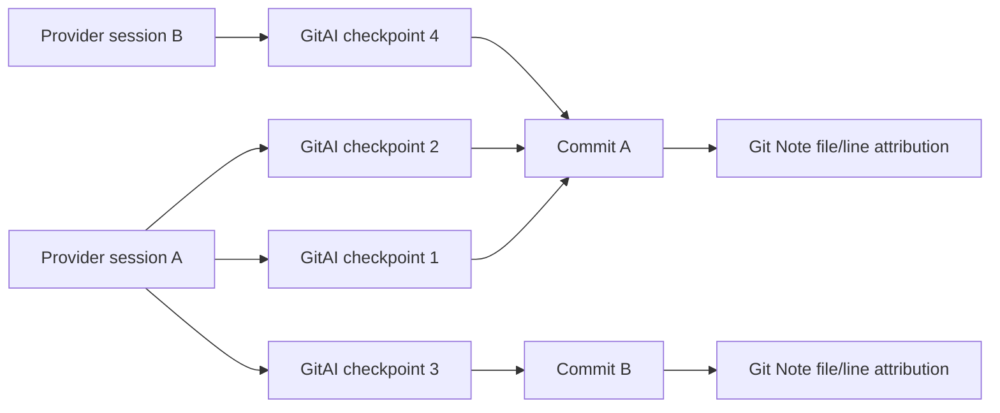
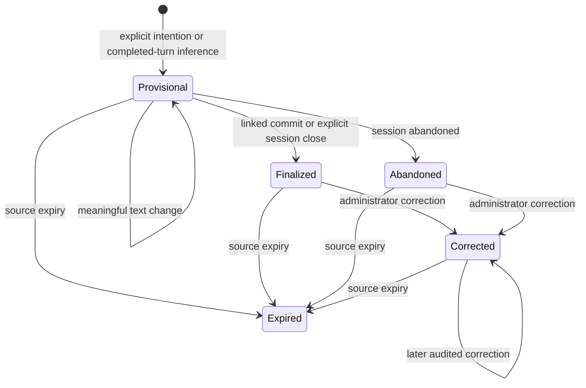
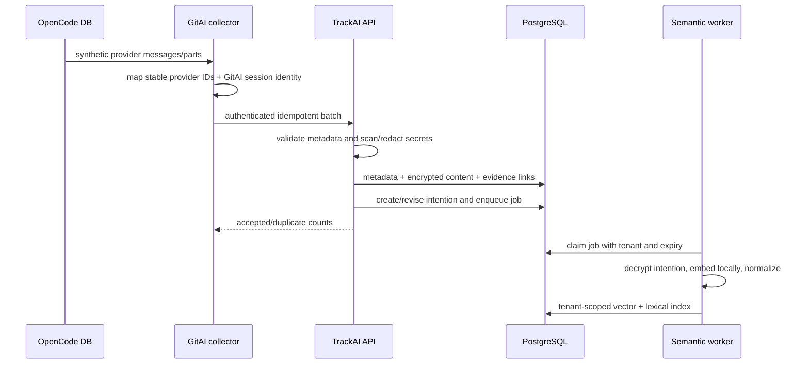
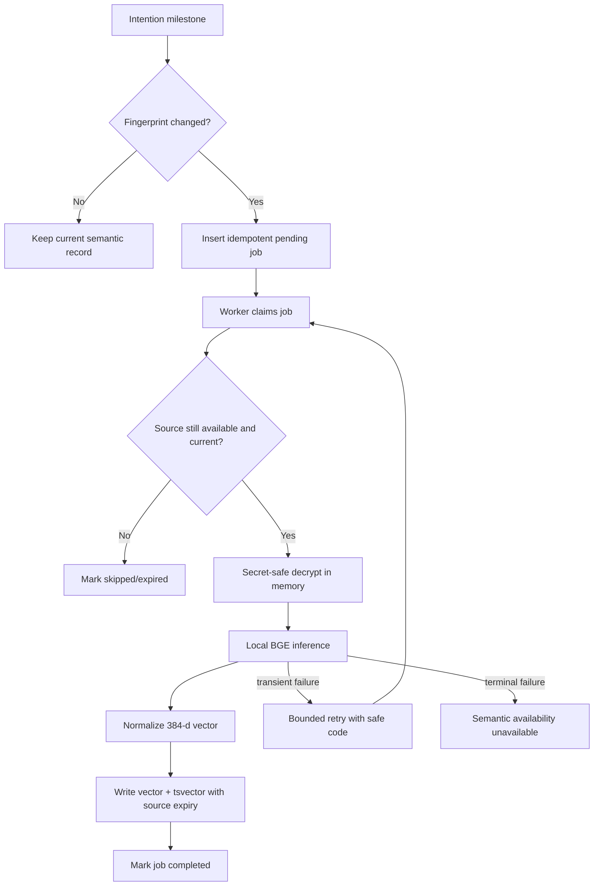
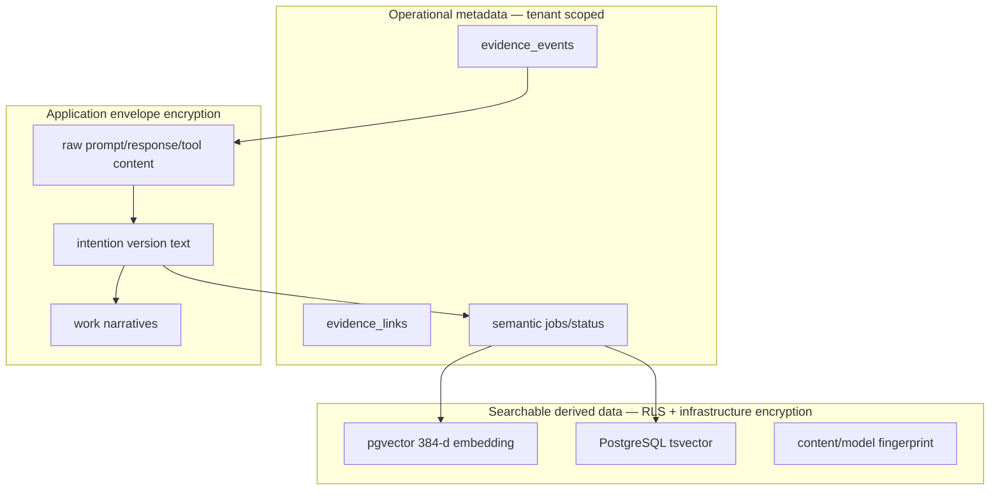
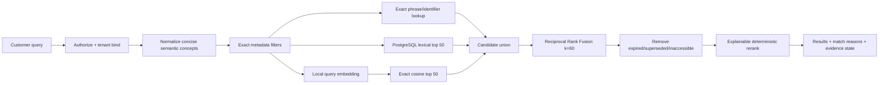
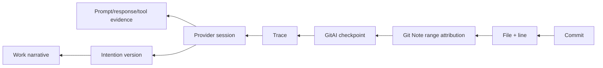
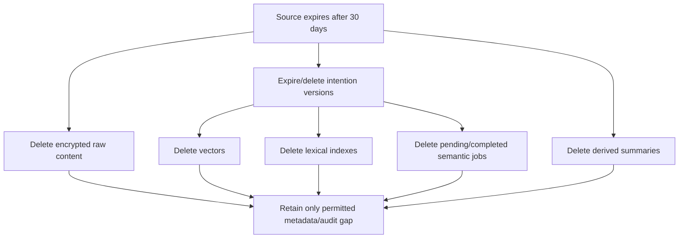

# Task5 Semantic Evidence Design

This document explains how Task5 evidence analysis, intentions, embeddings and
hybrid search work. It contains no independent status or completion claims.
The authoritative tracker and acceptance gates are in [`../TASK5.md`](../TASK5.md).
Implemented TrackAI semantic checkpoints are recorded in the canonical tracker;
the isolated GitAI OpenCode collection checkpoint is `a8d93aa20`.

## 1. GitAI identities remain authoritative

TrackAI borrows customer-facing ideas such as “Why?”, “Explain”, “Recap” and
similar-work search. It does not borrow a different definition of session or
checkpoint.

A session may produce no commit or many commits. A commit may contain work from
many sessions, traces and checkpoints. A checkpoint is an edit observation,
not a customer work package.

## 2. Prompt, intention and work narrative

| Object | Meaning | Evidence treatment |
|---|---|---|
| Prompt | An actual instruction sent by a human or system | Observed only when captured; encrypted raw content |
| Intention | The goal behind a unit of work | Explicit/observed, inferred, or corrected; separately versioned |
| Work narrative | Intention, outcome, friction, learnings and open items assembled for a customer | Derived view with supporting evidence links |

An embedding does not generate or prove an intention. It represents a selected
intention version numerically so similar goals can be found. The evidence state
still tells the customer whether that intention was supplied, inferred or
corrected.

### Intention version lifecycle

Every new version has a stable series ID, monotonically increasing version,
source fingerprint, evidence state, confidence, optional predecessor and the
same 30-day retention boundary as its source evidence. The latest
non-superseded version is searchable. Older versions remain auditable until
their own expiry.

## 3. Ingestion and evidence analysis

Supported events are prompt, response, reasoning, tool call and tool result.
Reasoning is stored only when OpenCode exposes it. Otherwise the event is
recorded with `availability = unavailable`.

Evidence Analysis is deterministic and explainable in Task5:

- outcome comes from the selected Git commit;
- friction comes from bounded event metadata and Task2 rework;
- learnings describe available checkpoints/evidence coverage;
- open items describe missing, redacted or expired evidence;
- intention selection prefers the latest corrected version, then observed,
  then inferred.

Task5 does not use a generative model to invent causal explanations.

## 4. When embeddings are created

Embedding every prompt would incorrectly treat each conversational turn as a
separate business goal, create noise and repeatedly reset work. Waiting for “the
prompt-to-commit lifecycle” would also be wrong because a session may never
commit or may contribute to multiple commits.

The implemented Task5 triggers are:

1. an explicit intention is first supplied;
2. the first usable prompt creates the session's one provisional inferred
   intention when no explicit intention exists;
3. an explicit intention replaces or upgrades that provisional inference;
4. an administrator creates an audited correction; or
5. an administrator starts revision-specific re-indexing after a pinned model
   upgrade.

A later prompt by itself does **not** create an intention version or embedding.
This prevents collector chunks and conversational follow-ups from becoming
fake business goals. Future finalization/abandonment triggers may change the
`lifecycle` field only when backed by an observed session/outcome event.

No new vector is written when the normalized content fingerprint, model
revision and dimensions are unchanged.

## 5. Model and local execution

- Model: `BAAI/bge-small-en-v1.5`.
- Output: normalized 384-dimensional vector.
- Runtime: a Node background job worker invokes the bundled local-only Python
  adapter, which loads the deployment-local Sentence Transformers artifact.
- Supported verification runtime: Python 3.11 or 3.12. The reproducible Intel
  macOS environment pins `numpy<2` and `scipy<1.15` for compatibility with the
  pinned PyTorch runtime. Python 3.14 is not a supported Task5 runtime.
- Artifact: immutable model revision and checksum recorded in configuration and
  each semantic record.
- Task5 verification pin: revision
  `5c38ec7c405ec4b44b94cc5a9bb96e735b38267a`; `model.safetensors` SHA-256
  `3c9f31665447c8911517620762200d2245a2518d6e7208acc78cd9db317e21ad`.
- Production: remote model loading disabled; startup health fails closed if the
  packaged artifact/checksum is absent.
- Query input uses the model's retrieval instruction; stored documents use the
  passage/document form.
- No prompt, intention or vector is sent to an external embedding provider.

The implementation boundary is:

- `apps/api/src/features/evidence/semantic-worker.ts` continuously claims jobs;
- `apps/api/src/features/evidence/semantic.ts` validates the pinned executable,
  revision, checksum, dimensions, normalization and safe failure codes;
- `apps/api/scripts/trackai-bge-embed.py` reads text only from stdin, applies the
  BGE query instruction only to queries, uses `local_files_only=True` and
  `trust_remote_code=False`, and emits only the vector;
- `evidence_intention_embeddings` stores the vector and PostgreSQL `tsvector`;
- `evidence_semantic_jobs` stores content-free retry state.

The executable never receives customer text in argv, and stderr is not copied
into application logs. The configured artifact revision and checksum are
stored beside each vector.

The model card documents its 384-dimensional representation and normalized
similarity usage: [BAAI BGE small English v1.5](https://huggingface.co/BAAI/bge-small-en-v1.5).

## 6. Storage and privacy boundary

Vectors and `tsvector` values cannot use application envelope encryption while
remaining searchable by PostgreSQL. They are therefore treated as sensitive
derived data: strict tenant filters, RLS, infrastructure encryption at rest,
no API exposure, no logging, audited administration and source-aligned deletion.

Task5 begins with exact pgvector cosine search. pgvector documents exact search
as the default and recommends tenant partitioning/separate indexes when using
approximate search in multitenant systems. HNSW is therefore deferred until
Task14 scale evidence justifies tenant-safe partitioning:
[pgvector documentation](https://github.com/pgvector/pgvector).

## 7. Hybrid retrieval and ranking

### Retrieval stages

1. Apply tenant authorization and exact repository, commit, file, session, tool
   and model filters before ranking.
2. Exact normalized phrase/identifier lookup produces an explicit match reason.
3. PostgreSQL full-text search returns up to 50 lexical candidates using
   `websearch_to_tsquery` and `ts_rank_cd`.
4. For a small, deterministic set of terse customer concepts, query
   normalization adds natural-language context before embedding. For example,
   `race condition` becomes a query about preventing concurrent-request
   conflicts with atomic updates. The original query remains authoritative for
   exact and lexical matching, and no evidence link or stored intention is
   created by this expansion.
5. Local BGE query inference plus pgvector cosine similarity returns up to 50
   dense candidates. A semantic-only candidate must have cosine similarity of
   at least `0.60`; exact and lexical candidates bypass this floor.
6. Candidate lists are fused with Reciprocal Rank Fusion:

   `RRF(document) = Σ 1 / (60 + rank_in_list)`

7. Superseded, expired and inaccessible intention versions are removed.
8. Exact matches lead, followed by fused relevance. Evidence state, confidence
   and stable ID only break relevance ties.

The response returns lexical rank, vector rank, fused score, customer-readable
match reasons such as exact, lexical, similar intention or concurrency concept,
model revision, evidence state, confidence and availability. It never returns
the vector or lexical document.

### Why no neural reranker yet

A cross-encoder can improve final relevance but adds another model and inference
path. Task5 first uses an explainable deterministic reranker and measures it on
customer-shaped hard negatives. A cross-encoder is reconsidered only if that
evaluation fails. The retrieve-then-rerank trade-off is described by
[Sentence Transformers](https://www.sbert.net/examples/sentence_transformer/applications/retrieve_rerank/README.html).

## 8. False similarity and evidence quality

Semantic similarity is not proof that two work items are identical. Search
results therefore keep separate fields for:

- semantic/lexical relevance;
- exact match reasons;
- evidence state;
- confidence;
- availability;
- supporting commit/session links.

Hard negatives include similar vocabulary with different goals, such as
“change login page colours” versus “reduce login failures.” Search quality is
measured using Recall@10, MRR@10, nDCG@10 and top-five hard-negative error rate.
No similarity result creates an evidence link automatically.

## 9. Reverse navigation

Git Note range attribution is observed. Provider IDs explicitly reported by the
collector are observed. A time-window-only association is inferred and must be
labelled as such. Missing Notes, traces or raw evidence create visible gaps.

## 10. Retention and deletion

All derived records inherit the source expiry. Model upgrades or retries retain
that date. Audit may record that a deletion occurred, but it cannot retain the
deleted content, vector, lexical terms or a reversible derivative.

## 11. Model upgrades and failure behavior

- A semantic record is uniquely identified by tenant, intention version,
  content fingerprint, model revision and dimensions.
- A model upgrade enqueues new jobs without mutating old records.
- The tenant-admin semantic reindex action enqueues the current unexpired
  intention versions for the configured revision and records a content-free
  audit event. If an idempotent job already exists in completed, failed or
  skipped state, reindex resets it to pending, clears only its safe error and
  attempt state, and preserves the source expiry. It never extends retention.
- Search reads only the configured active model revision after its backfill gate
  passes; old model rows expire or are deleted with the source.
- Transient inference failures retry with bounded backoff and safe codes.
- Terminal failure sets semantic availability to unavailable while exact graph
  and metadata workflows continue.
- TrackAI never falls back to an external embedding API or calls token overlap
  “semantic search.”

## 12. Customer-facing explanation rule

The simple view answers why, what, how and what went wrong. The graph/timeline
supports those statements. Raw evidence is a separate privileged action. The
work narrative is regenerated from evidence fingerprints and is never allowed
to override GitAI attribution, Task2 metrics or audited corrections.
