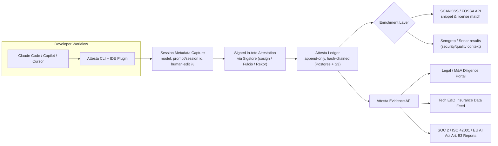

# Attesta brief (founder, as given)

*Recorded 2026-10-08 by TrackAI-Orchestrator, unedited apart from removing empty lines at the top. The orchestrator's business review and the plan are in `docs/plan/TASK15.md`.*

**Attesta**: AI Code Provenance & Attestation Platform

> *"A tamper-proof chain of custody for AI-generated code — which code was AI-assisted, by which model/tool, under which policy, and with what reviewer evidence. Attesta sits at the moment code is generated (in the IDE, in the CLI, in the CI pipeline, desktop Apps). It should produce audit-ready artifacts: PR-level AI authorship fields, commit metadata, model/tool logs, risk scoring, and exportable evidence packs for security, legal, and procurement teams.[audit-ready evidence for SOC 2/ISO 42001, a clean answer for M&A diligence questionnaires, a documentation trail for EU AI Act Article 53 and California AB 2013-style obligations, and a data feed that tech E&O insurers] — built for legal, security, and M&A teams, not just developers."*

Crucially, Attesta is **not** a competitor to SCANOSS, FOSSA, or Sonar — it's a layer that sits on top of and enriches them. It answers "who/what produced this and is it trustworthy," not "does this code look like GPL"

### 2.2 Competitive Landscape & Crowding

| Player | What they actually do | Overlap with Attesta | Gap Attesta exploits |
|---|---|---|---|
| **SCANOSS / FOSSA** | Snippet-level matching of code against known OSS to detect license contamination (SCANOSS is even MIT-licensed/open source) | Complementary — Attesta can call their APIs for enrichment | They don't capture *generation-time* provenance (which agent/model/session produced the code); they scan static artifacts after the fact |
| **Sonar (SonarQube + Gitar)** | Static analysis, security, and now AI-native PR review; huge install base (7M+ devs, 75%+ of Fortune 100) | Adjacent — Attesta is not a code-quality tool | Sonar is about *quality/security of the code*, not legal chain-of-custody or M&A/insurance-grade evidence |
| **SLSA / in-toto / Sigstore ecosystem** | Open standards + tooling (cosign, Fulcio, Rekor) for **build-provenance** (who built this artifact, was the pipeline tampered with) — increasingly required for U.S. federal software under EO 14028 | High technical overlap — Attesta should be built *on* this stack, not around it | These prove build integrity, not AI-authorship/license risk; "AI-generated code may originate from multiple training sources, making authorship attribution harder" is an explicitly acknowledged gap in current SLSA discourse |
| **Apiiro, Beyond Identity** | ASPM and commit-identity/signing platforms addressing adjacent supply-chain identity risk | Partial | Enterprise-priced, security-team-first tools; not packaged for legal/GRC/insurance consumption or SMB pricing |
| **Credo AI / Holistic AI** | Broad enterprise AI governance platforms (raised $40M+, named Gartner MQ Visionary/Leader) | Low direct overlap | Too broad, too enterprise-priced ($50K+ ACV, advisory-services-attached) to serve this specific workflow; would treat this as a feature, not their core wedge |

### 2.3 High-Level Development Plan

**Stack notes:**
- **Capture layer:** Task2 today already captures everything we need, even at commit level. Attesta does not need to do any GitAI work for this. Ideally we need all we have ( commit / PR / prompt / Repository / Human-developer / merged-by / policy-in-place / model(s) used / HumanVsAI Lines / date/time and other metadata ). I will continue working on this list. I do know that at commit and PR time , all the above data is available with Task2. But we can start small and keep adding. Task2 should be triggering Attesta module, when a trigger event happens ( Commit , PR merged etc ) and giving info in defined interface which Attesta expects.
- **Signing:** Open-source **Sigstore** (cosign/Fulcio/Rekor)
- **Enrichment:** Call SCANOSS's API/OSS engine rather than rebuilding snippet-matching — a high leverage "don't reinvent this" decision in the plan.
- **Backend:** TrackAI Backend. You ( Claude) decide the rest [ Postgres/Supabase for metadata ? , S3 for attestation blobs? , simple Merkle/hash-chain ? ] based on Sushicorp experience.
- **Deployment:** Task14 covers Deployment/productionization. [ Managed multi-tenant SaaS for Starter/Growth; containerized/self-hosted option for Enterprise/Gov (Docker/Helm)]
- **Integrations:** GitHub/GitLab/Bitbucket apps first;  and insurer/legal export formats as enterprise add-ons.
