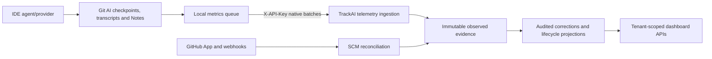

# Task2 → Task4 Handoff

**Status:** Active handoff preparation; final immutable checkpoint SHAs remain pending.

This document—not either Codex conversation—is the cross-task source of truth.
Complete every `TBD after E13` field with immutable evidence before creating the
Task4 worktrees. Never place tokens, client secrets, private keys, webhook
secrets or master keys here.

## Tracker authority

- Canonical tracker: `/Users/manishmahajan/Documents/Codex/2026-07-21/hi/outputs/Task1/TrackAI-v1-task1/Task2.md`
- Archived pointer only: `/Users/manishmahajan/Documents/Codex/2026-07-21/hi/outputs/Task2/Task2.md`

All future Task2 status changes belong in the canonical file. The archived path
must never be expanded back into a second tracker.

## Checkpoint identity

| Repository | Remote | Branch | Immutable checkpoint SHA | Clean and pushed |
|---|---|---|---|---|
| TrackAI-v1 | `https://github.com/mahamannu-ux/TrackAI-V1.git` | `feature/task2-lifecycle-metrics` | **TBD after E13** | ☐ |
| Git AI OSS | **TBD after E13: record configured GitHub remote** | `feature/task2-lifecycle-metrics` | **TBD after E13** | ☐ |

## Working-directory map

| Purpose | Directory / branch |
|---|---|
| Task2 TrackAI | `/Users/manishmahajan/Documents/Codex/2026-07-21/hi/outputs/Task1/TrackAI-v1-task1` · `feature/task2-lifecycle-metrics` |
| Task2 Git AI | `/Users/manishmahajan/Documents/Codex/2026-07-21/hi/outputs/Task2/git-ai-task2` · `feature/task2-lifecycle-metrics` |
| Task2 lab | `/Users/manishmahajan/Documents/Codex/2026-07-21/hi/outputs/git-ai-teamz-lab-vscode` |
| Task4 TrackAI | **TBD after E13** · `feature/task4-hardening` |
| Task4 Git AI | **TBD after E13** · `feature/task4-client-hardening` |

Task4 must never use or mutate a Task2 worktree.

## Architecture and telemetry flow

Task4 hardens identity, transport, policy and operations around this flow. It
must not redefine Task2 metric semantics without an explicit cross-task change.

## Database and migration state

- Latest generated TrackAI migration: **TBD after E13**
- Supabase migrations manually applied through: **TBD after E13**
- Schema drift check/result: **TBD after E13**
- Backup location and timestamp: record locally, but do not commit a database
  dump or credentials.
- Existing observed rows remain immutable; Task4 migrations must not rewrite
  attribution, usage or correction evidence.

## Environment contract — names only

Record whether each name is required and where it is configured; never record
its value:

- `DATABASE_URL`
- Supabase server/browser URL and key variable names used by the applications
- `TRACKAI_INGEST_TOKENS_JSON` — temporary Task1/Task2 mechanism
- `GITHUB_WEBHOOK_SECRET`
- `GITHUB_APP_ID`
- `GITHUB_APP_PRIVATE_KEY`
- `GITHUB_APP_INSTALLATIONS_JSON`
- `GITHUB_ALLOW_PUBLIC_READ`
- `TRACKAI_DEV_EVIDENCE_ENABLED` — local T2.24 prototype only; ignored in production
- `TRACKAI_OPENCODE_DB_PATH` — absolute local read-only provider DB path
- Proposed Task4 `MASTER_ENCRYPTION_KEY`
- Any Git AI API base URL, API key and repository allowlist configuration names

Final post-E13 configuration matrix: **TBD after E13**.

## Tenant and SCM test topology

| Tenant | Domain | GitHub organization/repositories | Purpose |
|---|---|---|---|
| Company A | `purpletealabs.net` | `mahamannu-ai/git-ai-teamz-lab`, `mahamannu-ai/trackai-webhook-test` | Primary lifecycle and telemetry tenant |
| Company B | `customer-b-oidc.com` | `customer-b-corp-ai/concurrency_engine_for_webhook_tests` | Isolation and negative-control tenant |

GitHub App installation IDs are identifiers rather than credentials, but their
post-E13 configuration and repository access must be reverified and documented
here before Task4 starts.

## Metric invariants owned by Task2

- Generated LoC is complete gross AI-generated SLOC. Partial checkpoint totals
  are drill-down evidence and the headline remains `Unavailable`.
- Committed, In-PR, Merged and Production represent retained code at distinct
  lifecycle boundaries.
- Production requires successful deployment evidence; default-branch merge is
  only a labelled proxy.
- Revert is inverse history and does not supersede the reverted commit or count
  restored code as newly generated.
- Rework preserves the modifying actor. Missing evidence is not zero.
- Observed evidence is immutable; audited corrections are explicit overlays.

Canonical Task2 tracker and final post-E13 changes: **TBD after E13**.

## Verification evidence

Complete after E13:

- TrackAI API test command and result: **TBD after E13**
- TrackAI API/web production build commands and results: **TBD after E13**
- Git AI formatting/unit/integration commands and results: **TBD after E13**
- E13a OpenCode model-switch result: **TBD after E13**
- E13b Codex result: **TBD after E13**
- E13c Antigravity result or explicitly documented blocker: **TBD after E13**
- Tenant-isolation regression result: **TBD after E13**

## Known defects and deferred work

The post-E13 owner must reconcile this section with the canonical Task2 and
Task4 matrices. Current known boundaries include:

- Whole-file deletion may produce no editor checkpoint.
- Explicit soft/mixed/hard reset operations may produce no Git AI rewrite event;
  identical recommits can be inferred, but an abandoned hard-reset tip cannot.
- Complete Generated-LoC evidence coverage and line-identity retention remain
  Task2 work.
- Durable tenant-bound queueing, explicit repository grants, quarantine,
  encryption, retention/export and operations monitoring remain Task4 work.
- **TBD after E13:** add any model/provider-specific findings.
- T2.11e: some Copilot conversations/models emit no token-bearing usage span;
  TrackAI must retain `Unavailable` until late usage can be correlated and deduplicated.
- T2.11f: Git AI now counts `h_` working-tree ranges as human and presents
  `KnownHuman` checkpoints as human. The focused fixture still needs a local
  daemon run plus one live manual-edit verification before the tracker turns green.
- T2.17 still needs live two-commit rebase-merge and divergent single-commit
  rewritten-merge acceptance without lifecycle/session duplication.
- T2.24 raw content is a development-only on-demand prototype. Production
  persistence, encryption, authorization, redaction, retention and search belong
  to Task4/Task5.

## Explicit Task4 non-dependencies

Task4 may begin without T2.14, remaining T2.21 trends/deep links, T2.22,
T2.23 or T2.24 being green. Task4 must preserve their data contracts but does
not wait for their compatibility, visualization or live-acceptance work.

## Shared-file conflict map

The following surfaces are jointly sensitive and require checkpoint-based
integration rather than copied patches:

- TrackAI database schema and migrations
- Telemetry ingestion/service and machine authentication
- Repository policy and SCM reconciliation
- Lifecycle API/dashboard integration
- Git AI queue, uploader, configuration and rewrite-event code

Task2 owns metric meaning; Task4 owns delivery/security/policy mechanics. If a
change crosses that boundary, document the contract and coordinating commit in
both trackers before merging.

## Reproducibility and secret-safety gate

- [ ] Every checkpoint SHA exists locally and on its documented remote.
- [ ] Both Task2 worktrees are clean.
- [ ] Fresh API tests and production builds pass.
- [ ] Git AI focused tests and required live checks pass.
- [ ] Migration state matches the running Supabase schema.
- [ ] `rg` secret scan finds no token/private-key/secret values in tracked docs.
- [ ] A fresh reader can start API/web and explain the telemetry flow using only
      repository documentation.
- [ ] Task4 worktrees are created only after all prior boxes are checked.

## Instructions for the new Task4 Codex task

1. Read `TASK4.md`, the canonical Task2 tracker, and this handoff completely.
2. Verify the checkpoint SHAs and inspect their diffs before proposing changes.
3. Confirm the dedicated Task4 worktree and branch; never work in Task2 paths.
4. Begin with Task4 Wave 1 and update `TASK4.md` after each implemented and
   manually verified acceptance signal.
5. Preserve Task2 metric invariants and report any required shared-contract
   change back to the lifecycle-metrics task.
