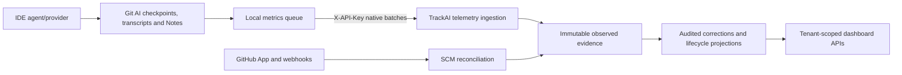

# Task2 → Task4 Handoff

**Status:** Task2 merged into TrackAI `main`; ready for isolated Task4 worktrees.

This document—not either Codex conversation—is the cross-task source of truth.
Verify the recorded immutable evidence before creating the Task4 worktrees.
Never place tokens, client secrets, private keys, webhook
secrets or master keys here.

## Tracker authority

- Canonical tracker: `/Users/manishmahajan/Documents/Codex/2026-07-21/hi/outputs/Task1/TrackAI-v1-task1/Task2.md`
- Archived pointer only: `/Users/manishmahajan/Documents/Codex/2026-07-21/hi/outputs/Task2/Task2.md`

All future Task2 status changes belong in the canonical file. The archived path
must never be expanded back into a second tracker.

## Checkpoint identity

| Repository | Remote | Branch | Immutable checkpoint SHA | Clean and pushed |
|---|---|---|---|---|
| TrackAI-v1 | `https://github.com/mahamannu-ux/TrackAI-V1.git` | `feature/task2-lifecycle-metrics` | `c16af4cde56526f9604f959fc697414cae100aa4` | ✅ Clean and pushed; handoff recorded by `c5012e4fff653d2cdf32a19797125875a86d5947` |
| Git AI OSS | `https://github.com/mahamannu-ux/git-ai.git` | `feature/task2-lifecycle-metrics` | `a77081cba79c836472f6e00facf7eed6f432ed99` | ✅ Clean and pushed |

TrackAI PR #2 merged as `f59a915d1f937c4545449c1d5198f17bbe9967ca`.
The human-readable Git AI patch inventory is
[`docs/GIT_AI_TASK2_CHANGES.md`](../GIT_AI_TASK2_CHANGES.md).

## Working-directory map

| Purpose | Directory / branch |
|---|---|
| Task2 TrackAI | `/Users/manishmahajan/Documents/Codex/2026-07-21/hi/outputs/Task1/TrackAI-v1-task1` · `feature/task2-lifecycle-metrics` |
| Task2 Git AI | `/Users/manishmahajan/Documents/Codex/2026-07-21/hi/outputs/Task2/git-ai-task2` · `feature/task2-lifecycle-metrics` |
| Task2 lab | `/Users/manishmahajan/Documents/Codex/2026-07-21/hi/outputs/git-ai-teamz-lab-vscode` |
| Task4 TrackAI | Not yet created · planned `feature/task4-hardening` |
| Task4 Git AI | Not yet created · planned `feature/task4-client-hardening` |

Task4 must never use or mutate a Task2 worktree.

## Collaboration and working style

The following practices made the lifecycle lab reliable and should be retained
by the Task4 agent:

- Always state the exact absolute directory/repository before commands. There
  are several similarly named worktrees and the wrong one can look healthy.
- Work one bounded runbook step at a time. Give copy/paste-ready commands, the
  expected result and what the user should report before moving on.
- Explain unfamiliar behavior in simple language and distinguish “expected,”
  “known limitation” and “defect.” Do not treat a green command as proof that a
  customer-facing metric is semantically correct.
- Prefer short tables, stable task/test IDs, and 🟢/🟡/🔴 status marks. Keep one
  canonical tracker and update it as implementation and live verification occur.
- Use dry-run-first commands for resets, rebuilds, backfills and migrations.
  Never apply a migration, delete test evidence or rotate/revoke a credential
  without an explicit review/confirmation step.
- Combine automated tests with small live Company A/Company B experiments.
  The user can run long local Cargo/build checks; use focused tests while
  iterating and reserve full suites for checkpoint/release gates.
- Ask for only the output needed to decide the next step. Exact totals, SHAs and
  error text are valuable; huge successful payloads usually are not.
- Preserve honest states: observed versus audited, merged proxy versus deployed,
  zero versus `Unavailable`, and exact versus confidence-based linkage.
- Never print or commit API keys, private keys, webhook secrets, raw provider
  databases or customer prompt content.

## Architecture and telemetry flow

Task4 hardens identity, transport, policy and operations around this flow. It
must not redefine Task2 metric semantics without an explicit cross-task change.

## Database and migration state

- Latest generated TrackAI migration: `apps/api/drizzle/0002_hard_hellfire_club.sql`
- Supabase migrations manually applied through: migration journal row `3`
  (`f8b901fa8cfee1fee5a653973ff7bc12ba2434e2b37a7d45e3333ed784b429db`).
- Schema verification: `ai_commit_model_attributions` and
  `ai_model_lifecycle_events` exist with RLS enabled. The applied E15 model
  rebuild reconciled Generated 1,193, Committed 917, Merged/Production 572 and
  Reworked 135.
- Backup location and timestamp: record locally, but do not commit a database
  dump or credentials.
- Existing observed rows remain immutable; Task4 migrations must not rewrite
  attribution, usage or correction evidence.

## Environment contract — names only

Record whether each name is required and where it is configured; never record
its value:

- `DATABASE_URL`
- Supabase server/browser URL and key variable names used by the applications
- `TRACKAI_INGEST_TOKENS_JSON` — temporary Task1/Task2 mechanism
- `GITHUB_WEBHOOK_SECRET`
- `GITHUB_APP_ID`
- `GITHUB_APP_PRIVATE_KEY`
- `GITHUB_APP_INSTALLATIONS_JSON`
- `GITHUB_ALLOW_PUBLIC_READ`
- `TRACKAI_DEV_EVIDENCE_ENABLED` — local T2.24 prototype only; ignored in production
- `TRACKAI_OPENCODE_DB_PATH` — absolute local read-only provider DB path
- Proposed Task4 `MASTER_ENCRYPTION_KEY`
- Any Git AI API base URL, API key and repository allowlist configuration names

Post-E13 configuration: TrackAI API/web use their local untracked environment
files; Git AI uses a local API base URL, tenant-bound API key and repository
allowlist. The GitHub App is installed for `mahamannu-ai` and
`customer-b-corp-ai`; public-read fallback is disabled. T2.24 additionally
requires the development-only evidence flag and an absolute read-only OpenCode
database path. No values are recorded in Git.

## Tenant and SCM test topology

| Tenant | Domain | GitHub organization/repositories | Purpose |
|---|---|---|---|
| Company A | `purpletealabs.net` | `mahamannu-ai/git-ai-teamz-lab`, `mahamannu-ai/trackai-webhook-test` | Primary lifecycle and telemetry tenant |
| Company B | `customer-b-oidc.com` | `customer-b-corp-ai/concurrency_engine_for_webhook_tests` | Isolation and negative-control tenant |

GitHub App installation IDs are identifiers rather than credentials, but their
post-E13 configuration and repository access must be reverified and documented
here before Task4 starts.

## Metric invariants owned by Task2

- Generated LoC is complete gross AI-generated SLOC. Partial checkpoint totals
  are drill-down evidence and the headline remains `Unavailable`.
- Committed, In-PR, Merged and Production represent retained code at distinct
  lifecycle boundaries.
- Production requires successful deployment evidence; default-branch merge is
  only a labelled proxy.
- Revert is inverse history and does not supersede the reverted commit or count
  restored code as newly generated.
- Rework preserves the modifying actor. Missing evidence is not zero.
- Observed evidence is immutable; audited corrections are explicit overlays.

Canonical Task2 tracker: `Task2.md` at TrackAI implementation checkpoint
`c16af4cde56526f9604f959fc697414cae100aa4`. The duplicate external Task2 file
is an archived pointer only.

## Verification evidence

- TrackAI API: 42 tests passed and the API TypeScript build passed.
- TrackAI web: production build, lint and type checking passed.
- Git AI: formatting and `cargo check --tests` passed. The long integration run
  passed 3,218 tests and exposed four focused regressions; after correction,
  all eight commit-metadata recovery tests and both Claude latest-checkpoint
  tests passed. The known-model split regression also passed. A second complete
  80-minute integration run was intentionally not required for this checkpoint.
- VS Code/Antigravity extension: `npm run compile` and `npm run lint` passed.
- E13a: one OpenCode conversation retained distinct DeepSeek and Nemotron model
  segments without overwriting attribution.
- E13b: standalone native Codex acceptance is explicitly superseded for this
  milestone, not represented as completed by GPT-OSS.
- E13c: Antigravity live attribution passed with Gemini 3.5 Flash, Claude Sonnet
  4.6 and GPT-OSS 120B; token evidence remains unavailable.
- Tenant isolation: both login directions passed. A Company B repository event
  carrying a Company A key was rejected before raw storage as unenrolled.

## Known defects and deferred work

The post-E13 owner must reconcile this section with the canonical Task2 and
Task4 matrices. Current known boundaries include:

- Whole-file deletion attribution is supported when an agent checkpoint exists;
  provider/editor paths that emit no checkpoint remain an evidence limitation.
- Reset/recommit and deletion-only revert flows are implemented and live-tested.
  A reset with no later successor evidence remains historically observable but
  cannot be assigned a successor operation without guessing.
- Durable tenant-bound queueing, explicit repository grants, quarantine,
  encryption, retention/export and operations monitoring remain Task4 work.
- T2.11e: some Copilot conversations/models emit no token-bearing usage span;
  TrackAI must retain `Unavailable` until late usage can be correlated and deduplicated.
- T2.11f is complete: focused tests and live human addition/deletion verification
  both passed with zero Unknown additions.
- T2.11g: Antigravity exposes model/edit evidence but no token-bearing usage
  events through the current adapter.
- T2.17 is complete: two-commit rebase and divergent single-commit rewritten
  merge acceptance passed without lifecycle/session duplication.
- T2.24 raw content is a development-only on-demand prototype. Production
  persistence, encryption, authorization, redaction, retention and search belong
  to Task4/Task5.

## Explicit Task4 non-dependencies

Task4 may begin without T2.14, remaining T2.21 trends/deep links or T2.22.
T2.23 and T2.24 are green, but their production expansion still belongs to the
later policy/security and Evidence Explorer programs. Task4 must preserve these
data contracts and does not wait for deferred compatibility or visualization work.

## Shared-file conflict map

The following surfaces are jointly sensitive and require checkpoint-based
integration rather than copied patches:

- TrackAI database schema and migrations
- Telemetry ingestion/service and machine authentication
- Repository policy and SCM reconciliation
- Lifecycle API/dashboard integration
- Git AI queue, uploader, configuration and rewrite-event code

Task2 owns metric meaning; Task4 owns delivery/security/policy mechanics. If a
change crosses that boundary, document the contract and coordinating commit in
both trackers before merging.

## Reproducibility and secret-safety gate

- [x] Every checkpoint SHA exists locally and on its documented remote.
- [x] Both Task2 worktrees are clean at their recorded checkpoints.
- [x] Fresh API tests and production builds pass.
- [x] Git AI focused tests and required live checks pass.
- [x] Migration state matches the running Supabase schema.
- [x] `rg` secret scan finds no real token/private-key/secret values in tracked
      docs; `.env.example` contains only a visibly elided private-key placeholder.
- [x] A fresh reader can start API/web and explain the telemetry flow using only
      repository documentation.
- [ ] Task4 worktrees are created only after all prior boxes are checked.

## Instructions for the new Task4 Codex task

1. Read `TASK4.md`, the canonical Task2 tracker, and this handoff completely.
2. Verify the checkpoint SHAs and inspect their diffs before proposing changes.
3. Confirm the dedicated Task4 worktree and branch; never work in Task2 paths.
4. Begin with Task4 Wave 1 and update `TASK4.md` after each implemented and
   manually verified acceptance signal.
5. Preserve Task2 metric invariants and report any required shared-contract
   change back to the lifecycle-metrics task.
