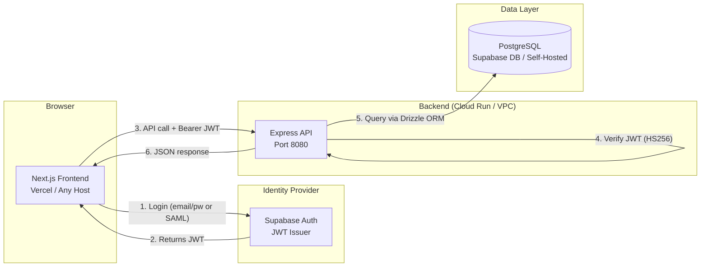

# TrackAI-v1 — Master Plan

## Architecture Overview

A **completely decoupled** architecture where the frontend and backend are independent deployable units, communicating solely over HTTPS with JWT-based authentication.

## Key Principles

1. **Frontend never touches the database.** All data access flows through the backend API.
2. **JWT is the only auth contract.** The backend verifies Supabase-issued JWTs using a shared secret. No session cookies, no server-side state.
3. **Environment-driven configuration.** All URLs, secrets, and connection strings are injected via environment variables — no hardcoded values.
4. **Self-hosted ready.** Replace Supabase with any OIDC/SAML provider and point `DATABASE_URL` at your own PostgreSQL. The architecture doesn't change.

## Deployment Targets

| Component | Default             | Self-Hosted Alternative                     |
| -----------| ---------------------| ---------------------------------------------|
| Frontend  | Vercel              | Nginx, Caddy, any static host               |
| Backend   | Google Cloud Run    | Docker on any VM, K8s, ECS                  |
| Database  | Supabase PostgreSQL | Any PostgreSQL (RDS, AlloyDB, self-managed) |
| Auth      | Supabase Auth       | Keycloak, Auth0, Okta (swap JWT secret)     |

## MVP Scope

- [x] Email/password + SAML SSO login
- [x] Protected dashboard with session guard
- [x] CRUD wiring (GET/POST items)
- [x] JWT middleware with inline documentation
- [x] Docker image for Cloud Run
- [x] Drizzle ORM with migration support
- [ ] Rate limiting & request validation (Phase 2)
- [ ] CI/CD pipeline (Phase 2)
- [ ] Observability & logging (Phase 2)
