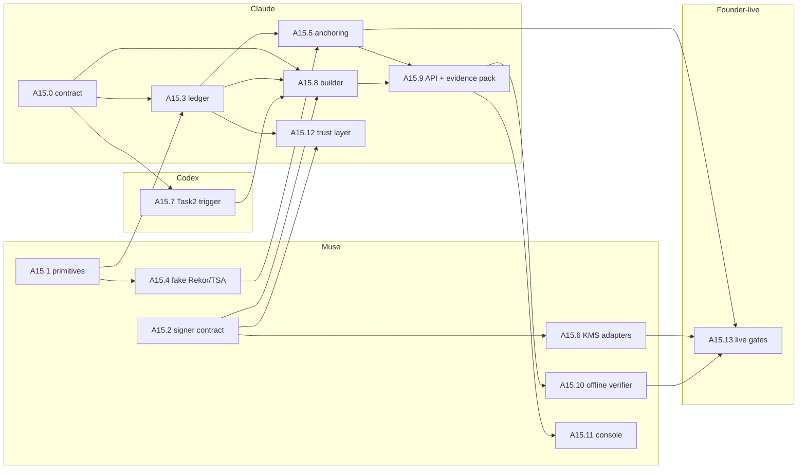

# Task15 — Attesta: signed AI-code provenance and the shared trust layer

*Tracker and plan. Written 2026-10-08 by TrackAI-Orchestrator from the founder's brief (`docs/founder/ATTESTA_BRIEF.md`), `docs/plan/REUSE_MAP.md` and the code. Symbols per AGENTS.md §11. Section 1 waits for the founder's buy-in; sections 3–5 assume the recommendations in section 1 and say where a "no" would change them.*

**In one paragraph.** For every commit and pull request TrackAI already knows, from Task2, which lines were AI-assisted, by which agent and model, in which session, who committed and who merged, and under which policy. Attesta turns that knowledge into **evidence a third party can check without trusting TrackAI**: a signed statement per commit and PR, kept in a tamper-evident ledger, timestamped by an independent authority and anchored in a public transparency log, and exportable as an evidence pack with an offline verifier. Attesta also owns the signer, key hierarchy, rotation and revocation that Task6 (signed activation, policy bundles), Task9 and Task14 reuse.

**Customer story.** Priya, CISO at Acme, gets a due-diligence questionnaire from an acquirer: "What share of your codebase was AI-generated, by which tools, and can you prove it?" She opens TrackAI, filters `payments-service` for the last 12 months, exports an evidence pack and sends it. The acquirer's counsel runs the included verifier on a laptop with no TrackAI account: every statement's signature checks out, nothing in the ledger was altered or removed, and each batch was timestamped and logged publicly at the time. What Priya still cannot claim after phase 1: that the attribution itself is correct beyond what TrackAI observed (honest states stay: observed, partial, Unavailable).

---

## 1. Business review of the brief (founder buy-in needed)

The brief is strong on the wedge: generation-time provenance that scanners (SCANOSS, FOSSA, Sonar) cannot see, built on Sigstore rather than around it. Recommended changes:

| # | Brief says | Recommendation | Why |
|---|---|---|---|
| R1 | "tamper-proof chain of custody" | **"tamper-evident"** in all customer wording | Nothing prevents tampering; we detect it. Legal and insurance buyers read "proof" as a warranty. |
| R2 | Attests "which code was AI-assisted" | Attest **what TrackAI observed, with its completeness** (recorded / partial / Unavailable) inside each statement | Attestation proves a record is unchanged since a time, not that attribution is right. Carrying Task2's honest states into the statement keeps us credible with counsel and insurers. |
| R3 | Built for legal, security and M&A teams | **Lead with the CISO** (security budget, supply-chain programs already funded); package the same evidence for GRC and legal; M&A and insurers in later phases | Matches TrackAI's buyer; one evidence format serves all, the packaging differs. |
| R4 | EU AI Act Art. 53 and California AB 2013 | Do not headline them. Lead with **ISO/IEC 42001, SOC 2 change management, NIST SSDF (SP 800-218) / US secure-software attestation, SLSA**, and **customer-contract AI-disclosure clauses** | My reading (not legal advice): Art. 53 and AB 2013 put training-data documentation duties on model providers, not on companies whose developers use AI tools. Overclaiming a regulation is a credibility risk with exactly the legal buyers we want. Have counsel confirm before any marketing. |
| R5 | Competitors list | Add **GitHub** (native artifact attestations on Sigstore, Copilot audit logs) and **Git AI under OpenAI**; position Attesta as the **neutral, cross-vendor** witness | A model or platform vendor attesting its own output is weaker evidence than an independent party covering every agent and model; that neutrality, plus customer-verifiable output, is the moat. |
| R6 | Sigstore (cosign / Fulcio / Rekor) | **Sign with tenant-controlled keys** (KMS, no custody by TrackAI); **anchor only Merkle roots** to public Rekor plus an RFC 3161 TSA; keyless Fulcio optional later; private Rekor for Enterprise/Gov | Keyless signing writes signer identities (emails, org names) into a public log, and statements contain repository and developer data; neither may leak. SushiCorp's design already solved this (only a 32-byte root leaves the tenant). |
| R7 | Attesta CLI + IDE plugin for capture | **No new client.** Capture stays in Task2/GitAI (founder agreed); Attesta adds a **verifier** instead (standalone, later also `git-ai attesta verify`) | Saves a client to build and ship; the verifier is what outsiders need. |
| R8 | "risk scoring" | Phase 2, **transparent factors only** (AI share, review evidence present, policy in force, security findings), never an opaque score | An unexplained score invites dispute in diligence and conflicts with Task5's no-surveillance rule. |
| R9 | "reviewer evidence" | Needs PR review/approval events from the SCM, which Task2 does not capture today | New capture item for Task2/Task7 (Codex); until then statements mark reviewer evidence `Unavailable`. |
| R10 | SCANOSS/FOSSA enrichment | Phase 2, **opt-in per tenant**, fingerprints only (SCANOSS WFP), self-hosted engine for Enterprise | Sending code or fingerprints to a third party is itself a disclosure the CISO must approve. |
| R11 | Packaging | Attesta as a **TrackAI add-on tier** priced per active developer; the **verifier free and open** | A free verifier is the trust builder: anyone can check our evidence. |

**Phase 1 (this plan):** signed per-commit and per-PR statements for GitHub repositories, the ledger, TSA + Rekor anchoring, the Evidence API, evidence-pack export, the offline verifier, and the shared trust layer's first users. **Phase 2:** enrichment, transparent risk factors, M&A/insurer export formats, GitLab/Bitbucket (with Task7), private Rekor, keyless option.

## 2. Architecture decisions (orchestrator's call, as the brief asks)

1. **Statement:** an in-toto Statement v1 in a DSSE envelope. Subject: the git commit (`gitCommit` digest = commit SHA) and, for a PR, the merge commit plus PR reference. Predicate type `https://trackai.dev/attesta/ai-provenance/v1` (name final at A15.0). Compatible with `cosign verify-attestation`, Rekor `dsse` entries and SLSA tooling.
2. **Predicate content (start small, grow):** repository, commit/PR identity, committer and merged-by (pseudonymous IDs by default), agents, models and sessions involved, AI vs human line counts with availability, lifecycle stage, policy in force (Task4 repository policy; Task6 rule-pack version), digest of the GitAI authorship note, TrackAI evidence references. No raw prompts or code, ever.
3. **Signing:** server-side, per-tenant ECDSA P-256 key behind a signer contract ported from SushiCorp SG-1 (local dev signer refuses production; AWS KMS and Google Cloud KMS adapters; verify every signature before use). TrackAI holds no customer private key in production.
4. **Ledger:** Postgres, one hash chain per tenant, ported from SushiCorp EV-1 (gap-free `seq`, guard triggers, stored canonical bytes, structured verify report). Envelopes stored in the database (they are small); object storage (Task4's export sink) only for evidence packs.
5. **Anchoring:** ported from EV-2: batches of chain records → RFC 6962 Merkle root → RFC 3161 TSA token and a Rekor `hashedrekord` entry with a dedicated anchoring key; dual mode all-or-nothing; full proofs stored for offline checks.
6. **Trigger from Task2:** Task2 writes an `attesta_subjects` outbox row in the same transaction as the event it observes (commit observed with its note, PR merged, deployment); Attesta's worker builds, signs, chains and anchors asynchronously. Nothing on the ingestion path waits for signing. The outbox shape is the interface Attesta defines first (A15.0) and Codex implements (A15.7).
7. **Verification:** `GET` routes reachable by the auditor role; an evidence pack (statements, envelopes, chain segment, proofs, public keys, verifier) signed with the RP-1 statement pattern; a standalone verifier that exits 0 / 1 / 2 (ok / failed / not fully checkable).

## 3. Subtasks

Sizes against T6 (1.0× = all of Task6.a ≈ 4× SushiCorp S3). "Who": Claude, Muse, Codex, founder-live.

| ID | Subtask | Who | Size | Depends on | Status |
|---|---|---|---|---|---|
| A15.0 | Contract and design: predicate schema v1, subject and outbox interface for Task2, API routes, DB tables, error codes; frozen under `docs/contracts/attesta/` | Claude | 0.05× | founder buy-in | ⬜ |
| A15.1 | Primitives: RFC 8785 canonical JSON, RFC 6962 Merkle trees and proofs, DSSE envelope (PAE, sign/verify) with ported test vectors | Muse | 0.08× | — (now) | ⬜ prompt ready |
| A15.2 | Signer contract and local dev signer (SG-1 rev 1.1 translated), verify-before-use, error split | Muse | 0.05× | — (now) | ⬜ prompt ready |
| A15.3 | Ledger: migration, chain guard triggers (SECURITY DEFINER), sealing transaction, verify report, Company A/B isolation | Claude | 0.2× | A15.0, A15.1 | ⬜ |
| A15.4 | Fake Rekor and fake TSA as test specifications (ported behaviour, lying-log cases) | Muse | 0.08× | A15.1 | ⬜ |
| A15.5 | Anchoring: Rekor and TSA adapters, batching worker (plan → submit → record), stored proofs | Claude | 0.25× | A15.3, A15.4 | ⬜ |
| A15.6 | KMS signer adapters (AWS, Google Cloud) | Muse | 0.08× | A15.2, founder OK for SDK dependencies | ⬜ |
| A15.7 | Task2 trigger: write `attesta_subjects` outbox rows at commit-observed, PR-merged, deployment | Codex (Task2) | 0.1× | A15.0 | ⬜ |
| A15.8 | Statement builder: Task2 records → predicate → DSSE → ledger | Claude | 0.1× | A15.0–A15.3, A15.7 | ⬜ |
| A15.9 | Evidence API (auditor-readable) and signed evidence-pack export | Claude | 0.12× | A15.5, A15.8 | ⬜ |
| A15.10 | Offline verifier (standalone Node script, ported from `offline_verify.py`) | Muse | 0.08× | A15.9 format frozen | ⬜ |
| A15.11 | Console: "attested / anchored / pending / broken" on commit and PR views, verify panel | Muse (structure) after Claude's design note | 0.08× | A15.9 | ⬜ |
| A15.12 | Shared trust layer: key hierarchy (root and online keys), rotation, revocation (three-state rule from TR-1), interface for D6.1 and Task6.b | Claude | 0.2× | A15.2, A15.3 | ⬜ |
| A15.13 | Founder-live gates: rekor.sigstage.dev + FreeTSA anchoring, KMS signing, offline verification on a clean machine | founder-live | 0.05× | A15.5, A15.6, A15.10 | ⬜ |
| A15.P2 | Phase 2: SCANOSS enrichment, risk factors, M&A/insurer formats, GitLab/Bitbucket, private Rekor, keyless | later | — | phase 1 | n/a |

**Phase 1 total:** about 1.5× T6 (Claude about 0.9×, Muse about 0.45×, Codex 0.1×, founder-live 0.05×). Claude's share at SushiCorp prices (S3 ≈ $31, T6 ≈ $125) is about $110 if run in cloud sessions; the $100 of cloud credits covers A15.0, A15.3, A15.5 and A15.8 with a small top-up, so run A15.9 and A15.12 in normal chats.

## 4. Sub-task graph

**Critical path:** A15.0 → A15.3 → A15.5 → A15.9 → A15.10 → A15.13. **Start at once:** A15.1 and A15.2 (Muse, no dependencies), A15.0 (Claude, after buy-in). A15.7 (Codex) starts as soon as A15.0 merges.

## 5. Sessions

| Session | Subtasks | Agent | Estimate | Prompt |
|---|---|---|---|---|
| Task15a-attesta-primitives | A15.1 | Muse | 0.08× | `docs/prompts/NEXT_CHAT_Task15a-attesta-primitives_PROMPT.md` |
| Task15b-attesta-signer | A15.2 | Muse | 0.05× | `docs/prompts/NEXT_CHAT_Task15b-attesta-signer_PROMPT.md` |
| Task15c-attesta-contract | A15.0 | Claude | 0.05× | written by the lead after buy-in |
| Task15d-attesta-ledger | A15.3 | Claude | 0.2× | after 15a, 15c |
| Task15e-attesta-fakes | A15.4 | Muse | 0.08× | after 15a |
| Task15f-attesta-anchoring | A15.5 | Claude | 0.25× | after 15d, 15e |
| Task15g-attesta-kms | A15.6 | Muse | 0.08× | after 15b + dependency OK |
| Task2-attesta-trigger | A15.7 | Codex | 0.1× | after 15c |
| Task15h-attesta-builder | A15.8 | Claude | 0.1× | after 15c, 15d, Task2-attesta-trigger |
| Task15i-attesta-evidence | A15.9 | Claude | 0.12× | after 15f, 15h |
| Task15j-attesta-verifier | A15.10 | Muse | 0.08× | after 15i |
| Task15k-attesta-console | A15.11 | Muse | 0.08× | after 15i |
| Task15l-trust-layer | A15.12 | Claude | 0.2× | after 15b, 15d |

## 6. Invariants (acceptance criteria for every session; AGENTS.md §9 items 16–21)

Gap-free `seq` from `chain_head` under `FOR UPDATE`; anchoring never changes `record_hash`; exact canonical bytes stored; no network inside the chain lock; revocation UNKNOWN is never CLEAN; an unreachable log is never a pass; pinned log key in production; only Merkle roots leave the tenant; no raw content or code in any statement; every statement carries availability, never a silent zero; Company A/B isolation on every new table.

## 7. Founder decisions

<Filled when the founder answers section 1 and the dependency question (`canonicalize` for A15.1; AWS/Google KMS SDKs for A15.6).>
