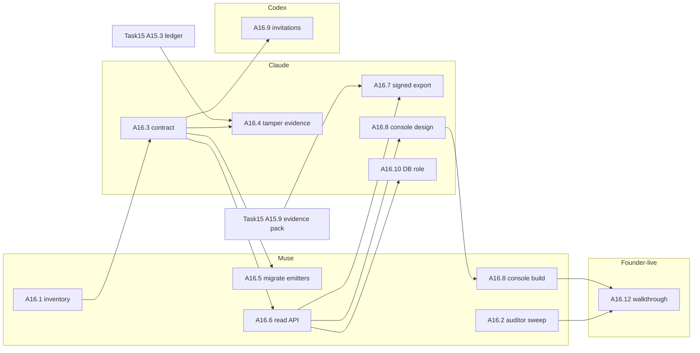

# Task16 — Audit and auditor experience

*Tracker and plan. Written 2026-10-08 by TrackAI-Orchestrator from the founder's notes (`docs/founder/VISION.md` part 3), `docs/plan/PROJECT_MAP.md`, `docs/plan/REUSE_MAP.md` (AU-1, ID-2, RP-1) and `docs/plan/TASK15.md`. Symbols per AGENTS.md §11. Scope is still forming (founder: "not much clarity"); section 1 lists what needs his yes.*

**In one paragraph.** Today TrackAI writes one append-only table, `security_audit_events` (actor, action, target, details, time), from Task4 administration (machines and credentials, grants, backfill, GitHub App, retention, export), Task5 (consent, raw reveal, corrections, purges) and Task6.a (finding reads). It is shown inside Administration, is not tamper-evident, cannot be searched or exported on its own, and new sources (Attesta signing and anchoring, D6.1 activation leases, Task6.b policy bundles, Task14 signed artifacts) have no events yet. Task16 gives audit one home: a catalog of every event, one way to emit them, a tamper-evident log through Attesta, an auditor's own console area, search and signed export, and auditor lifecycle (invitations, expiry).

**Customer story.** Dana is the internal auditor at Acme. She signs in with an auditor invitation that expires after the audit. She opens **Audit** (not Administration), filters "credential revocations and raw-evidence reveals in Q3", sees who did what, when, to which machine or repository, and why. She exports the result as a signed evidence pack and verifies it offline, including that no event was deleted. She can change nothing.

## 1. Decisions (approved 2026-10-08)
| # | Question | Recommendation |
|---|---|---|
| D1 | Is Task16 a separate Task from Attesta? | Yes (founder, 2026-10-08); it consumes Attesta's ledger and evidence-pack format rather than building its own. |
| D2 | Tamper evidence | Chain every audit event into Attesta's per-tenant ledger (A16.4) instead of a second chain. |
| D3 | Audit API for customers' tools (SIEM export, webhooks) | Read API now in TrackAI; SIEM/webhook delivery moves to Task11 (API/SDK). |
| D4 | Auditor invitations | Port SushiCorp ID-2's expiring, revocable invitations (back-port candidate), membership-based, never by email domain. |
| D5 | Retention of audit events | Never purged by tenant retention; exportable before tenant deletion. Confirm with counsel per market. |

## 2. Subtasks

Sizes against T6. "Who": Claude, Muse, Codex, founder-live.

| ID | Subtask | Who | Size | Depends on | Status |
|---|---|---|---|---|---|
| A16.1 | Audit event inventory: every action written today (file:line, actor, target, details keys) plus the planned ones from Task15, D6.1, Task6.b and T14.7, in `docs/plan/AUDIT_EVENT_CATALOG.md` | Muse | 0.03× | — (now) | ⬜ prompt ready |
| A16.2 | Auditor guard sweep: a test proving every mutating admin route is denied to `tenant_auditor` (route table vs action allow-list), ported from SushiCorp AU-1 | Muse | 0.03× | — (now) | ⬜ prompt ready (same session as A16.1) |
| A16.3 | Audit contract: event schema v1 (names, required fields, severity, no raw content), one `recordAuditEvent()` emitter, catalog as code | Claude | 0.05× | A16.1 | ⬜ |
| A16.4 | Tamper evidence: audit events sealed into the Attesta ledger (or chained with it), verify report | Claude | 0.1× | A16.3, Task15 A15.3 | ⬜ |
| A16.5 | Migrate existing emitters to `recordAuditEvent()` (Task4, Task5, Task6 call sites) | Muse | 0.06× | A16.3 | ⬜ |
| A16.6 | Audit read API: filter by actor, action, resource, time; keyset paging; `no-store`; auditor-reachable | Muse | 0.06× | A16.3 | ⬜ |
| A16.7 | Signed audit export (evidence pack, Attesta RP-1 pattern) | Claude | 0.05× | A16.6, Task15 A15.9 | ⬜ |
| A16.8 | Auditor console area separate from Administration: search, detail, export, verify card; no write controls (UI-1 rules) | Claude design, Muse build | 0.1× | A16.6 | ⬜ |
| A16.9 | Auditor invitations and expiry; membership-based tenant selection (ID-2 back-port) | Codex (Task4 owner) | 0.1× | A16.3 | ⬜ |
| A16.10 | Database read-only role for auditor reads (AU-1 layer 4) | Claude | 0.05× | A16.6 | ⬜ |
| A16.11 | Emitters for new sources: Attesta (key create/rotate/revoke, sign, anchor ok/failed, verify run, pack export), D6.1 lease issue, Task6.b bundle publish/activation, T14.7 artifact signing | owning Tasks | — | A16.3 | n/a here |
| A16.12 | Founder-live auditor walkthrough (Company A/B, admin vs auditor vs developer) | founder-live | 0.02× | A16.8 | ⬜ |

**Total:** about 0.6× T6 (Claude about 0.25×, Muse about 0.25×, Codex 0.1×).

## 3. Sub-task graph

**Critical path:** A16.1 → A16.3 → A16.6 → A16.8 → A16.12. **Start at once:** A16.1 + A16.2 (one Muse session). A16.4 and A16.7 wait for Attesta.

## 4. Sessions
| Session | Subtasks | Agent | Estimate | Prompt |
|---|---|---|---|---|
| Task16a-audit-inventory | A16.1, A16.2 | Muse | 0.06× | `docs/prompts/Task16/NEXT_CHAT_Task16a-audit-inventory_PROMPT.md` |
| Task16b-audit-contract | A16.3 | Claude | 0.05× | lead writes after 16a |
| Task16c-audit-emitters | A16.5 | Muse | 0.06× | after 16b |
| Task16d-audit-api | A16.6 | Muse | 0.06× | after 16b |
| Task16e-audit-tamper | A16.4, A16.7 | Claude | 0.15× | after 16d and Task15d/15i |
| Task16f-audit-console | A16.8 | Claude design note, Muse build | 0.1× | after 16d |
| Task4-auditor-invitations | A16.9 | Codex | 0.1× | after 16b |
| Task16g-audit-db-role | A16.10 | Claude | 0.05× | after 16d |

## 5. Founder decisions
1. **2026-10-08:** D1–D5 approved as recommended.
