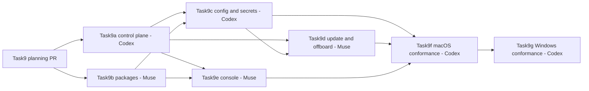

# Task9 — MDM and managed developer fleet

*Authoritative tracker and session plan. Written 2026-10-09 by Codex from the founder-approved [`Task9_PRIMER.md`](primers/Task9_PRIMER.md). Symbols per AGENTS.md §11.*

**Goal.** Let a tenant administrator deploy, configure, inventory, update, roll back and offboard GitAI on managed macOS and Windows developer machines. Linux is a later support wave. TrackAI consumes Jamf and Intune as device-management systems; it does not become an MDM.

**Completion claim.** A platform is supported only after its real-host row passes. Engineering and CI may be complete while Jamf, Intune, a second Mac or a Windows rental remains unavailable; those rows stay pending and the customer claim stays narrower.

---

## 1. Approved product and security boundaries

1. **Initial platforms:** macOS first, then Windows x64. Windows ARM64 remains build-only while the existing quick CI path is useful. Linux implementation and claims are deferred.
2. **Enrollment depth:** phase 1 starts from a device already enrolled in Jamf or Intune and proves post-login unattended package/configuration execution. Apple ADE and Windows Autopilot/OOBE are later certification, not phase-1 gates.
3. **Server authority:** device posture, MDM assignment and client acknowledgements are evidence only. Active machine credentials, tenant membership and repository grants remain authoritative.
4. **Policy boundary:** T9.4 provisions Task4 repository/delivery policy and Task6 Security `off`/`monitor` activation only. Task6 Policy vocabulary, inheritance, exceptions, simulation, customer rules and blocking remain deferred.
5. **Signing boundary:** Task15 owns signed activation/configuration, signer trust, rotation and revocation. Task9 defines a typed verifier seam and fails closed when a signature is required but cannot be verified; it never invents keys or a trust hierarchy.
6. **Secret boundary:** macOS uses Keychain and Windows uses Credential Manager/DPAPI through the Task14 T14.3 contract. A supported desktop route must not silently fall back to the current JSON credential file.
7. **Offboarding:** server revocation is immediate and authoritative. MDM uninstall and local cleanup are best-effort evidence because an offline or hostile device may ignore them.
8. **Privacy:** inventory contains a closed metadata set only—installation/device reference, platform/OS, GitAI version, configuration version, service/queue health, safe MDM evidence and timestamps. No prompt, response, command, file content, tool payload, credential or raw MDM payload.
9. **Procurement:** Windows, Intune, Jamf and a second Apple Silicon Mac are best-effort. Missing resources postpone only their live evidence and support claim, not portable engineering.
10. **Reuse:** none from SushiCorp because it has no endpoint fleet. Reuse Task4, Task6 Security, Task14 T14.3 and existing GitAI packages/updater/hook installers.

## 2. Master subtask matrix

| ID | Outcome | Implemented | Automated evidence | Founder-live evidence | Owner session | Completion boundary |
|---|---|---:|---:|---:|---|---|
| T9.1a | Signed/notarized macOS PKGs and signed Windows x64 MSI, preserving existing release provenance | ⬜ | ⬜ | ⬜ | Task9b, Task9f, Task9g | Artifact verifies before install; no unsupported architecture claim |
| T9.1b | Native signed Linux packages | n/a deferred | n/a | n/a | Later Linux wave | Resume when Linux becomes a selected customer platform and a real host exists |
| T9.2a | Secret-free unattended deployment to already-enrolled Jamf and Intune devices | ⬜ | ⬜ | ⬜ best-effort | Task9b, Task9f, Task9g | Package/configuration deploy without exposing `trk_v1` in arguments, logs or profiles |
| T9.2b | Linux package/service deployment | n/a deferred | n/a | n/a | Later Linux wave | Same trigger as T9.1b |
| T9.3 | Closed device identity/posture and assigned-user evidence, never authority | ⬜ | ⬜ | ⬜ | Task9a, Task9f, Task9g | Tenant-bound metadata; stale/mismatch states; self-report grants nothing |
| T9.4 | Machine-authenticated managed configuration for Task4 policy and Task6 monitor activation | ⬜ | ⬜ | ⬜ | Task9a, Task9c | Versioned fetch, verifier seam, atomic activation, last-known-good, acknowledgement, server recheck |
| T9.5 | Fleet inventory and safe health | ⬜ | ⬜ | ⬜ | Task9a, Task9e | Current/stale/unreported/unavailable are distinct; no raw content |
| T9.6 | Staged software/configuration rollout and rollback | ⬜ | ⬜ | ⬜ best-effort two-device | Task9a, Task9d, Task9f, Task9g | Ring/version pin, health decision, return to N-1, queue and credential preserved |
| T9.7 | Audited revoke/offboard workflow | ⬜ | ⬜ | ⬜ | Task9a, Task9d, Task9e | Dry-run/impact preview; Task4 revocation blocks upload; cleanup outcome recorded |
| T9.8 | macOS Keychain and Windows Credential Manager/DPAPI machine-credential storage | ⬜ | ⬜ | ⬜ | Task9c, Task9f, Task9g | No plaintext file/log; wrong user/machine and locked/unavailable store fail closed |
| T9.9 | MDM-to-TrackAI assignment reconciliation | ⬜ | ⬜ | ⬜ best-effort MDM | Task9a, Task9e, Task9f, Task9g | Match/mismatch/unavailable explained; explicit admin confirmation; no auto-authority |
| T9.10a | macOS and Windows fleet security/E2E | ⬜ | ⬜ | ⬜ best-effort | Task9f, Task9g | Install → configure → offline work → health → update → rollback → rotate → revoke → offboard |
| T9.10b | Linux fleet security/E2E | n/a deferred | n/a | n/a | Later Linux wave | Resume with T9.1b/T9.2b/T9.8 Linux |

## 3. Interface and state model to freeze first

Task9a freezes the server-facing vocabulary before dependent GitAI or UI sessions start. Exact JSON and database names are decided in that session; these semantics are already fixed:

### Managed configuration

- Scope: one tenant plus one authenticated machine installation.
- Content references: current repository/branch/credential-key bindings and current Task6 `off`/`monitor` activation. No plaintext credential and no future Task6 Policy language.
- Metadata: schema version, opaque configuration ID, monotonically increasing epoch, issued/valid times, compatibility range and optional rollout ring.
- Verification: `verify(bytes, signature metadata) -> verified | rejected | unavailable` behind a Task15-owned interface. Test fakes are allowed; production unsigned success is not.
- Activation: download to staging, validate the complete document, atomically switch one active pointer, retain one last-known-good version, then acknowledge success or a safe failure code.

### Fleet evidence

- Stable identifiers: tenant ID, TrackAI machine ID, installation ID and optional opaque MDM device reference.
- Closed posture: platform, OS version, architecture, GitAI version, active configuration ID/epoch, update channel/ring, service state, safe queue counters and observation time.
- Assignment evidence: opaque MDM user reference or normalized non-authoritative label, source, observed time and match/mismatch/unavailable result against the separately audited Task8 custodian assignment.
- Honest states: `current`, `stale`, `unreported`, `unavailable`, `mismatch` and `revoked` are never collapsed into zero or healthy.

### Rollout and offboarding

- Rollout targets explicit machine IDs or a bounded ring, pins an artifact/configuration version and records planned, applied, failed, rolled-back or unavailable states.
- Rollback selects a previously verified artifact/configuration; it never rotates/revokes a credential merely to change software.
- Offboarding is dry-run first and previews machine, active credentials, grants, pending rollout and intended MDM/local cleanup. Apply invokes existing Task4 revocation and writes immutable audit before cleanup acknowledgement.

## 4. Waves and exit gates

### Wave 1 — Control plane and existing package foundation

Sessions: Task9a and Task9b may run in parallel after the planning PR merges, one per agent.

Exit gates:

- The server contract is tenant- and machine-bound and has Company A/B negative tests.
- A generated migration is inspected, applied and rolled back only on a disposable database.
- Existing PKG/MSI behavior is preserved; package inputs contain no machine credential.
- Windows x64 CI builds and performs the existing MSI install/uninstall smoke.
- Task13 is not concurrently editing shared GitAI package/hook files.

### Wave 2 — Endpoint configuration, secrets and lifecycle

Sessions: Task9c after Task9a's interface lands; Task9d after Task9a and Task9c. Task9e may begin after Task9a and after Muse completes Task9b.

Exit gates:

- Managed configuration is staged, completely validated and atomically activated with last-known-good recovery.
- macOS and Windows credential adapters have failure-injection tests; supported desktop routes do not fall back to plaintext JSON.
- Task15 verifier is an injected seam; missing/rejected verification cannot activate a production-required configuration.
- Update/rollback preserves the Task4 queue, immutable binding and active credential.
- Offboarding previews exact scope, revokes server authority first and reports local cleanup separately.
- The console explains current/stale/unavailable/mismatch states and does not turn MDM evidence into authority.

### Wave 3 — Platform conformance

Sessions: Task9f on the current Intel Mac, then Task9g when Windows/Intune is available or as CI-only closure if it is not.

Exit gates:

- The current Intel Mac passes the full local lifecycle with Keychain and a real signed/notarized PKG.
- Jamf deployment, second-Mac rollout and Apple Silicon are run if procured; otherwise each remains an explicit pending evidence row.
- Windows x64 build and hosted MSI install/uninstall CI always run.
- Native Windows Credential Manager/DPAPI and lifecycle run only on an obtained Windows host; Intune deployment runs only with an isolated test tenant. Missing access narrows the claim.
- No Linux, Windows ARM64, ADE, Autopilot/OOBE or non-Jamf/non-Intune support is inferred.

## 5. Sessions and file ownership

The founder approved seven Codex/Muse sessions. TrackAI and GitAI changes always use separate branches and PRs. Prompts are written from the template after this planning PR merges and before each session starts.

| Session | Repository / agent | Scope | Estimate | Depends on | Owned/pre-approved implementation surfaces |
|---|---|---|---:|---|---|
| **Task9a-fleet-control-plane** | TrackAI / Codex | T9.3; T9.4 server interface; T9.5 inventory contract; T9.6 rollout records; T9.7 revoke orchestration; T9.9 reconciliation | about 0.24x target; 0.38x ceiling | Plan merged | new `apps/api/src/features/fleet/`; `core/db/schema.ts`; generated migration `0014_*` + meta; app router mount; focused tests/scripts; package scripts; reuse `machine.manage` |
| **Task9b-managed-packages** | GitAI / Muse | T9.1a and T9.2a: selectively port upstream macOS/Windows login-start behavior, then harden existing PKG/MSI for secret-free managed deployment | about 0.20x target; 0.25x ceiling | Plan merged; no Task13 overlap in daemon, MDM or packaging files | new top-level `mdm/`; MDM tests/workflow; bounded `bg start --retry-secs`; `packaging/`; bounded release workflow; Linux/nightly/WSL excluded |
| **Task9c-managed-config-secrets** | GitAI / Codex | T9.4 client fetch/verify/stage/activate; T9.8 macOS/Windows secret-store adapters | about 0.40x | Task9a merged; preferably Task9b merged | new `src/fleet/`; `src/auth/{credential_backend,credentials}.rs`; `src/metrics/delivery.rs`; `src/security/activation.rs`; `src/config.rs`; bounded daemon/startup wiring; Cargo manifests/tests |
| **Task9d-fleet-update-offboard** | GitAI / Muse | T9.6 update/rollback mechanics and T9.7 local cleanup/uninstall | about 0.30x | Task9a + Task9c merged | new `src/fleet/` lifecycle modules; `src/commands/upgrade.rs`; bounded install/uninstall and packaging scripts; exact daemon restart tests |
| **Task9e-fleet-console** | TrackAI / Muse | T9.5 inventory; T9.6 rollout state; T9.7 dry-run/offboard UX; T9.9 mismatch explanation | about 0.25x | Task9a merged; Muse free after Task9b | new `apps/web/src/app/dashboard/fleet-workspace.tsx`; `apps/web/src/lib/api.ts`; minimal `dashboard/page.tsx` integration; focused web/API contract tests |
| **Task9f-macos-conformance** | GitAI docs/tests / Codex | T9.1a–T9.10a current Intel Mac lifecycle; best-effort Jamf, second Mac and Apple Silicon gates | about 0.30x | Task9a–Task9e merged | platform tests/runbooks under GitAI `tests/` and `docs/`; only bounded fixes in Task9-owned files; no new product surface |
| **Task9g-windows-conformance** | GitAI docs/tests / Codex | T9.1a–T9.10a Windows x64 CI floor; best-effort native Windows/Intune lifecycle | about 0.35x | Task9a–Task9e and Task9f merged; host/tenant if available | Windows tests/runbooks and CI; only bounded fixes in Task9-owned files; existing ARM64 build left build-only and untouched unless it blocks the quick CI path |

The original estimates are conservative ceilings, not work budgets. Each implementation prompt should choose the smallest correct slice and set a lower operational target; after the 2026-10-09 upstream inventory expanded Task9b to reuse the final macOS/Windows login-start kit, Wave 1 targets about **0.44x T6** and still remains below its original 0.63x ceiling. Re-estimate the whole active total after Wave 1 actuals rather than padding all seven sessions now. The later Linux wave remains outside these seven sessions.

### Sequence and safe parallelism

Task9a and Task9b are the only recommended parallel pair. Task9e can overlap Task9c after both Wave-1 PRs merge because they are different repositories and agents. Task9d waits for Task9c. Task9f and Task9g remain lead-owned evidence sessions and run serially.

## 6. Integration and founder-live evidence registry

| ID | What it proves | Prerequisites | Gating | Status |
|---|---|---|---|---|
| IT-T9-01 | Disposable PostgreSQL: configuration scope/version/ack, fleet posture, rollout/offboard records, immutable audit and Company A/B isolation | Docker or local PostgreSQL through `scripts/it-db.sh` | Blocking: Task9a and every TrackAI fleet contract change | ⬜ designed |
| IT-T9-02 | Current Intel Mac: signed PKG, Keychain, managed config, offline queue, update, rollback, credential rotation, revoke and cleanup | Current Mac, disposable TrackAI tenant/runtime | Blocking: supported macOS local route | ⬜ designed |
| IT-T9-03 | Jamf post-login policy deployment, inventory, update/rollback and offboarding | Jamf Pro test tenant, APNs certificate, enrolled Mac | Blocking only for Jamf-managed claim; procurement best-effort | ⬜ pending access |
| IT-T9-04 | Hosted Windows x64 builds MSI and performs install/uninstall smoke without plaintext output | GitHub Actions Windows x64 runner | Minimum Windows evidence even without a rental | ⬜ existing basis; Task9 rerun pending |
| IT-T9-05 | Native Windows x64 MSI, Credential Manager/DPAPI, user context, restart, update/rollback and revoke | Windows 11 Pro x64 rental with local admin | Blocking only for native Windows claim | ⬜ pending host |
| IT-T9-06 | Intune post-login MSI/config deployment, inventory, assignment mismatch, rollback and retire/offboard | Isolated Intune/Entra test tenant plus IT-T9-05 host | Blocking only for Intune-managed claim | ⬜ pending access |
| IT-T9-07 | Two-device macOS rollout ring and assignment reconciliation; optional Apple Silicon architecture evidence | Second Mac, preferably Apple Silicon | Non-blocking for single-Mac support; blocking for two-device/Apple-Silicon claim | ⬜ best-effort |
| IT-M9-01 | Task15-signed, machine-bound configuration/activation verifies, rejects tamper/replay/revocation and preserves last-known-good | Task15 verifier/trust interface | Production blocker shared with D6.1; not a blocker for Task9 engineering | ⬜ waits for Task15 |

Agent/sandbox evidence stays partial until the founder runs the real-infrastructure row. A missing best-effort resource never becomes a pass; the tracker records `pending access` and the release matrix says unsupported/unverified.

## 7. Acceptance invariants

- No plaintext credential in a command line, configuration profile, environment dump, log, fixture, database, package or handoff.
- The one-time `trk_v1` value moves directly into the selected OS secret store; safe key IDs may appear in metadata.
- An unavailable, locked or wrong-user secret store fails closed on supported desktop routes.
- No MDM-reported user, posture value or client acknowledgement grants tenant, repository or human access.
- Every fleet table and route is tenant-bound, uses `withTenant()`, enables RLS without browser policies and has Company A/B tests.
- Configuration activation is whole-document and atomic. Parse, compatibility, signature, tenant/machine audience, expiry or epoch failure retains last-known-good and reports a safe code.
- Server admission independently rechecks active machine credential and repository/branch grant on every upload.
- Revocation prevents server acceptance even if MDM cleanup is delayed or never occurs.
- Update and rollback preserve the durable queue, original evidence timestamps and enqueue-time tenant/repository/branch/key binding.
- Inventory and UI contain metadata only and keep current, stale, unreported, unavailable, mismatch and revoked distinct.
- Monitor-only Task6 behavior is never described as prevention. Task6 Policy and blocking remain deferred.
- CI, simulated profiles and shared code never substitute for native host or MDM evidence.

## 8. Completion and deferral boundary

Task9 engineering is complete when Task9a–Task9e merge, all scoped automated gates pass and the macOS local lifecycle in Task9f passes. The task can close with conditional platform rows if best-effort procurement fails:

- **Jamf unavailable:** package/local macOS may be supported; Jamf-managed macOS remains unverified.
- **Second Mac unavailable:** one-device Intel macOS may be supported; rollout-ring and Apple Silicon claims remain unverified.
- **Windows unavailable:** Windows x64 remains build plus hosted MSI smoke only; no native Windows support claim.
- **Intune unavailable:** native Windows may be supported if IT-T9-05 passes; Intune-managed Windows remains unverified.
- **Task15 not yet integrated:** Task9's typed seam is complete, but production signed activation/configuration and D6.1 remain blocked on IT-M9-01.
- **Linux:** fully deferred; no package, service, secret-store or E2E claim.

The task is not complete merely because 70–85% of estimated work merged. Any unavailable live gate must have a named resume trigger, exact prerequisites and honest customer wording in the Task9 closeout handoff.

## 9. Founder decisions

1. **2026-10-09:** all primer recommendations approved.
2. **2026-10-09:** keep seven Codex/Muse sessions and the proposed sequence unless implementation discovers a real file/dependency conflict.
3. **2026-10-09:** procurement of Windows, Intune, Jamf and a second Mac is best-effort and may take time; engineering proceeds meanwhile.
4. **2026-10-09:** request a simple Windows rental specification—Windows 11 Pro, local administrator access, preferably x64—and inspect the actual machine ourselves.
5. **2026-10-09:** if Windows and Intune are obtained, do not add ARM64 validation; retain the existing quick build-only CI check if it stays cheap. Without the host/tenant, Windows x64 GitHub Actions build plus MSI install/uninstall is the minimum evidence.
6. **2026-10-09:** the founder accepts that worst-case remaining work may be 15–25% real-device/MDM validation after engineering is complete; it must remain pending, not be called passed.
7. **2026-10-09:** Task15 may start shortly. Task9 proceeds with its verifier seam and current single-Mac work; the shared signed trust gate integrates later.
