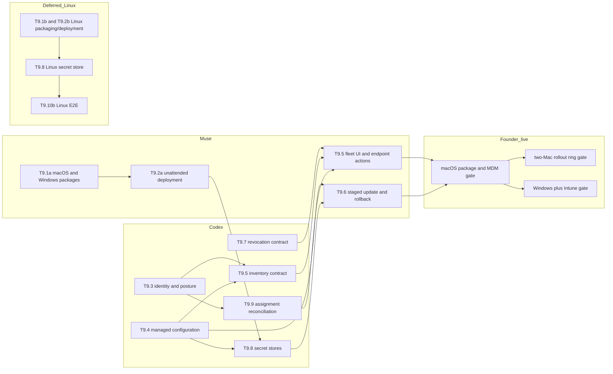

# Task9 primer: managed installation and fleet control

*Written 2026-10-09 by Codex. Founder decisions recorded 2026-10-09 after checkpoint 1.*

## In one paragraph

Task9 lets an enterprise administrator deploy GitAI to company Macs and Windows PCs without asking every developer to run setup by hand. The administrator can give each installation the right TrackAI configuration, see which installations are healthy, roll out or undo an update in stages, and revoke a departing or compromised device. The first release should support macOS and Windows. Linux remains a later support wave. TrackAI remains the authority for machine credentials and repository access; an MDM such as Jamf, Kandji or Intune performs device deployment rather than TrackAI trying to become an MDM.

## A customer story

Priya is the security lead at Acme. Today she can enroll and revoke one GitAI installation, but installing it and placing its local policy and credential still needs careful per-machine work. After Task9, she publishes one approved macOS or Windows rollout, starts with a small ring, sees installed version and safe health facts, expands the rollout, and offboards a laptop without exposing its credential. She still cannot create a new customer policy language: Task6 Policy remains deferred, and Task9 only provisions the Task4 repository policy and Task6 monitor activation that exist today.

## Words you will see

| Word | Means |
|---|---|
| MDM | A customer's device-management product, such as Jamf, Kandji or Intune, which installs software and configuration on company devices. |
| Fleet | The set of developer machines that a customer manages. |
| Package | An operating-system installer: PKG on macOS, MSI on Windows, and later a native Linux package. |
| Configuration profile | Settings delivered by a device-management product without putting a secret in a shell command. |
| Machine credential | The one-time `trk_v1` secret used by one GitAI installation to authenticate to TrackAI. |
| Policy provisioning | Getting the already-approved repository routing and monitor settings onto the correct installation. It does not mean inventing new policy rules. |
| Posture | Safe facts about a device or installation, such as OS, GitAI version, service state and last check-in. It is evidence, not authority. |
| Rollout ring | A small group that receives a release before the rest of the fleet. |
| Last-known-good | The previous verified software or configuration version retained for a safe rollback. |
| Reconciliation | Comparing MDM device/user facts with TrackAI's audited machine/custodian assignment without letting either report grant access. |
| Founder-live | A gate run by the founder on a real machine or MDM tenant; CI or a simulated profile is not a substitute. |

## Scope choices already supplied by the founder

- Keep the total implementation split to **seven Codex/Muse sessions**, below the requested maximum of eight or nine. Founder-live checks are gates inside those sessions, not extra agent threads.
- Build and certify **macOS first, then Windows** when the rented Windows machine is ready.
- Defer Linux implementation and certification to a later support wave. Keep interfaces portable and do not claim Linux support meanwhile.
- The current machine is an Intel Mac on macOS 15.0.1. A second Mac is not needed to start. If one is rented for the final macOS gate, an Apple Silicon Mac adds more value than another Intel Mac and permits a real two-device staged rollout.

## The pieces (waves and subtasks)

Value is what the customer notices. Size is measured against all of Task6 Security, where 1.0x means the complete Task6 Security effort. The original three-platform scope is about **2.5x T6**. The recommended macOS-and-Windows first release is about **2.2x T6**; the deferred Linux wave is about **0.3x T6** because it can reuse the portable contracts but still requires real packaging, service, secret-store and host evidence.

| # | Piece, in plain words | Example of what it does | Value to the customer | Size | Who (Codex / Muse / founder-live) | Could we simplify or defer it? What would we lose? | Founder: keep / simplify / defer / reorder |
|---|---|---|---|---|---|---|---|
| T9.1a | Signed macOS and Windows packages | Signed/notarized macOS PKGs and a signed x64 MSI verify their platform signatures before installation. | High: enterprises need trustworthy, repeatable artifacts. | about 0.15x | Muse implementation; Codex review; founder-live Mac/Windows | Keep and harden the existing PKG/MSI scaffolding. Defer Windows ARM64 certification unless a customer needs it; keep its existing CI build only while it stays quick. | **Keep; macOS before Windows; x64 native first** |
| T9.1b | Native Linux packages | A signed DEB/RPM installs the same client and service contract. | Medium later; none for the stated first release. | about 0.12x | Muse plus founder-live Linux | Defer. Raw Linux binaries and `install.sh` do not prove managed Linux support. | **Defer** |
| T9.2a | Unattended macOS and Windows deployment | Jamf installs the PKG or Intune installs the MSI without developer prompts or secrets in process arguments. | High: this is the core fleet-deployment journey. | about 0.15x | Muse implementation; founder-live MDM tenants | Limit the first release to Jamf for macOS and Intune for Windows rather than claiming every vendor. Post-login deployment to an enrolled device is sufficient; OOBE/ADE/Autopilot is later certification. | **Keep, best-effort live Jamf/Intune** |
| T9.2b | Unattended Linux deployment | A package repository and systemd-aware install work without a desktop session. | Medium later. | about 0.10x | Muse plus founder-live Linux | Defer with T9.1b. We lose Linux fleet support, not macOS/Windows portability. | **Defer** |
| T9.3 | Device identity, posture and assigned-user evidence | TrackAI records the MDM device reference, OS/version, client version and reported custodian as evidence, while the machine credential and audited Task8 assignment still decide authority. | High: admins can identify stale, unexpected or misassigned devices without trusting self-report for access. | about 0.25x | Codex; founder-live on each OS | Start with a small closed posture schema. Defer deep compliance signals such as disk encryption or EDR status until a customer and MDM source require them. | **Simplify as recommended** |
| T9.4 | Managed configuration and current-policy provisioning | A machine-authenticated client receives its Task4 repository bindings and Task6 `off`/`monitor` activation, verifies the future signed seam, activates atomically and reports the applied version. | High: correct configuration reaches the correct installation and remains fail-closed offline. | about 0.30x | Codex | Do not implement Task6 Policy vocabulary, inheritance or customer rules. A typed verifier seam waits for Task15 Attesta. | **Keep narrow existing-policy scope** |
| T9.5 | Fleet inventory and health | The admin sees version, platform, configuration version, last check-in and safe queue/service health for each managed installation. | High: operators can find missing, stale and unhealthy clients. | about 0.20x | Codex server contract; Muse UI; founder-live | Reuse Task4 delivery health and add only fleet-safe fields. Defer rich dashboards, bulk UX polish and arbitrary device telemetry to Task10/customer need. | **Keep simplified** |
| T9.6 | Staged update and software/configuration rollback | Acme moves two Macs to release N, observes health, then expands or returns them to N-1 without losing the durable queue. | High: limits fleet-wide outages. | about 0.30x | Muse client mechanics; Codex rollout contract; founder-live on two devices where available | One device can prove update and rollback mechanics, but two devices are needed to prove a real rollout ring. A second Mac is useful here, not needed earlier. | **Keep; second Mac best-effort** |
| T9.7 | Revocation and offboarding | Revoking a machine immediately blocks server access; the MDM removes local configuration, credentials, hooks and binary with an auditable result. | High: departing or compromised devices stop sending data. | about 0.15x | Codex contract; Muse endpoint action; founder-live | Reuse Task4 revocation. Keep local cleanup best-effort and server denial authoritative, because an offline or hostile device may ignore MDM. | **Keep** |
| T9.8 | Operating-system secret stores | `trk_v1` credentials live in Keychain on macOS and Credential Manager/DPAPI on Windows rather than the current owner-only JSON keyring. | Very high: closes the known plaintext-file gap. | about 0.35x | Codex because it is security-critical; founder-live per OS | Implement the Task14 T14.3 adapter contract, not a new contract. Defer libsecret/headless fallback with Linux. No silent JSON fallback on supported desktop systems. | **Keep macOS/Windows; defer Linux** |
| T9.9 | MDM-to-TrackAI assignment reconciliation | The admin sees that MDM says laptop 42 belongs to Sam while TrackAI's audited custodian is Priya, and must explicitly resolve the mismatch. | Medium/high: prevents silent identity drift. | about 0.20x | Codex; founder-live with test users/devices | Begin with compare-and-explain plus explicit confirmation. Defer automatic directory/SCIM changes to Task8. | **Simplify as recommended** |
| T9.10a | macOS and Windows fleet security/E2E | Install, configure, work offline, check in, update, roll back, rotate, revoke and offboard on real managed devices without leaking a secret. | Very high: converts code and CI into supported platform claims. | about 0.35x | Codex lead plus founder-live | CI is useful but cannot replace native machines and MDM accounts. Windows/Intune and a second Mac are best-effort; engineering continues and unavailable live rows remain explicitly pending. | **Keep; macOS then Windows; procurement best-effort** |
| T9.10b | Linux fleet security/E2E | Repeat the same journey on supported Linux desktop/headless combinations. | High only when Linux becomes a promised platform. | about 0.08x | Codex plus founder-live Linux | Defer. Without a real Linux host, package/service/keyring/restart behavior remains unsupported. | **Defer** |

## Sub-task graph

The active critical path is managed-configuration contract -> desktop secret stores -> staged update/rollback -> real macOS gate -> real Windows gate. Package hardening and the TrackAI identity/inventory contract can start at the same time because they are in different repositories; Task13 must not simultaneously change their shared GitAI files.

## What already exists, and what `src/mdm/` really means

The name `src/mdm/` is broader than its current job. It is a registry of local installers for AI-agent and editor integrations—Claude Code, Codex, Cursor, VS Code, OpenCode, Gemini, JetBrains and others—not an enterprise fleet control plane (`git-ai/src/mdm/agents/mod.rs:1-59`). Its common interface checks whether a tool and its hooks exist, installs or removes hooks with dry-run support, installs extras such as extensions, and detects processes that may need restart (`git-ai/src/mdm/hook_installer.rs:4-100`). This is useful endpoint machinery and must be reused, but it does not enroll devices, talk to Jamf/Intune, maintain fleet inventory, distribute TrackAI policy or reconcile device users.

There is also newer and directly relevant packaging outside `src/mdm/`:

- `packaging/` contains macOS PKG and Windows MSI scaffolding. The packages intentionally install only `git-ai`; per-user agent hooks remain `git-ai install-hooks` work (`git-ai/packaging/README.md:1-19`).
- The MSI is per-user, changes the user's PATH and can run hook configuration, but its current `API_KEY` command-line property is explicitly observable to process inspection or shell history and is not acceptable as the final machine-credential handoff (`git-ai/packaging/README.md:21-30`; `git-ai/packaging/windows/git-ai.wxs:5-58`).
- The macOS PKG installs for the active console user and fails with no logged-in user (`git-ai/packaging/macos/scripts/postinstall:9-37`). That is good safety for an interactive install but is not yet a complete pre-login or shared-machine MDM story.
- Release CI builds and signs Windows MSIs, signs and notarizes macOS PKGs, and runs per-user install smoke tests (`git-ai/.github/workflows/release.yml:350-407,409-518,520-603`). The release notes still label PKG/MSI installers beta (`git-ai/.github/workflows/release.yml:747-752`).
- GitAI already has update channels, checksum verification and a self-upgrade path (`git-ai/src/config.rs:192-220`; `git-ai/src/commands/upgrade.rs:361-429,656-785`). It does not yet provide TrackAI-controlled rollout rings, a recorded last-known-good fleet rollback or managed offboarding.

### Overlap with T9.1-T9.10

| Existing area | Direct overlap | What Task9 still owns |
|---|---|---|
| `packaging/macos` and `packaging/windows` | Strong overlap with T9.1a and T9.2a | Harden managed, secret-free unattended install; package policy/profile inputs; prove signatures and real MDM deployment. |
| `src/mdm/` hook installers | Part of T9.2 endpoint setup, a small part of T9.5 hook health, and local cleanup for T9.7 | Reuse check/install/uninstall primitives. Do not treat them as device enrollment, posture, inventory or MDM reconciliation. |
| `install.sh` / `install.ps1` and `upgrade.rs` | Foundation for T9.6 update mechanics | Add server-governed rings, version pinning, last-known-good rollback, safe daemon/queue preservation and fleet evidence. |
| Task4 delivery policy and keyring | Foundation for T9.4, T9.5, T9.7 and T9.8 | Replace manual file provisioning with managed fetch/activation and OS secret stores; keep server enforcement authoritative. |
| Task6 activation lease | The current `off`/`monitor` setting provisioned by T9.4 | Leave the signed, machine-bound verification seam for Task15; do not add blocking or customer policy. |
| Nothing current | T9.3, most of T9.5, T9.9 and T9.10 | Add the bounded posture/inventory/reconciliation contracts and native fleet proof. |

## T9.4 policy compared with Task6 Policy

They meet at the endpoint, but they solve different problems.

| Question | T9.4 in Task9 | Task6 Policy (the deferred T6.b work) |
|---|---|---|
| Main job | Reliably deliver, activate and report the configuration that already exists. | Let a customer author, inherit, approve, simulate and enforce new organization policy. |
| Content now | Task4 repository/branch/delivery bindings and Task6 Security `off`/`monitor` activation. | Future capture, upload, redaction, retention, access, export, authorization and customer security rules. |
| Decisions it makes | Which authenticated machine receives which existing version/channel, whether it activated, and when to retain last-known-good. | What the effective policy means for a tenant, group, machine, repository, user, model, agent and data family. |
| Enforcement | Client applies configuration fail-closed; server still rechecks machine credential, grant and tenant boundaries. | Future client preflight plus authoritative server enforcement, simulation and explanation. |
| Signing | A typed `verify bundle` seam; Task15 owns signer, key hierarchy, rotation and revocation. | Will consume the same Task15 trust layer when resumed; Task9 does not invent its format. |
| Status | Task9 work now. | Explicitly deferred until customer requirements validate the vocabulary and workflow (`TASK6_POLICY.md:17-27`). |

Task6 Policy describes a broad effective-policy compiler and multiple policy families (`TASK6_POLICY.md:76-132`) plus bundle distribution, verification and atomic activation (`TASK6_POLICY.md:186-241`). T9.4 implements only the reusable delivery envelope and today's narrow content. It must not freeze a Cedar schema, inheritance model, exception workflow or customer-rule format on behalf of deferred T6.b.

## Task4 device credentials compared with T9.4-T9.7

Task4 already created the security primitives. It issues one-time opaque `trk_v1` credentials, supports bounded rotation overlap and credential or whole-machine revocation; it also binds machines to repository/branch grants (`TASK4.md:30-35`). GitAI's Task4 runtime loads a versioned repository policy and a credential keyring together, resolves a credential by its safe key ID and reports health bindings (`git-ai/src/metrics/delivery.rs:218-254,398-525`). The verified Task4 foundation also includes a durable tenant/repository/branch/key-bound offline queue and tenant-safe monitoring (`docs/handoffs/TASK4_TO_TASK5.md:20-30`).

Task9 does not replace those semantics:

| Area | What Task4 completed | What Task9 adds |
|---|---|---|
| T9.4 configuration | A manually installed versioned local delivery-policy file, credential keyring and authoritative server grant checks. | Fleet-safe, machine-authenticated fetch/provisioning, version acknowledgement, atomic activation, managed bootstrap settings and a future signature-verifier seam. |
| T9.5 inventory/health | Latest counts-only machine delivery health and operator diagnostics. | Device/platform/client/config version, managed state, safe posture and fleet-wide stale/mismatch views. No raw content. |
| T9.6 update/rollback | Credential rotation overlap, database migration rollback checks, queue restart/retry and self-upgrade foundations. | Software/configuration rollout rings, version pins, success criteria and return to the previous client/config version while preserving the durable queue. Credential rotation is not software rollback. |
| T9.7 revocation/offboarding | Credential revoke, whole-machine revoke and repository-grant revoke fail closed at the server. | A fleet workflow that previews scope, triggers those Task4 revocations, requests MDM cleanup/uninstall, records outcome and proves no further accepted upload. Server denial remains effective even if the device is offline or ignores cleanup. |

The key difference is scale and orchestration. Task4 proved the lifecycle for one installation at a time, including two logical tenant profiles on one Mac. Task9 makes those existing controls deployable and observable across real managed devices. “Provisioning” in Task4 meant generating/installing local policy and credentials safely; T9.4 automates that journey without changing who is authorized. “Rollback” in Task4 mostly meant safe database/test rollback or credential overlap; T9.6 means reverting a fleet's client or configuration release.

## Real-machine dependencies

| Resource | Subtasks that genuinely need it | What can proceed without it | Recommendation |
|---|---|---|---|
| Current Intel Mac | T9.1a, T9.2a, T9.4-T9.8 and T9.10a macOS mechanics | All design, unit tests, server work and first local PKG cycle | Use now. It is sufficient to start and to prove one-device macOS behavior. |
| Second Mac | Final T9.3/T9.6/T9.9/T9.10a two-device reconciliation, rollout-ring and offboarding evidence | All implementation and single-device gates | Helpful, not required. If rented for one week, choose Apple Silicon and schedule it only for the final macOS session. |
| Windows 11 x64 machine | Native T9.1a/T9.2a MSI, T9.3 posture, T9.6 rollback, T9.7 offboarding, T9.8 DPAPI/Credential Manager and T9.10a | Cross-compilation/CI smoke and platform-neutral contracts | Required before claiming Windows support. Rent it for the Windows integration session; Intune/Entra enrollment adds the most value. Windows ARM64 can remain CI-only initially. |
| Linux host | T9.1b/T9.2b packages/services, T9.8 libsecret or headless fallback, T9.10b | Portable interfaces and non-Linux work | Deferred. Do not claim Linux support until a real supported distribution and user/service context pass. |
| macOS MDM test tenant | T9.2a, T9.4, T9.6, T9.7, T9.10a | Local PKG mechanics | Required for the managed macOS claim. Jamf is the selected first conformance target. |
| Microsoft Intune test tenant | Windows parts of T9.2a, T9.4, T9.6, T9.7, T9.9, T9.10a | MSI CI and local Windows installation | Required for the first managed Windows claim. |

## What we reuse

- **Inside TrackAI:** Task4 machine enrollment, `trk_v1` credentials, repository grants, durable offline queue, client delivery health, audit and server-side enforcement. Task9 composes them; it does not redefine them.
- **Inside GitAI:** existing PKG/MSI scaffolding, package signing/notarization workflow, checksum-verified installers and upgrades, update channels, local hook installers, daemon restart behavior and Task4 delivery runtime.
- **Task6 Security:** only the existing monitor activation contract and privacy-safe findings. Blocking and customer rules remain out of scope.
- **Task14:** T14.3 defines the endpoint secret-store adapter contract; Task9 integrates it. T14.7 later certifies release-wide artifact integrity (`TASK14.md:82-93,118-128`).
- **Task15 Attesta:** supplies the future signed configuration/activation trust layer. Task9 leaves a typed verification seam and can test a fake verifier; it does not create signing keys or trust roots.
- **SushiCorp:** none, because SushiCorp has no endpoint fleet component. This matches `docs/plan/REUSE_MAP.md`; internal TrackAI reuse is the better fit.

## Risks in plain words

- A secret passed as an MSI property can appear in local process inspection or history. Provision only a non-secret bootstrap reference through MDM and exchange it for the machine credential directly into the OS secret store.
- Per-user GitAI state conflicts with system-context MDM installers. Define the user/service ownership model before changing installers, and test logged-out, user-switch and restart cases.
- Device-reported posture or an MDM-assigned email could accidentally become authorization. Store it as evidence only; machine credentials, grants and audited Task8 assignments remain authoritative.
- Task13 shares `src/mdm/`, `src/config.rs`, `install.sh`, `install.ps1` and daemon startup. Do not run overlapping Task9/Task13 implementation sessions on these files.
- Task15 may not land before T9.4. Use a narrow verifier interface and fail closed; do not ship an unsigned mechanism as production-ready or invent Task9 signing.
- One Mac can simulate profiles but cannot prove fleet separation or a rollout ring. Use the optional second Apple Silicon Mac for final evidence, not as a blocker for early work.
- GitHub Actions can build on Windows/Linux but cannot prove customer MDM, OS secret-store context, service lifecycle or real offboarding. Label CI and founder-live evidence separately.
- Linux's desktop and headless secret-store/service models differ materially. Deferring both implementation and claims is safer than a partial `install.sh` claim.

## Approved sessions after checkpoint 1

The founder approved this seven-session split on 2026-10-09. No session mixes TrackAI and GitAI changes.

| Session | Pieces | Repository / agent | Estimate (x T6) | Why this agent |
|---|---|---|---:|---|
| Task9a | T9.3, T9.4 server contract, T9.5 contract, T9.7 server orchestration, T9.9 | TrackAI / Codex | about 0.38x | Security and identity boundaries plus a likely migration require lead ownership. |
| Task9b | T9.1a, T9.2a package and unattended-install hardening | GitAI / Muse | about 0.25x | Existing bounded PKG/MSI scaffolding can be specified file by file and cross-reviewed. |
| Task9c | T9.4 client, T9.8 macOS/Windows secret-store adapters | GitAI / Codex | about 0.40x | Credential handling and fail-closed activation are security-critical. |
| Task9d | T9.6 client update/rollback and T9.7 endpoint cleanup | GitAI / Muse | about 0.30x | Bounded behavior can follow frozen interfaces and exact fault tests from Task9a/c. |
| Task9e | T9.5/T9.6/T9.7/T9.9 admin fleet UI | TrackAI / Muse | about 0.25x | UI work is bounded after Task9a freezes the APIs and states. |
| Task9f | T9.1a-T9.10a macOS integration and founder-live gates | GitAI docs/tests / Codex | about 0.30x | The lead must reconcile security, packaging and evidence and review the real-device run. |
| Task9g | T9.1a-T9.10a Windows integration and founder-live gates | GitAI docs/tests / Codex | about 0.35x | Native Windows/Intune, DPAPI and service behavior need lead triage and exact support claims. |

Estimated active total: **about 2.2x T6** after allowing for cross-session integration/review. Linux resumes later as a separate support wave estimated at about **0.3x T6**, not as an eighth placeholder session now.

## Founder answers at checkpoint 1

1. **macOS MDM:** attempt a Jamf Pro trial on a best-effort basis. Lack of a tenant does not block engineering; the Jamf evidence row remains pending.
2. **Windows and Intune:** attempt to rent Windows 11 Pro with local administrator access and obtain Intune on a best-effort basis. Inspect the actual host after procurement. If unavailable, retain Windows x64 build plus MSI install/uninstall CI as the minimum and mark native/Intune gates pending.
3. **Second Mac:** best-effort only. The current Intel Mac is the initial verified route; rent Apple Silicon for the final rollout-ring gate if practical.
4. **Windows architecture:** prefer native x64. Do not add ARM64 work; retain the existing build-only CI path only while it stays quick, and make no ARM64 support claim.
5. **Task15 dependency:** proceed now with a typed verifier seam. Single-Mac Task9 work may complete before Task15; production signed activation/configuration remains blocked until Task15 supplies the trust layer.

## Founder decisions

Recorded from the 2026-10-09 kickoff:

- Initial available host: one Intel Mac.
- Windows: expected through a short-term rental; native Windows-dependent gates must wait for it.
- Linux: defer implementation and support claims to a later wave.
- Optional second Mac: best-effort rental for the final macOS rollout/E2E gate, preferably Apple Silicon; its absence leaves only the two-device/Apple-Silicon evidence pending.
- Session budget: fewer than eight or nine Codex/Muse sessions; the proposed split uses seven.
- MDM scope: Jamf for macOS and Intune for Windows, both best-effort. Phase 1 proves post-login policy execution on an enrolled device; OOBE/ADE/Autopilot is not required.
- Worst case: complete engineering and CI, and leave unavailable native/MDM gates explicitly pending rather than blocking the implementation sessions.
