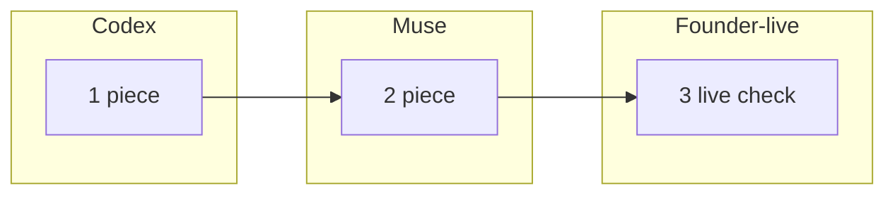

# Task primer template

Copy to `docs/plan/primers/<TaskN>_PRIMER.md` when a Task starts, before any session prompt (AGENTS.md §12.8). The orchestrator writes it; the founder reads it and marks every row. Write for a smart intern on day one: no jargon (or a one-line meaning the first time a term appears), short sentences, a customer example for everything. Delete these two paragraphs.

---

# <TaskN> primer: <Task name in plain words>

*Written <date> by <agent>. Founder decisions recorded <date>.*

## In one paragraph
<What the customer gets when this Task is done, said the way you would say it to a customer. No internal names.>

## A customer story
<One concrete example with names: "Priya is the security lead at Acme. Today she cannot … After this Task she opens … and sees …". Then one sentence on what she still cannot do after this Task.>

## Words you will see
| Word | Means |
|---|---|
| <term> | <one plain sentence> |

## The pieces (waves and subtasks)
One row per subtask. **Value** is what the customer notices; **Size** is the estimate against T6 (1.0× = all of Task6.a); **Could we…** gives the cheaper option if there is one.

| # | Piece, in plain words | Example of what it does | Value to the customer | Size | Who (Codex / Muse / founder-live) | Could we simplify or defer it? What would we lose? | Founder: keep / simplify / defer / reorder |
|---|---|---|---|---|---|---|---|
| 1 | <subtask> | <tiny example> | <high / medium / low, and why> | about 0.1× | Muse | <option and what is lost> | |

## Sub-task graph

<Critical path in one line; what can start at once in one line. An arrow means "must finish before".>

## What we reuse
<What comes from SushiCorp or elsewhere, in plain words ("the tamper-evident log SushiCorp already built and tested"), and what is new.>

## Risks in plain words
- <what could go wrong, how likely, what we do about it>

## Suggested sessions (after the founder marks the table)
| Session | Pieces | Agent | Estimate (× T6) | Why this agent |
|---|---|---|---|---|
| <TaskN>a | 1, 2 | Muse / Codex / Claude | about 0.2× | <one line> |

## Founder decisions
<Filled after the review: what was kept, simplified, deferred or reordered, with the date.>
